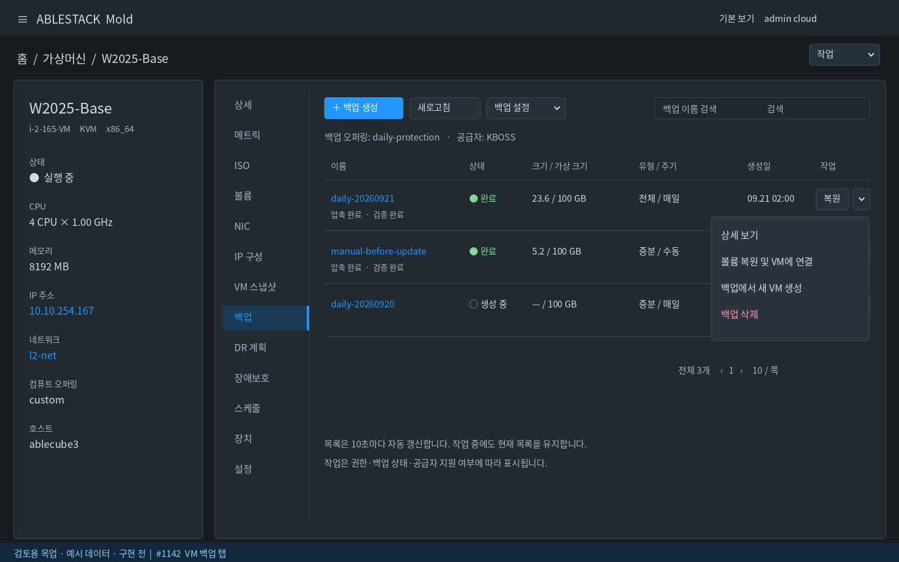
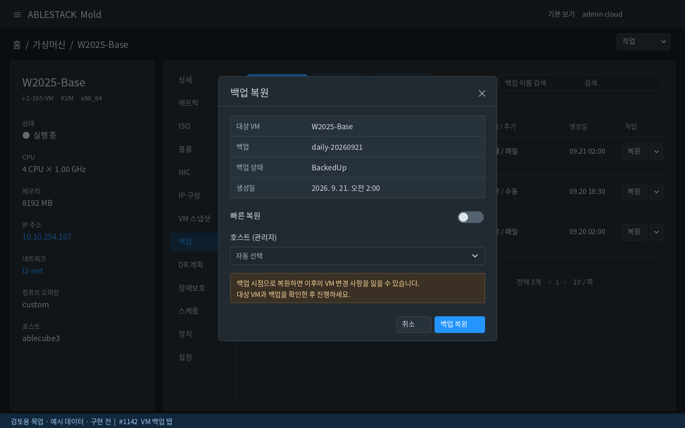
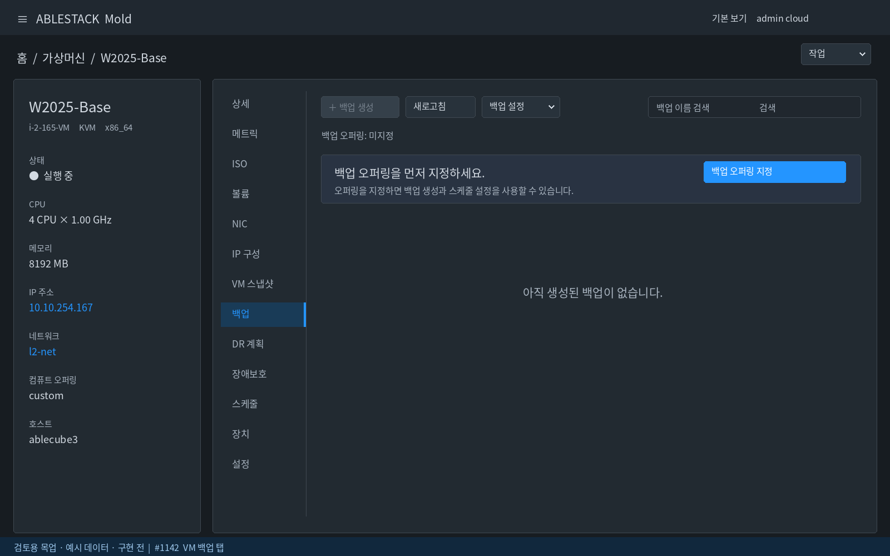

<!--
Licensed to the Apache Software Foundation (ASF) under one
or more contributor license agreements.  See the NOTICE file
distributed with this work for additional information
regarding copyright ownership.  The ASF licenses this file
to you under the Apache License, Version 2.0 (the
"License"); you may not use this file except in compliance
with the License.  You may obtain a copy of the License at

  http:www.apache.org/licenses/LICENSE-2.0

Unless required by applicable law or agreed to in writing,
software distributed under the License is distributed on an
"AS IS" BASIS, WITHOUT WARRANTIES OR CONDITIONS OF ANY
KIND, either express or implied.  See the License for the
specific language governing permissions and limitations
under the License.

-->

## 목표
VM 상세의 **백업 탭 안에서 생성·설정·복원·삭제 작업**을 수행할 수 있도록 VM 스냅샷 탭의 툴바·행 작업·대화상자 스타일로 통일한다. 탭 이름과 중복되는 내부 `백업` 제목은 추가하지 않는다. 이번 이슈는 **분석 및 목업 검토 단계**이며 실제 기능 구현·배포는 포함하지 않는다.

## 현행 코드 분석
분석 기준: Europa `090c478cbee05ab9a47786f1bbedc6502172a8cd`.

- `ui/src/views/compute/InstanceTab.vue`: 백업 탭은 `ListResourceTable` + `listBackups(virtualmachineid)`만 사용. 이름 클릭 시 `/backup/:id` 이동. 검색 비활성, 탭 내 작업 버튼 없음.
- 현재 컬럼: 이름, 상태, 크기, 가상 크기, 유형, 주기, 생성일. `backupprovider === 'kboss'`이면 압축 상태와 검증 상태도 제공.
- `ui/src/config/section/compute.js`: VM 상단 작업에 오퍼링 지정/해제, 백업 생성, 스케줄 설정이 존재한다.
- `ui/src/config/section/storage.js`: 백업 상세 화면에 복원, 볼륨 복원 및 VM 연결, 백업으로 새 VM 생성, 백업 삭제가 존재한다.
- `StartBackup.vue`: 공급자별 이름/설명, quiesce 및 KBOSS isolated 옵션을 이미 처리한다. 이 입력과 API 매개변수를 재사용한다.
- 기준 `VmSnapshotsTab.vue`: 생성/새로고침/검색 툴바, 행의 복원 + 명시적 아래 화살표, 보조 작업 메뉴, 확인창, 10초 자동 갱신, 작업 완료 이벤트 갱신을 제공한다.

### 자동 갱신에 대한 확인
현재 공통 `ListResourceTable.vue`에도 `listRefreshMixin`이 적용되어 있고 기본 주기는 10초다. `loading = !listRequest.loaded`로 최초 로딩을 구분하고 갱신 직전 배열을 비우지 않는다. 따라서 **현재 백업 탭에 자동 갱신이 없거나 화면 깜빡임이 재현됐다고 판단하지 않는다**. 리소스 deep watcher의 추가 조회 및 배열 교체는 존재한다. 새 전용 탭에서는 같은 VM 객체 갱신으로 목록을 초기화하지 않고 중복 요청·오래된 응답·불필요한 행 교체를 방지한다.

실서버 로그인 후 동작 재현 검증은 하지 않았으며, 본 분석은 최신 소스 기준이다. 목업은 실데이터/완성 화면이 아닌 예시다.

## UI 배치
### 상단
- 왼쪽: **＋ 백업 생성**, **새로고침**, **백업 설정 ▾**.
- 오른쪽: 백업 이름 검색. 좁은 화면에서는 검색을 다음 줄로 배치.
- 오퍼링/공급자 요약을 한 줄로 표시. 설정 메뉴: 오퍼링 미지정이면 지정, 지정된 경우 스케줄 설정 및 오퍼링 해제(분리된 위험 확인창).
- 오퍼링 미지정 시 생성 버튼 비활성 및 지정 안내. 조회 권한만 있으면 목록/상세만 제공.
- 오퍼링 해제는 개별 백업 삭제와 구분한다. `forced`는 기본 선택하지 않고 기존 데이터 영향/공급자 동작을 확인창에 설명한다.

### 목록
- 이름(상세 링크), 상태, 크기/가상 크기, 유형/주기, 생성일, 작업 순서. 표시 정보는 축약하되 상세 값과 API 원본 의미를 보존.
- KBOSS 압축/검증 상태는 이름 아래 보조 상태로 표시해 폭을 절약. 다른 공급자에는 표시하지 않는다. 상태·오류를 색상만으로 전달하지 않는다.
- 행 오른쪽: **복원 + ▾**. 버튼 높이/중앙 정렬 동일, 8px 간격, 화살표 아이콘과 접근성 이름 필수.
- 더보기: 상세 보기 / 볼륨 복원 및 VM 연결 / 백업에서 새 VM 생성 / 구분선 / 백업 삭제(위험 색상).
- 완료 전 백업은 복원 비활성. 권한 없는 메뉴는 숨기고 상태상 불가한 작업에는 이유를 제공한다. 삭제 가능 여부를 복원 가능 조건과 동일하게 취급하지 않는다.
- 총 개수/페이지 크기/페이지 이동은 하단 오른쪽. 검색/페이지 전환은 VM 범위를 벗어나지 않는다.

## 기존 API 및 제약 유지
| 위치/작업 | API 또는 재사용 폼 | 유지할 제약 |
|---|---|---|
| 목록 | `listBackups` | VM ID 고정, 계정/프로젝트 권한 및 페이지/검색 조건 |
| 백업 생성 | `createBackup` / `StartBackup.vue` | 오퍼링 필요, Offline/flatten 차단, 공급자별 입력 |
| 오퍼링 지정/해제 | `assignVirtualMachineToBackupOffering`, `removeVirtualMachineFromBackupOffering` | 기존 show/disabled 조건, forced 영향 확인 |
| 스케줄 | `BackupScheduleWizard.vue` 및 기존 schedule API | VM 문맥 유지, 기존 생성·조회·변경·삭제 경로 재사용 |
| 원본 VM 복원 | `restoreBackup` | `status === BackedUp`, quickrestore 옵션, hostid는 관리자만; 실행 직전 서버 상태 재조회 |
| 볼륨 복원 및 연결 | `restoreVolumeFromBackupAndAttachToVM` / `RestoreAttachBackupVolume.vue` | 기존 대상 볼륨/VM 선택과 서버 제약 유지 |
| 새 VM 생성 | `createVMFromBackup` / `CreateVMFromBackup.vue` | 기존 복원 폼과 공급자 지원 여부 유지 |
| 백업 삭제 | `deleteBackup` | NetBackup/ABLESTACK-NetBackup 및 Veeam/ABLESTACK-Veeam은 현행 UI 삭제 차단 유지; forced의 의미·복구 가능성은 서버/공급자 정책대로 안내 |

API가 노출돼 있다는 이유만으로 모든 공급자의 기능을 지원한다고 가정하지 않는다. 기존 action 정의의 권한/show/disabled 조건을 공통화하여 전역 화면과 VM 탭에서 판정이 달라지지 않게 한다. 서버 검증은 최종 판단으로 유지한다. 백업 API 응답에 필요한 VM/공급자 정보가 없는 경우 상세 조회 또는 명시적 VM 문맥을 보충한다.

## 대화상자
- 복원: 대상 VM, 백업 이름/ID, 생성일/상태를 먼저 표시하고 quickrestore 및 관리자 host 옵션 배치. 이후 변경 유실 및 서비스 영향 경고.
- 삭제: 대상 백업 식별과 공급자별 삭제 범위/forced 의미를 명확히 표시. 위험 버튼은 별도 확인 단계에서만 실행.
- 버튼은 오른쪽 정렬, gap 8px, 작은 화면에서는 줄바꿈. 설명은 입력 아래 8px 여백.
- 배경/텍스트/보조 설명/경고/비활성 색은 테마 토큰 사용. 라이트/다크 모드 모두 확인한다.
- 중복 제출 방지, 실패 시 오류와 대상 정보 유지. 비동기 job별 추적과 bounded polling을 재사용하고 성공 후 목록 및 VM 요약 갱신. 불확정 응답에는 mutation을 자동 재전송하지 않는다.

## 코드 수준 구현 방향
1. `VmBackupsTab.vue`를 추가하고 `InstanceTab.vue` 백업 탭의 공통 테이블을 교체한다. 다른 `ListResourceTable` 사용처의 동작 변경은 피한다.
2. `VmSnapshotsTab.vue`의 툴바/페이지/행 작업/테마 스타일 패턴을 따른다. 백업과 VM 스냅샷의 API/상태 체계는 별도로 유지한다.
3. compute/storage action 정의와 기존 백업 폼을 재사용한다. 새 폼을 중복 작성하지 않고 필요 시 full-width/VM 문맥 전달 옵션만 추가한다.
4. `listRefreshMixin` 10초 갱신 및 async-job-complete 갱신, scope/요청 토큰, row-key=id를 사용한다. 최초만 spinner, 백그라운드 오류 시 기존 행 + 오래된 데이터 안내를 유지한다.
5. 탭 비활성/화면 숨김/대화상자 입력 중 기존 refresh controller의 일시중지 정책을 존중하고 복귀 시 갱신한다. 마운트 해제·로그아웃·프로젝트 변경 시 timer/listener/job 추적을 정리한다.
6. 페이지·검색·포커스·열 폭·스크롤 유지. 삭제 후 마지막 페이지가 비면 유효한 이전 페이지로 이동한다. 공급자 필드는 데이터 첫 행 유무에 따라 컬럼을 바꾸지 않는다.

## 검증 및 완료 기준
- 생성/스케줄/오퍼링 설정, 복원/볼륨 복원/새 VM/삭제의 지원 조합과 API 파라미터를 기존 화면과 비교한다.
- 관리자/일반 사용자/읽기 전용, 오퍼링 없음, 빈 목록, KBOSS 및 타 공급자, BackedUp/진행/실패, Offline/flatten, 권한 없음 테스트.
- 주기 갱신 60초 이상 관측: 행 사라짐·전체 spinner·열 폭 변동 없음. 대화상자 입력/페이지/검색 유지, 오래된 응답 무시 및 오류 반복 알림 방지.
- 작업 완료 후 자동 반영, 실패/timeout/응답 유실에서 중복 작업 없음. 화면 종료 후 timer/listener 잔존 없음.
- 다크/라이트 테마, 키보드·화살표 표시, 버튼 높이/우측 정렬/8px 간격 확인.
- 목업 승인 후 Docker UI 모듈 빌드 → 별도 테스트 VM/백업으로 13번 검증 → PR. 실물 복원/삭제는 데이터 영향이 있으므로 검증 대상을 명시한다.

## 검토용 목업
아래는 예시 데이터이며 구현 전 설계 이미지다. 행 메뉴는 지원 가능한 공급자/권한 조합을 예시로 보여준다.

### 목록 및 행 더보기 메뉴

### 원본 VM 복원 대화상자

### 백업 오퍼링 미지정 상태

