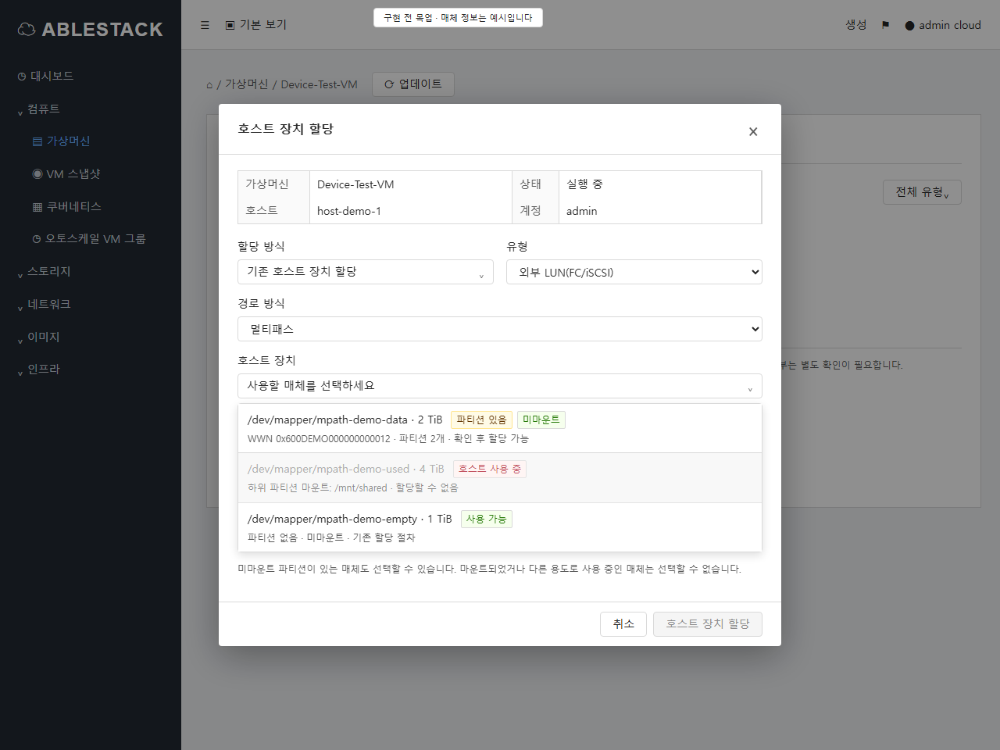
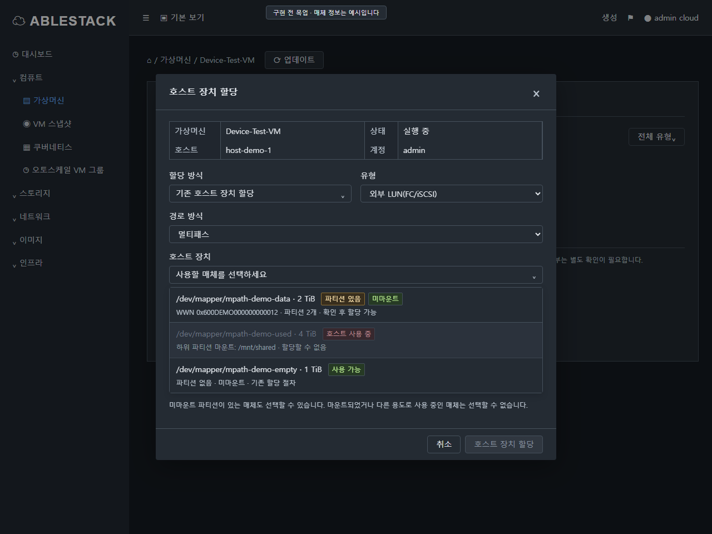
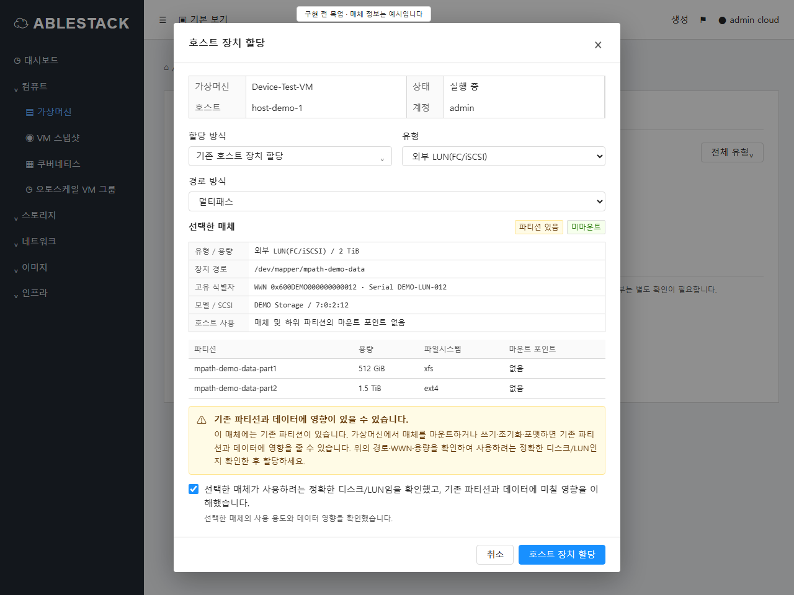
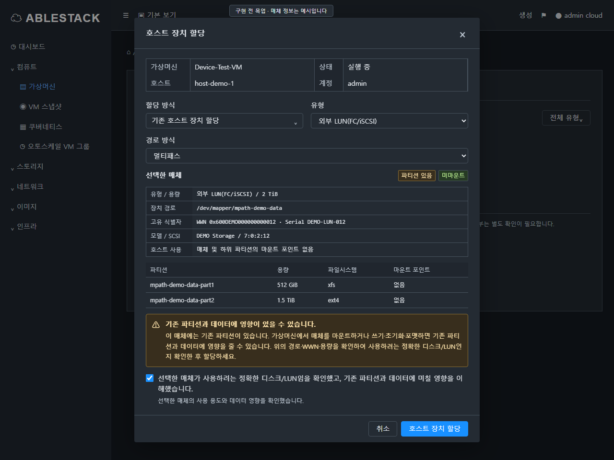
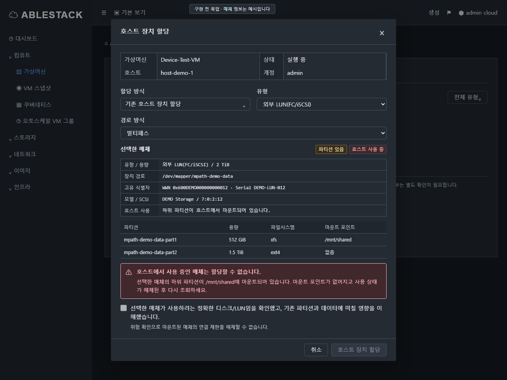
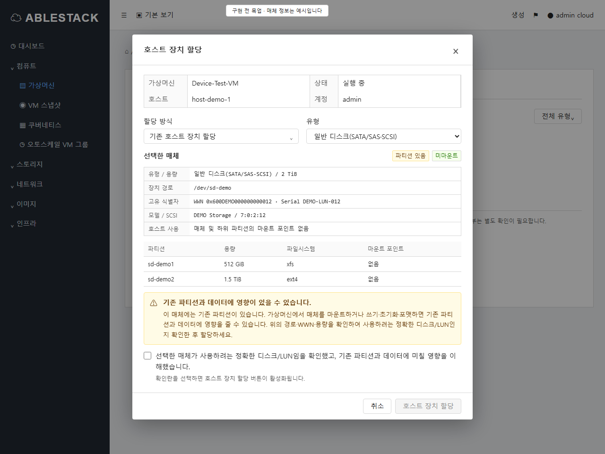
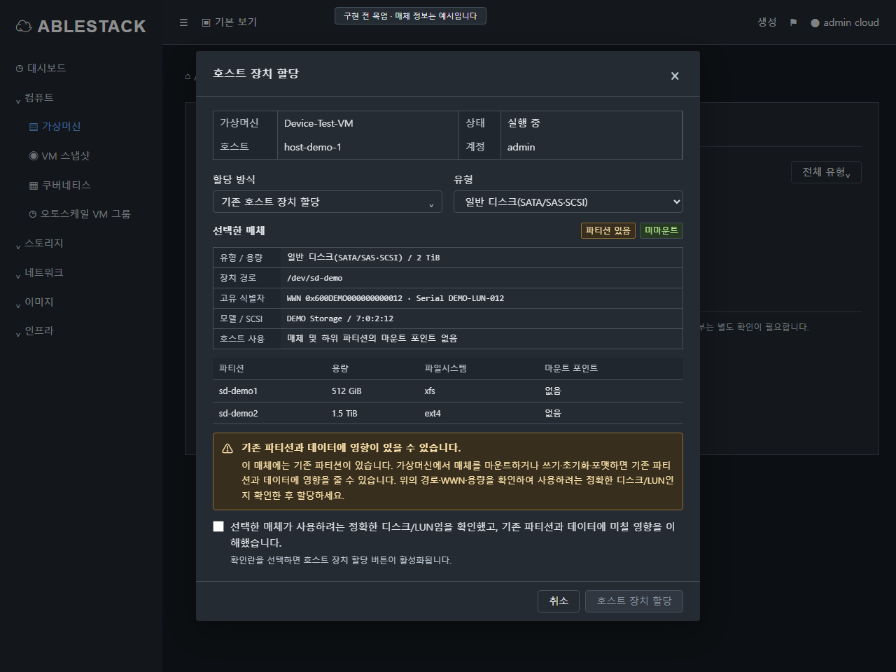
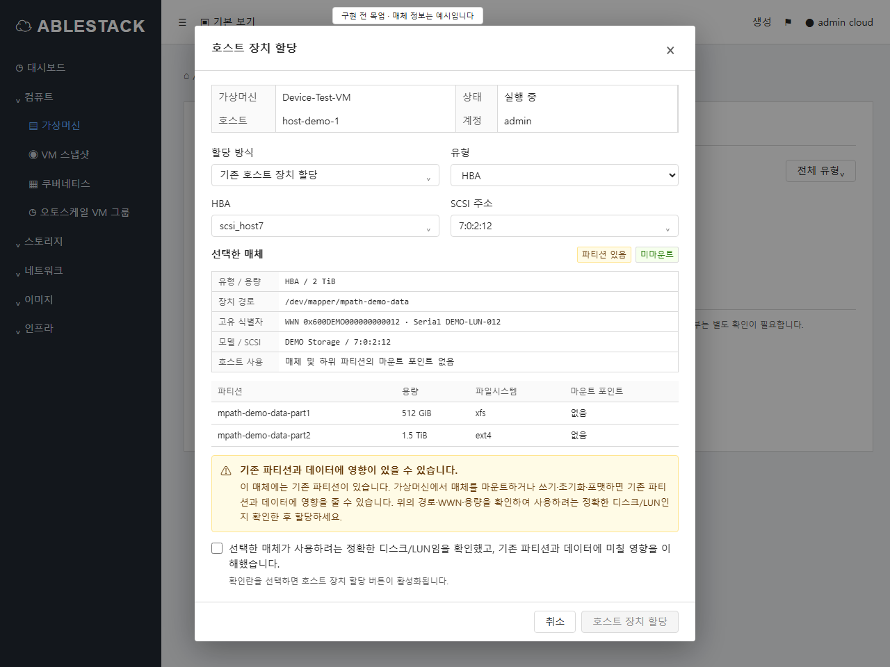
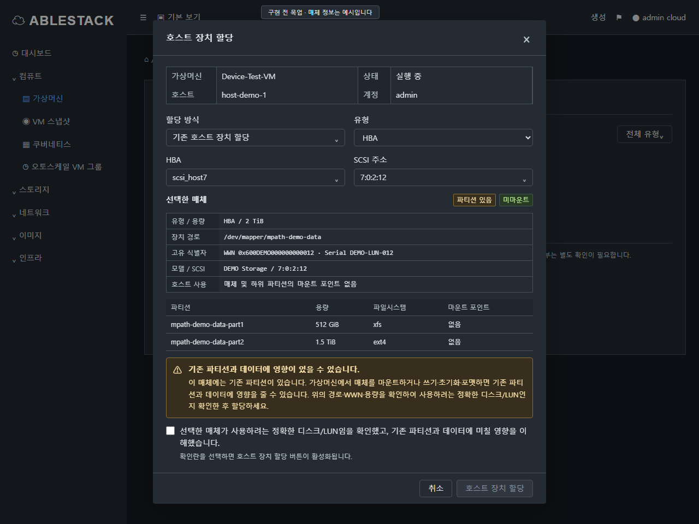

<!--
Licensed to the Apache Software Foundation (ASF) under one
or more contributor license agreements. See the NOTICE file
distributed with this work for additional information
regarding copyright ownership. The ASF licenses this file
to you under the Apache License, Version 2.0 (the
"License"); you may not use this file except in compliance
with the License. You may obtain a copy of the License at

  http://www.apache.org/licenses/LICENSE-2.0

Unless required by applicable law or agreed to in writing,
software distributed under the License is distributed on an
"AS IS" BASIS, WITHOUT WARRANTIES OR CONDITIONS OF ANY
KIND, either express or implied. See the License for the
specific language governing permissions and limitations
under the License.
-->
# 호스트 장치의 미마운트 파티션 매체 할당 — 구현 전 설계

기준: Europa `5e67b05335ee696594938510238ec1f0be162d79`, 2026-10-01.
이번 산출물은 개선 이슈와 목업이며 실제 UI/API/Mold Agent 수정, 모듈 빌드, 배포, 매체 연결을 수행하지 않는다.
목업 VM·호스트·경로·WWN·파티션은 모두 예시이며 실제 클러스터 매체를 할당하라는 지시가 아니다.

## 현행 확인

31번 U26-Sparse VM에서 기존 720px 호스트 장치 할당 대화상자를 열고 LUN 후보를 조회했다.
파티션이 있는 LUN 네 개와 파일시스템으로 분류된 후보 한 개가 비활성화되어 있었다.
실제 할당은 누르지 않고 취소했다. 이 관찰은 해당 실제 매체가 미마운트 상태라는 증거가 아니다.
소스의 차단 조건도 다음 경로에서 확인했다.

- `ui/src/utils/vmDevices.js:34`: haspartitions가 참이면 deviceusagestatus보다 먼저 partitioned로 분류.
- `ui/src/views/compute/VmDevicesTab.vue:63`: usage가 available이 아니면 후보 비활성화.
- `ui/src/views/compute/VmDevicesTab.vue:116`: HBA/VHBA의 SCSI 선택도 같은 조건으로 비활성화.
- `core/src/main/java/com/cloud/resource/HostBlockDeviceSafety.java:130`: 마운트, 일반 파일시스템, 파티션을 차단 사유로 분류하고 부모/자식/WWN 관계로 전파.
- `core/src/main/java/com/cloud/resource/ServerResourceBase.java`: LUN/SCSI/HBA/VHBA 모두 연결 직전에 HostBlockDeviceSafety로 available만 허용.
- 현재 HostBlockDeviceSafetyTest는 미마운트 파티션 거부를 정답으로 규정한다.

## 변경 원칙

1. 실제 연결 대상인 매체 및 하위 파티션·동일 WWN/멀티패스 별칭에 마운트 포인트가 없고, 다른 사용·할당 제한이 없으면 파티션이 있어도 확인 후 허용한다.
2. 파티션 내 일반 파일시스템의 존재는 경고 정보로 취급한다. 현재 LVM/RAID/swap/호스트 볼륨·다른 VM 할당·미확인 상태 차단은 유지한다. 마운트가 비어 있다는 이유만으로 다른 사용 상태를 available로 덮어쓰지 않는다.
3. HBA/VHBA는 어댑터 이름만 확인하지 않고 선택한 SCSI 주소에 해당하는 매체를 판정한다. HBA 전체 PCI passthrough 정책 변경은 범위 밖이다.
4. 파티션 여부와 실제 사용/마운트 여부를 분리해 응답한다. UI는 파티션 존재로 mounted 등의 근본 차단 사유를 가리지 않는다.
5. 목록 조회와 최종 연결의 조건을 일치시킨다. 서버/Agent에서도 파티션 위험 확인 여부와 실행 직전 실제 상태를 검사해 UI 우회·상태 변경을 거부한다.
6. 마운트 포인트는 부모의 단일 MOUNTPOINT만 보지 않고 하위·별칭 전체를 검사한다. lsblk MOUNTPOINTS 및 findmnt/mountinfo를 이용하고, 지원하지 않는 호스트에서는 검사 불능을 미사용으로 간주하지 않는다.
7. VM 스냅샷/권한/상태/할당 조건, 파티션 없는 매체의 기존 절차와 해제 절차는 보존한다. 자동 unmount·wipe·mkfs·파티션 변경은 하지 않는다.

## UI

기존 상단 `호스트 장치 할당 → reload + 업데이트`와 720px 대화상자, 하단 오른쪽 `취소 → 호스트 장치 할당`을 보존한다.
선택한 매체의 경로, WWN/Serial, 용량, 모델, SCSI 주소, 파티션 목록/파일시스템/마운트 포인트를 보여준다.
미마운트 파티션 후보는 선택 가능하고, 위험 확인 체크 전 최종 할당은 비활성화한다.
매체/유형/호스트/SCSI 주소 변경 시 확인을 초기화한다. 실제 장치 식별이 불가능하면 계속 차단한다.

경고: **기존 파티션과 데이터에 영향이 있을 수 있습니다.**

> 이 매체에는 기존 파티션이 있습니다. 가상머신에서 매체를 마운트하거나 쓰기·초기화·포맷하면 기존 파티션과 데이터에 영향을 줄 수 있습니다. 위의 경로·WWN·용량을 확인하여 사용하려는 정확한 디스크/LUN인지 확인한 후 할당하세요.

확인: **선택한 매체가 사용하려는 정확한 디스크/LUN임을 확인했고, 기존 파티션과 데이터에 미칠 영향을 이해했습니다.**

할당 자체가 자동 포맷한다는 의미로 표현하지 않는다. 실제 연결 시점의 재검사가 실패하면 구체적인 사용 사유를 표시하며 확인으로 우회하지 못한다.

## 목업 재현

mockup.html의 `theme=light|dark`, `scene=candidates|confirm|acknowledged|blocked`로 일반/다크 및 선택·확인 전/후·마운트 차단 상태를 표시한다.
확인란과 유형 변경은 목업 내 로컬 상태만 바꾸며 API를 호출하지 않는다.
실제 개발 후에는 API/Core/Server/KVM 변경 모듈 빌드 및 31번의 별도 테스트 매체로 기능 검증해야 한다.

## 구현 단계와 검증 계획

- 1단계: Agent의 읽기 전용 매체 검사 결과를 구조화하고 파티션 존재와 마운트·사용 차단을 분리. 고정된 차단 사유 우선순위로 부모/자식/별칭을 종합.
- 2단계: listHostLunDevices/listHostScsiDevices 응답과 HBA/VHBA 선택 경로에 경고·파티션·마운트 정보 제공. updateHostLunDevices/updateHostScsiDevices/updateHostHbaDevices/updateHostVhbaDevices의 연결 명령에는 `acknowledgepartitionrisk`(기본 false) 전달·최종 검사. 파티션 없는 기존 호출은 계속 호환.
- 3단계: 기존 대화상자에 식별 정보·경고·필수 확인 추가. 선택 변경 시 확인 취소, 실제 mounted/unknown/다른 사용 사유 우선 표시. 일반·다크 가독성/간격과 상단/하단 버튼 배치 보존.
- 4단계: HostBlockDeviceSafety·Agent guard·API 및 VmDevices 회귀. 미마운트 파티션+일반 FS 허용, 체크 전 거부, API 직접 미확인 거부, 하위/별칭 마운트 거부, active swap/LVM/RAID/다른 VM 거부, 확인 후 마운트된 race 거부, 오류/빈 응답 차단, 파티션 없는 매체·해제·스냅샷 조건 회귀.
- 5단계: WSL ext4 변경 Maven 모듈 및 UI 빌드, 테스트 클러스터의 폐기 가능한 독립 매체 배포/연결/해제와 기존 파티션·파일 보존 확인. 제품의 실제 GFS2/운영 LUN을 시험 데이터로 사용하지 않는다.

## 참고

- [lsblk 공식 매뉴얼: MOUNTPOINT와 MOUNTPOINTS, 다중 경로](https://man7.org/linux/man-pages/man8/lsblk.8.html)
- [findmnt 공식 매뉴얼: 현재 마운트 조회](https://man7.org/linux/man-pages/man8/findmnt.8.html)

## 목업 점검 결과

1280×960에서 기존 720px 대화상자의 본문·버튼이 잘리지 않고 페이지 가로 넘침이 없었다.
4개 상태 × 일반/다크 8장과 일반 디스크/HBA × 일반/다크 4장, 총 12장을 렌더링했다.
확인란 선택 시 할당 버튼 활성화, 디스크/HBA 유형 변경 시 확인 초기화와 버튼 비활성화를 실제 목업 UI에서 확인했다.
마운트 차단 상태의 확인란과 할당 버튼은 비활성화된다. 이는 목업 상호작용 확인이며 실매체 기능 검증은 아니다.
본문/확인 문구 대비는 일반 15.13:1·다크 11.41:1, 경고/파티션 표시 대비는 일반 10.10:1·다크 10.83:1이었다.

| 상태 | 일반 | 다크 |
|---|---|---|
| 후보 선택 |  |  |
| 위험 확인 전 |  |  |
| 위험 확인 후 |  |  |
| 마운트 사용 중 차단 |  |  |
| 일반 디스크 |  |  |
| HBA의 선택 매체 |  |  |
