# ISO 탭 및 연결/해제 목업

검토용 설계 자료입니다. 실제 API 호출이나 VM 변경은 없습니다.

## 열기

`mockup.html`을 다운로드하여 브라우저로 열거나 로컬 미리보기에서 확인합니다. 외부 라이브러리·인터넷 연결이 필요하지 않습니다.

상단 화면 상태 선택으로 0개/1개/2개 연결, 조회 실패, 조회 전용 상태를 바꿀 수 있습니다. 다크/라이트 전환, 연결 대화상자, 행별 작업 및 선택 해제, 완료·부분 실패·결과 미확인 화면을 조작할 수 있습니다. 진행 화면의 예시 버튼은 실제 제품 버튼이 아닌 목업 검토용입니다.

## 화면 설계

- ISO 0개여도 탭 유지. 볼륨/VM 스냅샷 형태의 툴바와 테이블, 검색, 페이지 구성.
- 연결 버튼 → 선택 연결 해제 → 새로고침 아이콘 → 우측 검색.
- 장치별 ISO 행과 연결 상태. 좌측 요약도 같은 최신 데이터로 갱신.
- 행 작업은 연결 해제 → 상세 순서. 파일 삭제 또는 부팅 순서 변경과 구분.
- 연결 대화상자: VM/Zone/계정 명시, 준비된 ISO만 선택, 연결된 항목 제외, 추가 가능 수 안내.
- 개별 작업 완료 확인 후 다음 요청. 성공/실패/결과 미확인 분리 및 명시적 실패만 재시도.
- 중앙 정렬 대화상자, 제목/하단 버튼 고정, 본문만 스크롤. 다크 모드 보조 문구 대비 유지.
- 숫자 2는 목업 예시이며 실제 구현은 isomaxcount 및 권한/VM/호스트 상태를 따름.
- VMware 강제 해제 등 기존 하이퍼바이저별 옵션은 해당 지원 환경에서만 조건부로 노출. 본 목업은 KVM 예시.

## 브라우저 확인

1123×856에서 연결 대화상자의 세로 중앙 오차 0px, 본문 overflow-y:auto 확인. 2개 선택 → 진행/결과, 선택 2개 해제 → 0개 목록과 ISO 탭 유지, 상세 대화상자, 라이트/다크 전환을 직접 조작했습니다.

## 이미지

|화면|미리보기|
|---|---|
|다크 목록|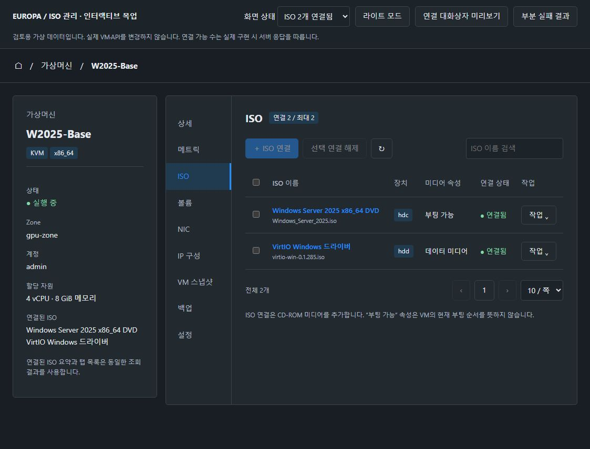|
|ISO 연결|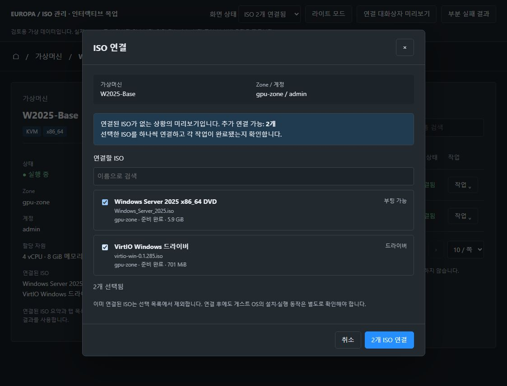|
|진행|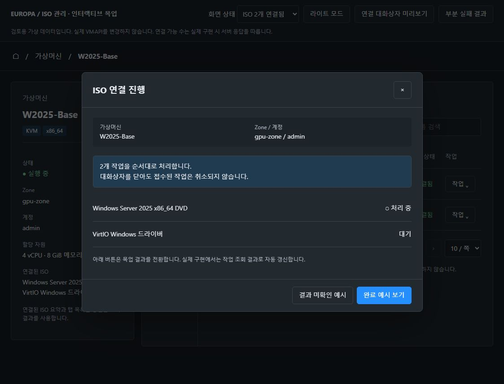|
|결과 미확인|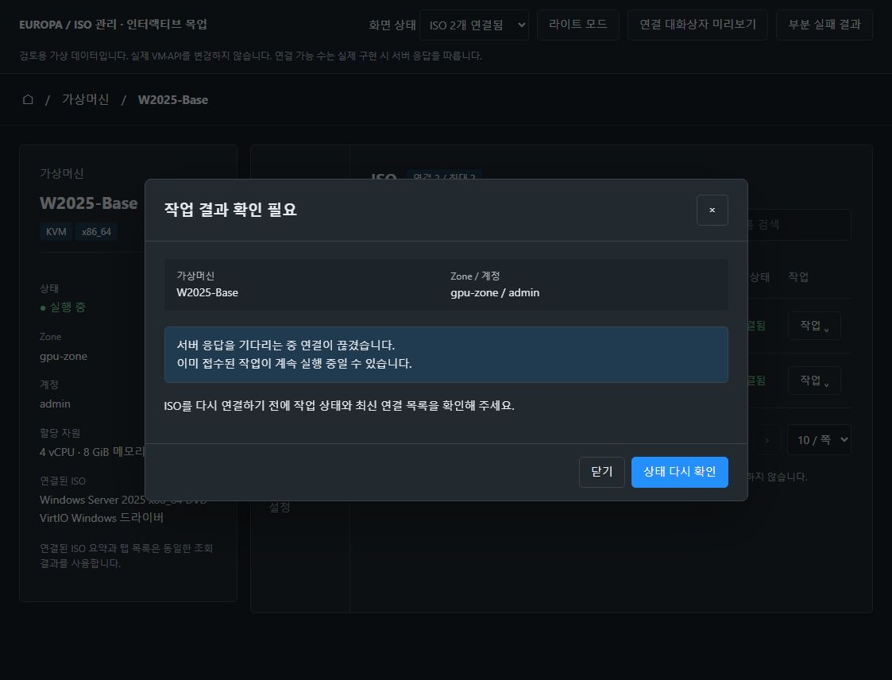|
|부분 실패|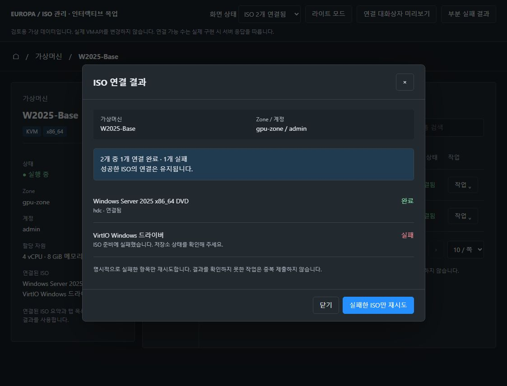|
|선택 해제|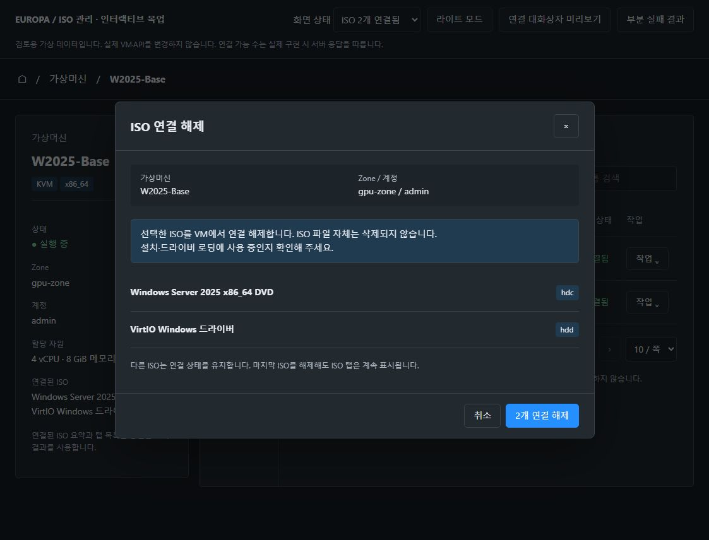|
|완료|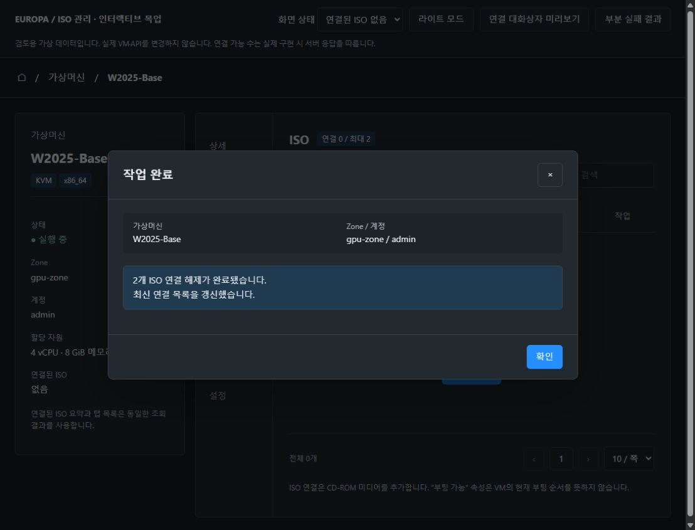|
|빈 목록|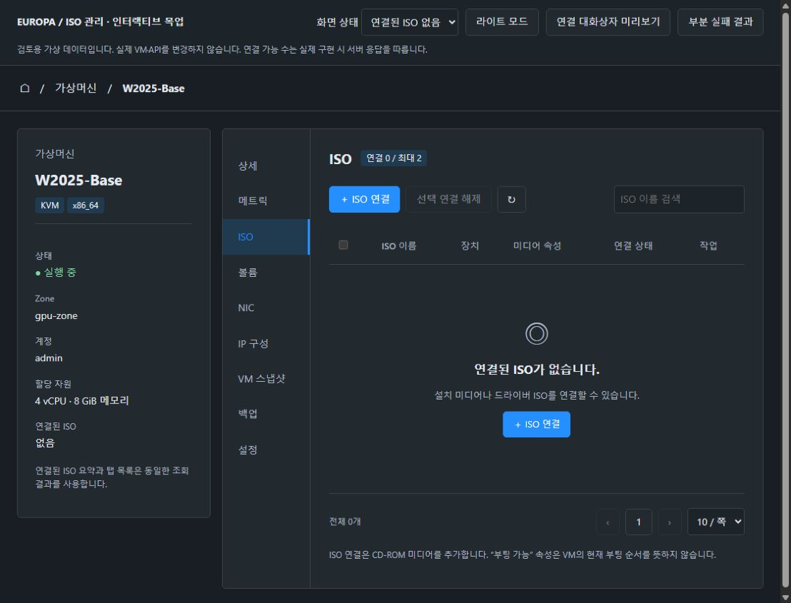|
|라이트 빈 목록|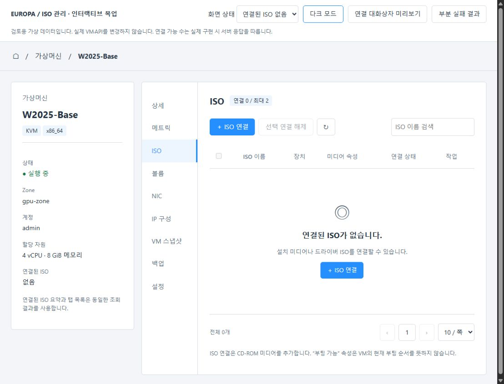|
|라이트 연결|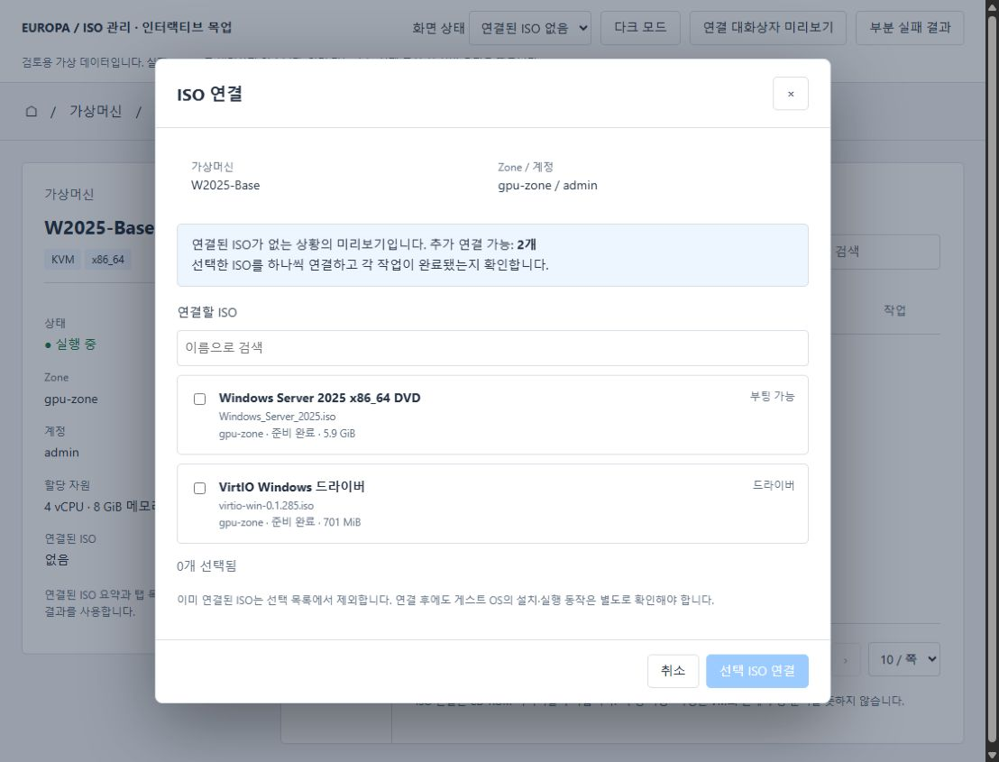|
|라이트 목록|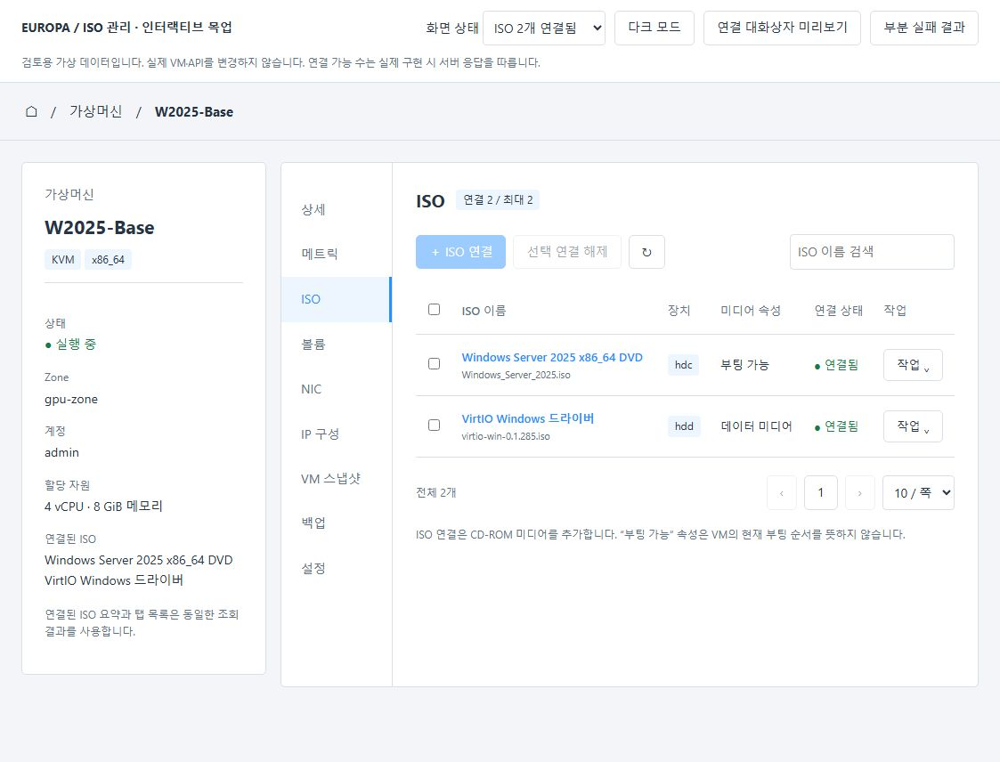|
|ISO 상세|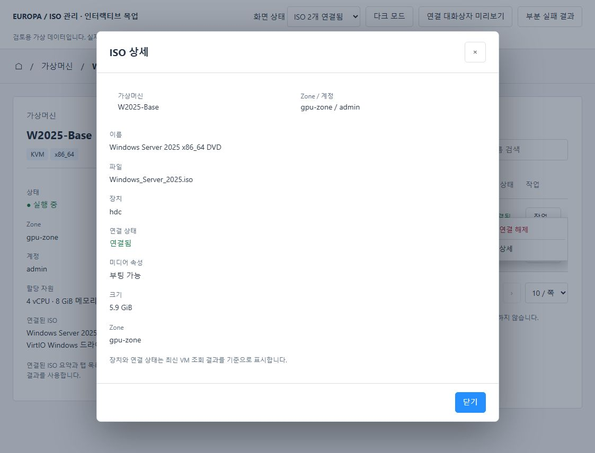|
|조회 실패|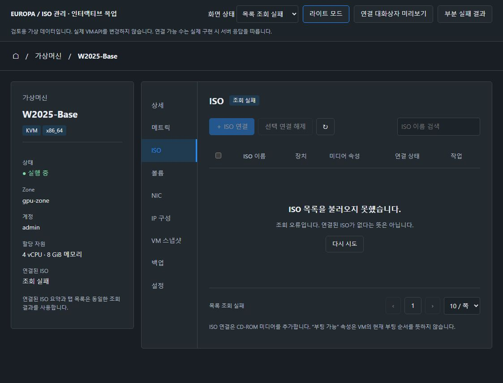|
