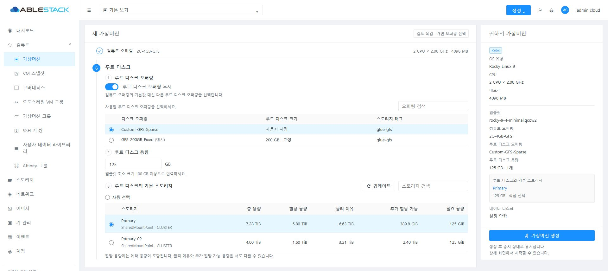
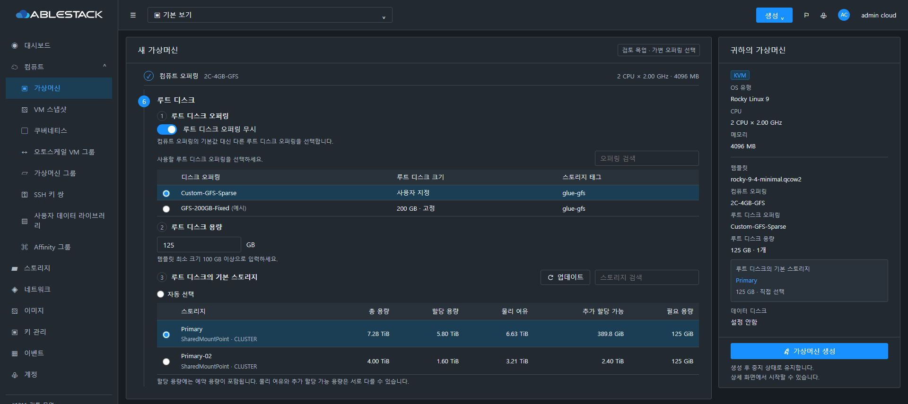
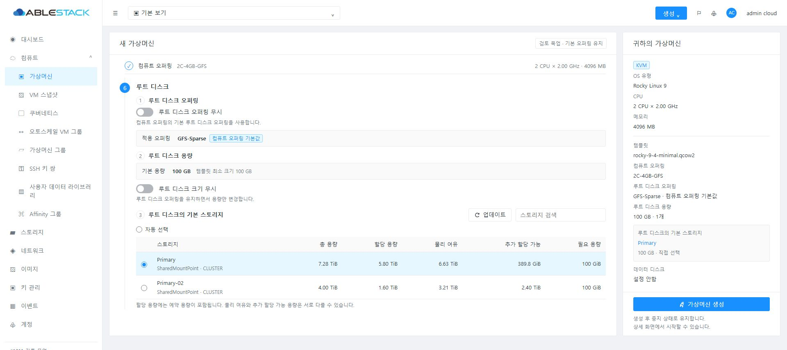
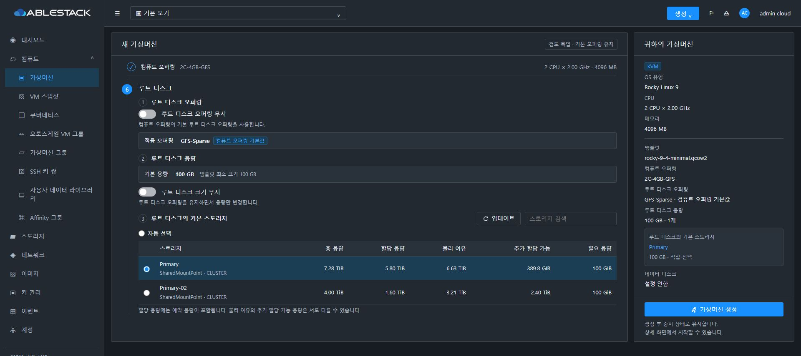
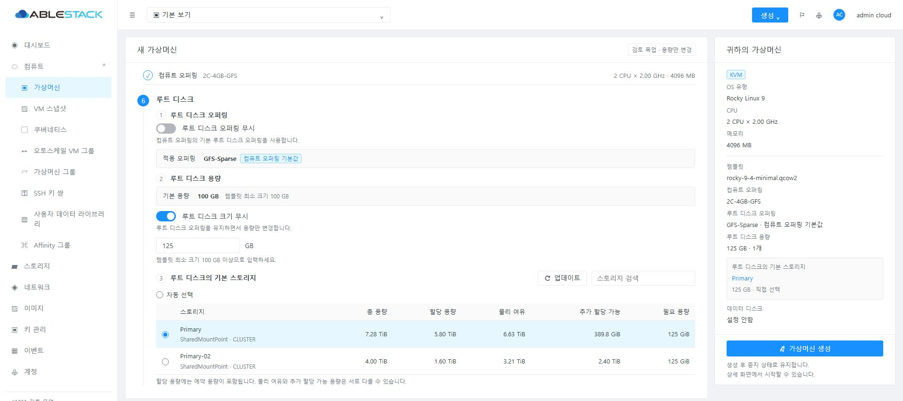
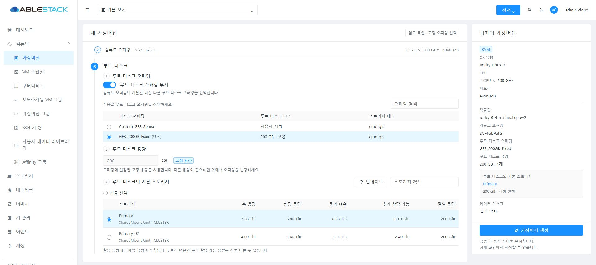
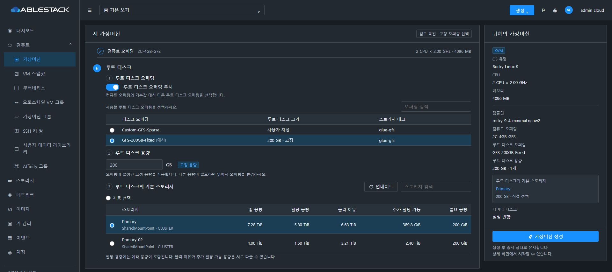
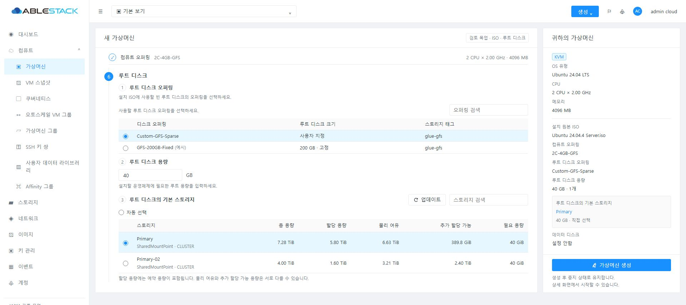
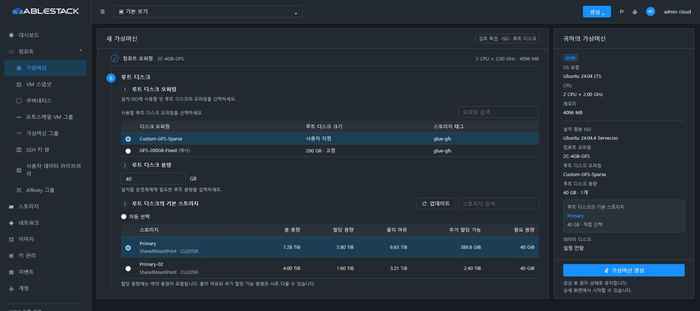

<!--
Licensed to the Apache Software Foundation (ASF) under one
or more contributor license agreements. See the NOTICE file
distributed with this work for additional information
regarding copyright ownership. The ASF licenses this file
to you under the Apache License, Version 2.0 (the
"License"); you may not use this file except in compliance
with the License. You may obtain a copy of the License at

  http://www.apache.org/licenses/LICENSE-2.0

Unless required by applicable law or agreed to in writing,
software distributed under the License is distributed on an
"AS IS" BASIS, WITHOUT WARRANTIES OR CONDITIONS OF ANY
KIND, either express or implied. See the License for the
specific language governing permissions and limitations
under the License.
-->

# #1211 루트 디스크 입력 순서 검토 목업

2026-10-02. 구현 PR #1215의 head `195e6f140807c03f2358c35884efd5bb14b74e83`를 기준으로 만든 **검토용 설계**다. 이 커밋은 문서·정적 HTML·목업 이미지에 한정하며 제품 UI/API, 테스트 클러스터와 구현 PR을 변경하지 않는다.

## 수정 이유와 제안 순서

현재 템플릿 생성 화면은 컴퓨트 오퍼링 아래에 루트 스토리지 표가 먼저 있고, 그 아래에 크기 무시·오퍼링 무시와 오퍼링 선택 표가 있다. 더 아래에서 오퍼링을 바꾸면 위쪽 후보 표가 바뀌므로 입력 흐름과 의존성이 뒤집혀 있다.

**컴퓨트 오퍼링 → 루트 디스크 오퍼링 결정 → 루트 용량 결정 → 루트 기본 스토리지 선택** 순서로 정리한다.

컴퓨트 다음에 하나의 **루트 디스크** 영역을 두고, 내부를 오퍼링 / 용량 / 기본 스토리지 순으로 배치한다. 번호는 목업에서 하위 관계와 입력 순서를 확인하기 위한 표시다. 기존 컴퓨트 표, 데이터 디스크 단계, 우측 요약 및 버튼 모양을 유지한다.

| 상태 | 오퍼링 영역 | 용량 영역 | 스토리지 영역 |
| --- | --- | --- | --- |
| 기본값 유지 | 오퍼링 무시 꺼짐. 현재 적용 오퍼링과 기본값 출처 표시 | 기본 용량 및 크기 무시 옵션 표시 | 기본 오퍼링·용량에 맞는 후보 |
| 용량만 변경 | 기본 오퍼링 유지 | 크기 무시를 켜면 용량 입력 | 변경한 용량으로 후보·필요 용량 재확인 |
| 다른 가변 오퍼링 | 오퍼링 무시 켜짐, 바로 아래 선택 표 | 선택한 가변 오퍼링의 용량 입력. 별도 크기 무시 스위치는 숨김 | 선택 오퍼링·입력 용량에 맞는 후보 |
| 다른 고정 오퍼링 | 오퍼링 무시 켜짐, 고정 오퍼링 선택 | 고정 크기 읽기 전용 및 고정 용량 표시. 크기 무시 스위치는 숨김 | 선택 오퍼링·고정 용량에 맞는 후보 |
| ISO | 필요한 루트 오퍼링 선택. 템플릿용 무시 옵션 없음 | 고정이면 읽기 전용, 가변이면 필수 입력 | 오퍼링·용량을 결정한 다음 후보 선택 |

오퍼링 무시가 켜진 동안 기존의 크기 무시 옵션은 이미 비활성화되는 관계다. 목업은 그 옵션을 숨기고 선택 오퍼링의 용량 입력으로 관계를 명확히 표현한다. API 계약이나 허용 범위를 바꾸자는 제안이 아니다.

컴퓨트의 루트 오퍼링 강제 정책, 템플릿 최소 크기와 deploy-as-is, KMS·IOPS 등 기존 제약은 유지한다. 강제 정책이 있는 경우 무시 옵션을 비활성화하고 이유와 적용 오퍼링을 표시한다. 고정 용량을 가변 입력으로 바꾸지 않는다.

오퍼링/용량 변경 시 **아래에 있는** 스토리지 후보와 우측 요약을 갱신한다. 표 전체를 숨기거나 초기화하지 않고, 유효한 선택은 유지하며 사용할 수 없으면 이유와 재선택 요구를 표시한다. 기본 자동 선택도 유지한다.

## 목업

오퍼링 이름, 용량과 스토리지 수치는 화면 배치 설명용 예시다. 실제 클러스터 후보나 기본 오퍼링을 보장하는 화면이 아니다.

### 가변 오퍼링 선택

### 기본 오퍼링 유지

### 기본 오퍼링 유지·용량만 변경

### 고정 오퍼링 선택

### ISO 루트

## 검토 및 후속 반영 범위

- CUA 브라우저에서 일반/다크 모드 목업을 직접 렌더링하고 오퍼링 → 용량 → 스토리지의 DOM 좌표 순서를 확인했다.
- 기본 오퍼링의 크기 무시 스위치와 별도 오퍼링의 고정/가변 용량 표현을 확인했다.
- 오퍼링 무시 전환 시 선택 표가 펼쳐지고, 하위 크기 무시 스위치가 숨겨지는 목업 상태를 확인했다.
- 검토 목업은 정적 예시이며 실제 후보 조회, VM 배포나 API 검증 결과를 뜻하지 않는다.
- 사용자 검토 후 PR #1215에 배치와 조건부 표시를 반영하고, UI 빌드·클러스터 배포·일반/다크 모드 검증으로 확인한다. #1211은 열린 상태로 유지한다.

[정적 목업 소스](mockup.html). 로컬 HTTP 서버로 이 디렉터리를 제공해 열 수 있다. `?state=default|size|custom|fixed|iso&theme=dark&capture=1`은 검토 이미지 상태를 선택한다. `capture=1`을 생략하면 검토용 상태/테마 선택기가 표시된다.
