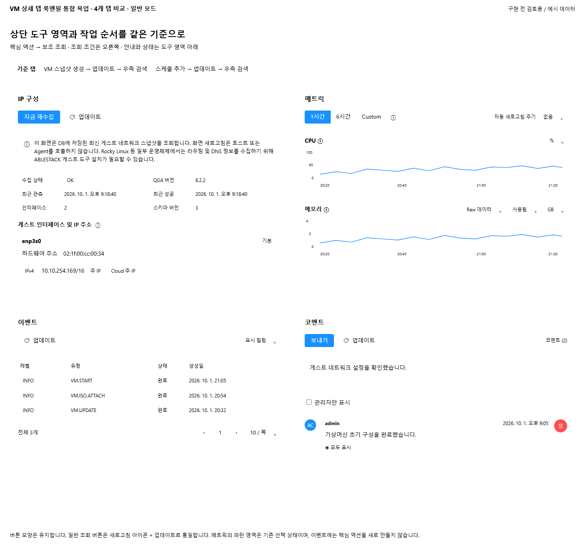
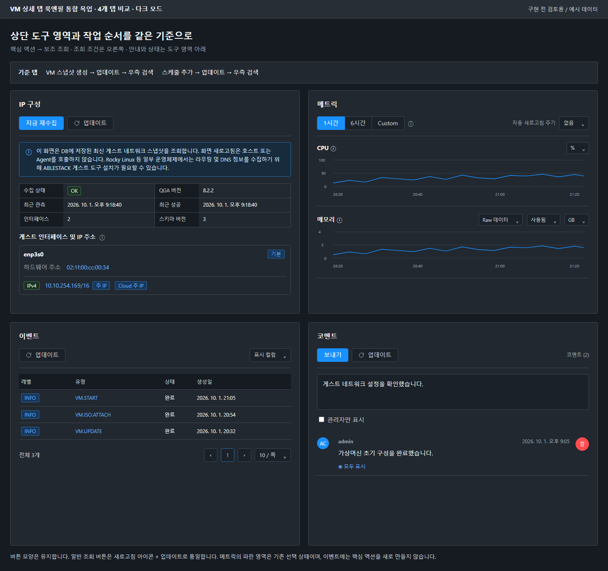

<!--
Licensed to the Apache Software Foundation (ASF) under one
or more contributor license agreements. See the NOTICE file
distributed with this work for additional information
regarding copyright ownership. The ASF licenses this file
to you under the Apache License, Version 2.0 (the
"License"); you may not use this file except in compliance
with the License. You may obtain a copy of the License at
http://www.apache.org/licenses/LICENSE-2.0
Unless required by applicable law or agreed to in writing,
software distributed under the License is distributed on an
"AS IS" BASIS, WITHOUT WARRANTIES OR CONDITIONS OF ANY
KIND, either express or implied. See the License for the
specific language governing permissions and limitations
under the License.
-->

# VM 상세 탭 룩앤필 통합 설계

2026-10-01, Europa `ca36cbc0ff65e06d55f344ccd42958193c974a03` 기준의 **구현 전 목업**이다.
운영 UI 소스 수정, 빌드, 클러스터 배포, 기능 검증 결과를 의미하지 않는다.
목업의 VM·차트·이벤트·코멘트 데이터는 배치 검토를 위한 예시다.

## 변경 범위 제한

**이미 표준에 맞는 UI는 수정하지 않는다.** 전 탭의 일괄 리팩터링·컴포넌트 교체·재디자인을 하지 않으며 차이가 확인된 부분만 수정한다.
스케줄·ISO·프로세스·설정·호스트 장치의 현재 표준 배치는 유지한다.
VM 스냅샷·볼륨·NIC는 조회 버튼 표기가 다를 경우 아이콘 + 업데이트만 통일하고 배치와 나머지 UI는 유지한다.
표준에 맞는 탭은 회귀 확인 대상이며 수정 대상이 아니다.
공유 StatsTab·EventsTab·AnnotationsTab은 VM 전용 옵션/호출부로 적용 범위를 제한하고 다른 자원 상세 화면을 변경하지 않는다.

## 공통 배치 기준

VM 스냅샷의 `snapshot-toolbar`와 스케줄의 `schedule-toolbar`를 기준으로 한다.
기존 버튼의 색상, 형태, 크기는 보존한다. **일반 조회·새로고침 버튼은 모든 VM 상세 탭에서 새로고침 아이콘(`reload-outlined`) + `업데이트` 문구로 통일한다.** 다른 업무 액션의 문구·아이콘은 보존한다.

- `새로고침`, `갱신` 등 조회 의미의 기존 버튼은 `업데이트`로 통일하고 텍스트 없는 조회 아이콘 버튼도 같은 표기 기준을 적용한다. 툴팁·접근성 이름도 일치시킨다. `지금 재수집`, `QGA 권한 다시 확인` 등의 별도 업무 동작은 이름을 바꾸지 않는다. 공유 번역 키를 전역 수정하여 다른 자원 화면의 문구를 바꾸지 않도록 VM 범위로 적용한다.
- 상단 왼쪽: 실제 핵심 액션 → 보조 조회 액션. 간격 8px, 기본 버튼 높이 32px.
- 상단 오른쪽: 해당 탭에 이미 존재하는 검색·필터·조회 조건. 본문과의 간격 20px.
- 안내문·상태 메시지: 상단 도구 영역 아래의 독립 영역. 버튼과 혼합하지 않는다.
- 대상별 작업: 해당 데이터 행/항목 안에 유지한다. 본문 사이·바닥에 전역 작업 버튼을 흩어 배치하지 않는다.
- 페이지 이동: 목록 아래 오른쪽. 첫 로딩과 데이터 갱신을 구분하고, 갱신 때 화면/목록/작성 내용을 제거하지 않는다.
- 조회 전용 탭은 의미 없는 파란 핵심 액션을 만들지 않는다. 메트릭 기간 선택의 파란색은 기존 선택 상태다.
- 일반/다크 모드의 의미별 색상 토큰을 재사용한다. 모드 간 구조·여백·작업 순서는 동일하다.
- 기존 대화상자의 제목·본문·하단 확인/취소 정렬을 기준 탭과 일치시킨다. 배치 변경만을 위해 새 확인 절차를 추가하지 않는다.
- 모바일에서는 현재 탭 표시 규칙과 액션 순서를 유지하고 조회 조건만 다음 줄로 감싼다.

## 집중 개선 4개 탭

| 탭 | 현재 차이 | 목업/개선 방향 | 주요 소스 |
|---|---|---|---|
| IP 구성 | 안내문 옆 오른쪽에 업데이트 → 지금 재수집이 배치됨 | 지금 재수집 → 업데이트를 상단 왼쪽에 배치하고 안내문을 아래로 이동. NIC 탭과 다른 `GuestNetworkTab`임에 유의 | `GuestNetworkTab.vue` |
| 메트릭 | 기간·도움말·자동 새로고침이 한 컨테이너에 이어지고 차트별 컨트롤 간격이 다름 | 기간 선택은 왼쪽, 자동 새로고침은 오른쪽. 기존 차트와 옵션은 제목 줄에 정렬 | `StatsTab.vue`, `StatsTab.scss` |
| 이벤트 | 표부터 시작하며 조회 도구가 분명하지 않고 페이지 이동 기준이 다름 | 기존 `fetchData/listEvents`로 상단 업데이트 버튼 제공. 표시 컬럼 선택을 오른쪽에 모으고 하단 페이지 이동 정렬 | `EventsTab.vue`, `ListView.vue` |
| 코멘트 | 작성 폼 아래 오른쪽에 보내기, 페이지 이동은 작성 폼 위에 있음 | 보내기를 상단 왼쪽으로 이동, 기존 조회 함수로 업데이트 제공. 작성 영역 아래 목록, 그 아래 우측 페이지 이동. 원형 삭제 버튼은 항목에 유지 | `AnnotationsTab.vue` |

이벤트·코멘트의 상단 업데이트는 기존 조회 함수를 재사용하는 UI 접근점이다.
새 API나 데이터 계약은 만들지 않는다. 이벤트의 표시 컬럼 선택은 기존 컬럼 선택 기능을 재배치한다.
코멘트 보내기의 `addAnnotation`, 관리자 전용 표시, 삭제·표시 권한 및 Ctrl+Enter 동작을 보존한다.

## 전체 탭 점검표

31번 클러스터의 Ubuntu24-Process (`90af4c7f-298f-4b43-afc3-8192f8ee13e0`)에서
현재 노출된 13개 탭을 브라우저로 조회했다. 아래 조건부 5개 탭은 `InstanceTab.vue`와 해당
컴포넌트의 소스 검토 대상이며, 이 VM에서의 실화면 검증으로 간주하지 않는다.

| 탭 | 현재 점검 | Epic의 처리/검증 |
|---|---|---|
| 상세 | 브라우저 조회 | 정보의 레이블·값·간격과 다크 모드 일치 |
| IP 구성 | 브라우저 조회 + 목업 | 도구 영역 위치·순서 집중 개선 |
| 메트릭 | 브라우저 조회 + 목업 | 기간/새로고침/차트 컨트롤 집중 개선 |
| 프로세스 | 브라우저 조회 | 현재 표준 배치 유지, 무깜빡임 갱신 회귀 |
| 스케줄 | 브라우저 조회 | 기준 탭, 수정 제외; 대화상자·페이지 이동·간격 회귀 |
| ISO | 브라우저 조회 | 현재 표준 UI 수정 제외; 상단/행 액션·필터·대화상자 회귀 |
| 볼륨 | 브라우저 조회 | 조회 표기만 통일; 현재 상단/행 배치 유지 |
| NIC | 브라우저 조회 | 조회 표기만 통일; 현재 상단/행 배치 유지 |
| 설정 | 브라우저 조회 | 현재 표준 UI 수정 제외; 읽기 전용 상태 회귀 |
| 호스트 장치 | 브라우저 조회 | 현재 표준 UI 수정 제외; 필터·상태 안내 회귀 |
| VM 스냅샷 | 브라우저 조회 | 기준 배치 유지; 조회 표기만 통일 |
| 이벤트 | 브라우저 조회 + 목업 | 조회 도구·표시 컬럼·페이지 이동 집중 개선 |
| 코멘트 | 브라우저 조회 + 목업 | 보내기·목록·페이지 이동 집중 개선 |
| 보안 그룹 | 조건부/소스 확인 | 전체 너비 수정 버튼을 표준 툴바에 배치; 권한과 그룹 변경 보존 |
| GPU | 조건부/소스 확인 | 공통 목록 도구·빈 상태·상세 링크 점검 |
| 백업 | 조건부/소스 확인 | 백업 보호 안내·액션·대화상자·권한 보존 |
| 장애 보호 | 조건부/소스 확인 | 보호 상태별 액션·진행 영역·대화상자·데이터 갱신 회귀 |
| DR 보호 | 조건부/소스 확인 | 상태/오류 안내·조회 도구·권한·상세 링크 회귀 |

조건부 5개 탭은 후속 구현 검증에서 기능이 활성화된 대표 VM을 선택해 일반/다크 모드로 확인한다.
한 종류의 표로 모든 정보를 강제 변환하지 않으며 차트·코멘트·설명 표의 정보 구조는 유지한다.
탭 순서(상세 → IP 구성 → 메트릭 → 프로세스 …), 탭 노출 권한 및 VM 상태 조건은 변경하지 않는다.

## 작업 순서와 완료 기준

1. 본 목업과 공통 배치 규칙 검토. 초기 브라우저/소스 점검을 기준선으로 확정.
2. 기준에 이미 맞는 탭은 변경 제외 목록으로 확정. 차이가 있는 툴바 위치·문구·간격만 VM 범위로 적용. 공유 컴포넌트는 VM 전용 옵션으로 범위를 제한하고 다른 자원 화면의 영향도도 확인.
3. IP 구성 → 메트릭 → 이벤트 → 코멘트를 순차 구현하고, 나머지 탭의 차이를 정리.
4. 현재 및 조건부 탭에서 일반/다크 모드, 데스크톱/모바일, 최초 로딩/빈 목록/오류/권한 제한/갱신을 검증.
5. 필요한 UI 빌드·테스트 배포 이후 실제 브라우저 좌표와 이미지, 기능 회귀 결과를 Epic에 기록.

완료 조건은 이미 표준에 맞는 UI의 변경 없음, 버튼 모양 보존, 일반 조회 버튼의 새로고침 아이콘 + 업데이트 표기 일치, 상단/행 작업 영역 일관성, 설명·표·차트·폼의 간격/대비 일관성,
검색/조회 조건/페이지 상태/코멘트 작성 내용을 보존하는 갱신, 기존 API·권한·동작 보존이다.
목업 이미지 게시만으로 구현 완료 또는 기능 검증 완료로 종료하지 않는다.
기존 프로세스 Epic #1199와 별도의 UI 개선 Epic으로 관리한다.

## 목업 검토

| 탭 | 일반 모드 | 다크 모드 |
|---|---|---|
| IP 구성 | [이미지](images/ip-light.png) | [이미지](images/ip-dark.png) |
| 메트릭 | [이미지](images/metrics-light.png) | [이미지](images/metrics-dark.png) |
| 이벤트 | [이미지](images/events-light.png) | [이미지](images/events-dark.png) |
| 코멘트 | [이미지](images/comments-light.png) | [이미지](images/comments-dark.png) |

[IP 구성 모바일 다크 모드](images/ip-mobile-dark.png).
`mockup.html`의 `?tab=ip|metrics|events|comments|overview&theme=light|dark`로 목업을 재현한다.
`layout-checks.json`은 목업만의 렌더링 오류·가로 넘침·버튼 높이/모서리·작업 순서·정렬 확인 기록이다.
