<!--
Licensed to the Apache Software Foundation (ASF) under one
or more contributor license agreements.  See the NOTICE file
distributed with this work for additional information
regarding copyright ownership.  The ASF licenses this file
to you under the Apache License, Version 2.0 (the
"License"); you may not use this file except in compliance
with the License.  You may obtain a copy of the License at

  http://www.apache.org/licenses/LICENSE-2.0

Unless required by applicable law or agreed to in writing,
software distributed under the License is distributed on an
"AS IS" BASIS, WITHOUT WARRANTIES OR CONDITIONS OF ANY
KIND, either express or implied.  See the License for the
specific language governing permissions and limitations
under the License.
-->

# VM 설정 탭 UI 개선안

## 분석 근거

- 31번 클러스터 CLVM-TEST-VM의 설정 탭을 조회했다. 실행 중 변경 차단 안내와 cpuNumber/memory/tpmversion/rootDiskController 세로 목록을 확인했다. VM 상태나 설정은 변경하지 않았다.
- `ui/src/components/view/DetailSettings.vue`: 전체 폭 점선 추가 버튼, 인라인 추가/편집, 삭제 Popconfirm. 검색과 페이징이 없다. Template 및 DR 리소스와 공유하므로 VM 범위를 분리하거나 opt-in하여 다른 화면의 회귀를 방지한다.
- `InstanceTab.vue`에서 VM 설정 탭이 해당 컴포넌트를 사용한다. `VmSnapshotsTab.vue`, `VmDevicesTab.vue`의 도구 모음/표/페이징을 UI 기준으로 삼는다.

## 개선 범위

- 탭 내부 별도 타이틀 없이 `설정 추가` → `업데이트` 텍스트 버튼, 오른쪽 검색.
- 표: 설정 이름 / 값 / 변경 가능 여부 / 작업. 이름과 값 검색, 10/20/50개 페이징, 새 검색 시 첫 페이지.
- 행 대표 작업 `편집`, 드롭다운 `설정 삭제`, 구분선, 마지막 `상세`. 읽기 전용·실행 중에는 변경 작업 차단, 상세 조회 유지. 비활성 이유를 텍스트/툴팁으로 제공.
- 추가/편집/삭제 확인/상세/비디오 장치 구성 대화상자. VM·상태는 레이블을 붙여 표시. 추가는 필수 이름/값 및 중복 키 검사, 편집은 이름 고정과 기존 값 비교. 취소·API 실패 시 원본 목록을 보존한다.
- 비디오 장치는 기존 1~4개 동작과 video.hardware[N]/video.ram[N] 규칙을 유지하고 교체될 설정을 명시한다. 별도 NVMe/장치 연결 기능은 추가하지 않는다.
- 긴 이름·값은 줄바꿈/툴팁, 상세에서 전체 확인. 설정 원본 키 자체는 번역 키 노출 오류로 취급하지 않는다.
- 조회 중/실패/빈 목록/검색 결과 없음/권한 없음 상태를 구분한다. 조회 실패 시 이전 데이터와 실패 안내를 유지하고 변경을 차단한다.

## 기존 API 및 보호 조건

| 용도 | 기존 API 및 입력 | 유의 사항 |
| --- | --- | --- |
| 최신 VM/설정 조회 | listVirtualMachines(id, details=all) | 상태, details, readonlydetails, alloweddetails 재확인 |
| 설정 후보 | listDetailOptions(resourcetype=UserVm, resourceid) | 후보 이름/값 자동완성 및 사용자 정의 입력 유지 |
| 템플릿 제한 | listTemplates(templatefilter=all, id) | ISO 기반 VM 예외, deployasis와 허용 설정 유지 |
| 추가/수정/삭제 | updateVirtualMachine(id, details[0].KEY, cleanupdetails) | 단일 삭제 전용 API 신설 없이 기존 전달 규칙 검증 |

- 관리자/소유자/프로젝트 범위와 updateVirtualMachine API 권한을 함께 검사한다.
- VM이 Stopped일 때만 변경. 제출 직전에 다시 조회해 상태 변경·읽기 전용·권한 변경을 반영한다.
- readonlydetails, deployasis/alloweddetails, extraconfig 제한을 보존한다. KVM TPM은 묶음 표시와 편집/삭제 금지를 유지한다.
- UpdateVMCmd의 cleanupdetails는 details 무시 및 삭제 의미가 있으므로 일반 단일 항목 삭제와 혼동하지 않는다. UserVmManagerImpl의 TPM 검증과 보호 키 처리를 변경하지 않는다. 마지막 편집 가능한 항목 삭제와 보호 설정만 남는 경우를 별도로 검증한다.
- 최신 설정으로 변경 후보를 만들되 선택한 항목 외 값은 보존한다. 갱신 간 충돌 감지 시 자동 덮어쓰기 대신 다시 확인하도록 안내한다. 서버 원자적 버전 검사를 새로 보장하는 변경은 범위 밖이다.
- 신규 API/DB 변경 없이 UI 중심 구현. 템플릿/DR 설정 화면은 이번 범위 밖이다.

## UI 원칙 및 완료 기준

- 모든 대화상자는 화면 수평·수직 중앙. 제목과 하단 버튼 고정, 본문만 스크롤. 좁은 화면에서도 입력 폭·버튼 간격·닫기 버튼 영역 유지.
- 기존 테마 토큰 적용. 다크모드 보조문구·값·비활성 선택지·툴팁·페이징 화살표에 검정 글자 또는 흰 배경이 남지 않게 한다.
- 실제 브라우저에서 다크/라이트, 1000×600과 일반 데스크톱, 긴 문자열, 빈/검색/오류/읽기 전용 상태 검증.
- 성공 후 서버 재조회, 실패 시 입력/목록 보존, 중복 제출 방지. 다른 설정·보호 키 불변 검증.
- 회귀 테스트: TPM 표시, ISO 템플릿, deployasis, 1~4개 비디오 장치, 취소, VM 전환/오래된 요청, API 실패.

## 이미지 목업

아래는 예시 데이터로 제작한 정적 디자인 이미지이며 실제 설정 변경 결과가 아니다. HTML은 이미지 재생성용이며 동작 프로토타입이 아니다.

### 표 및 작업 메뉴

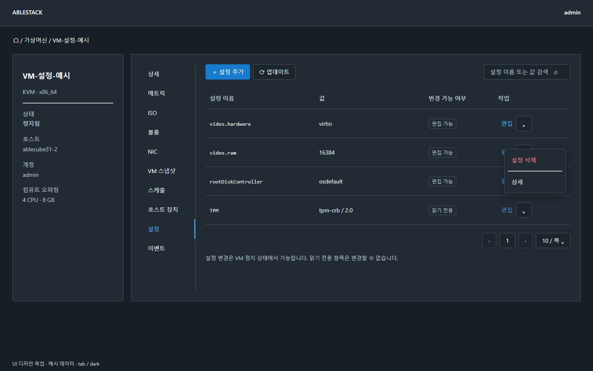

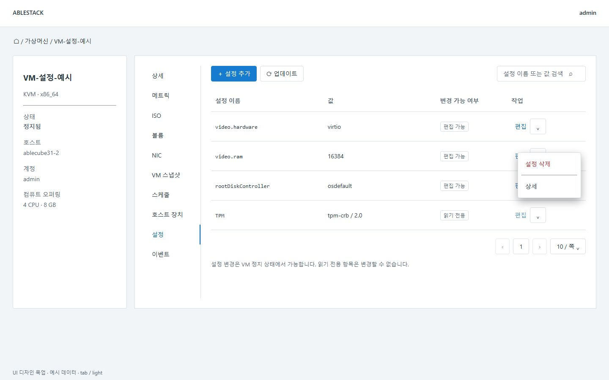

### 실행 중 변경 차단

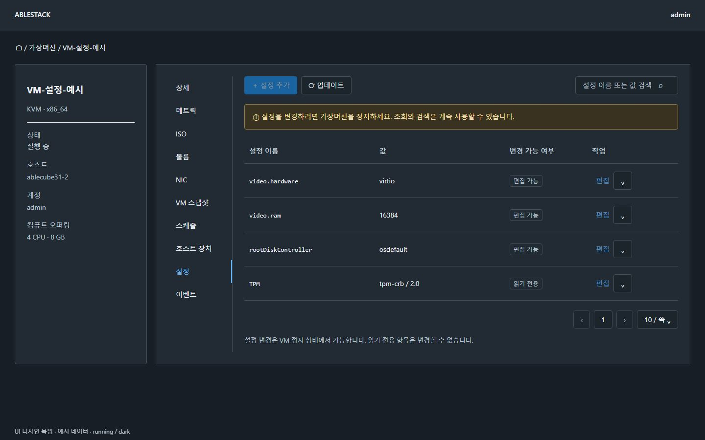

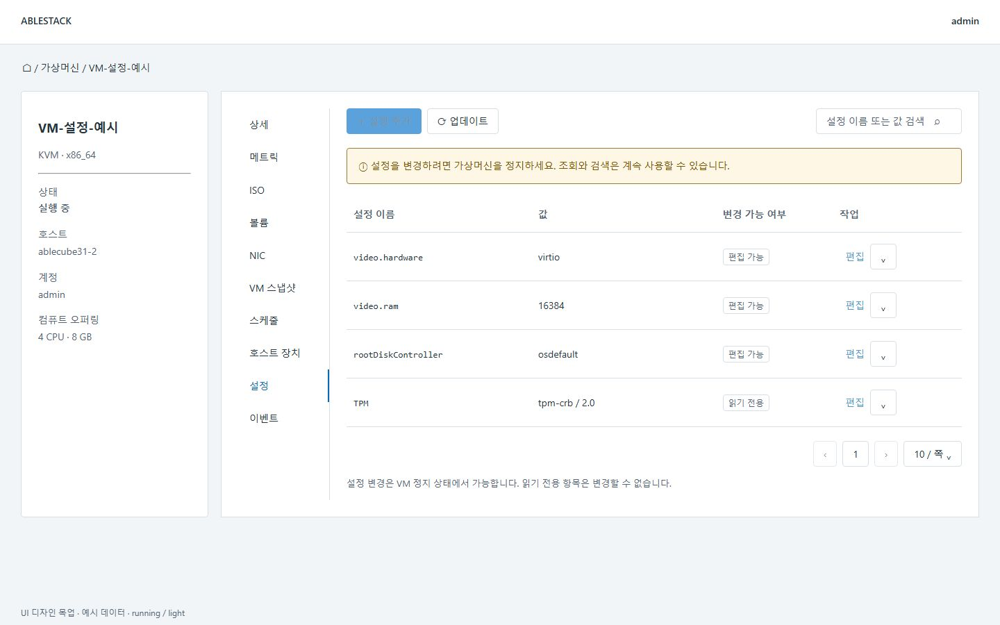

### 빈 목록

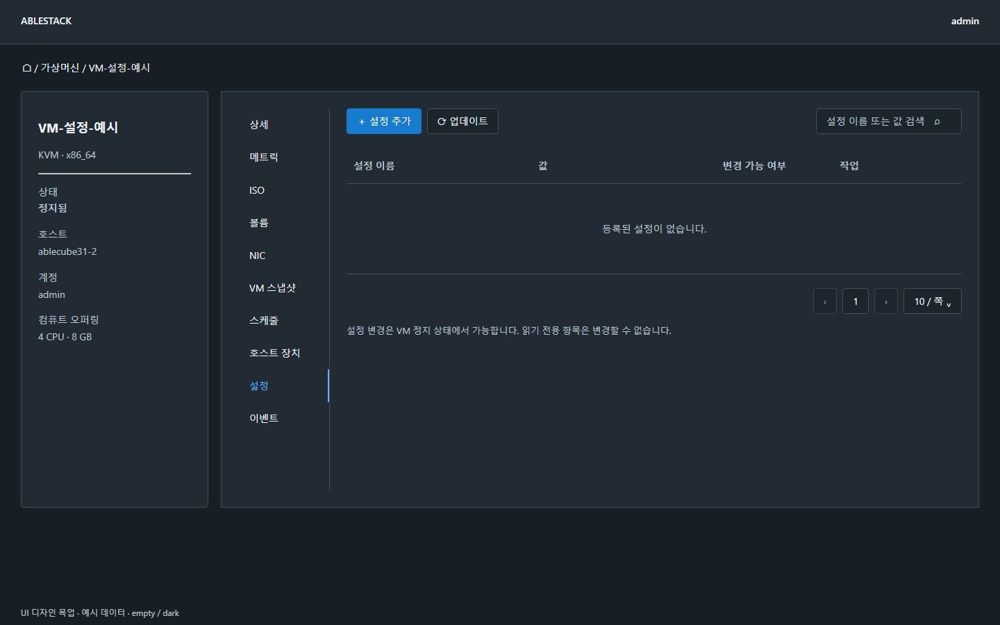

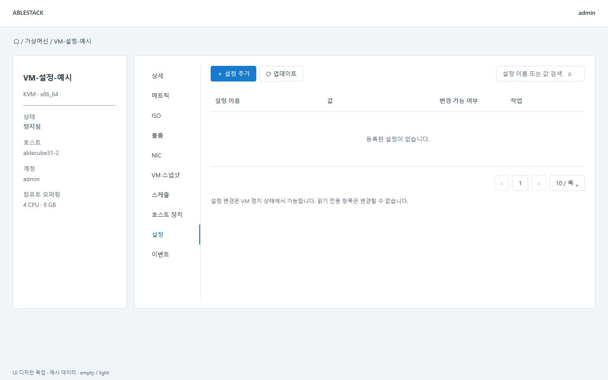

### 설정 추가

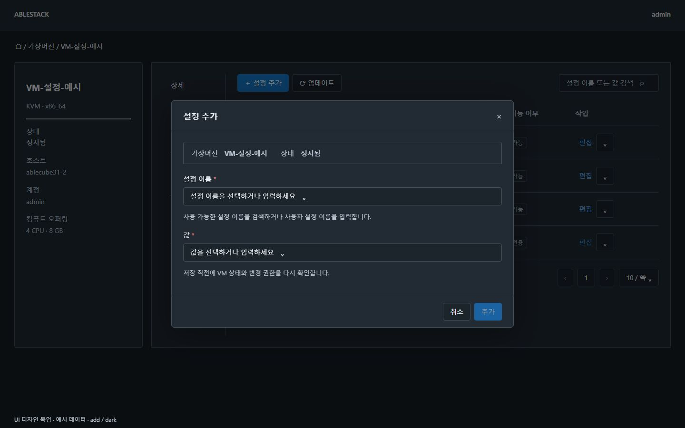

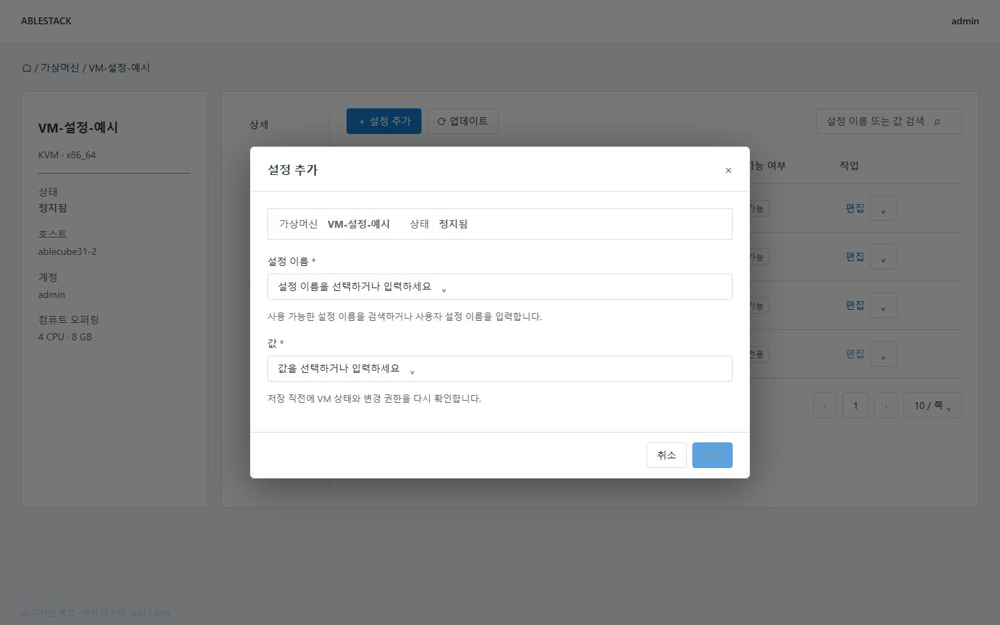

### 설정 편집

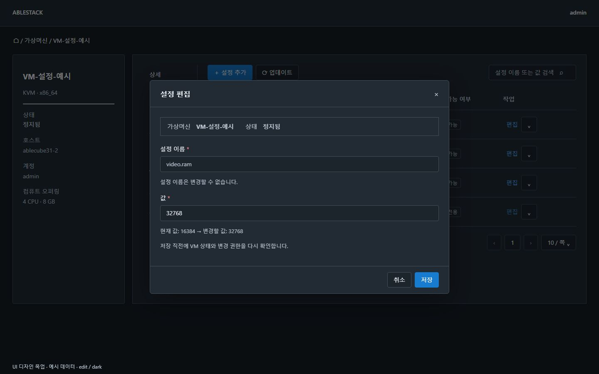

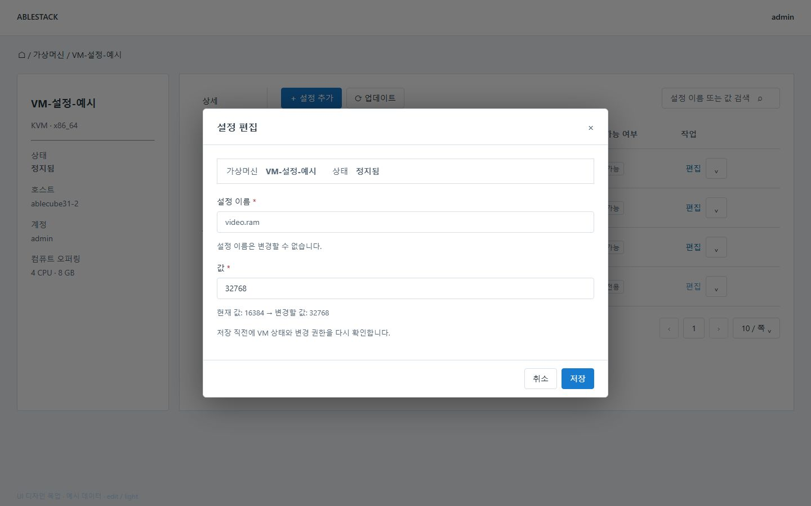

### 설정 삭제 확인

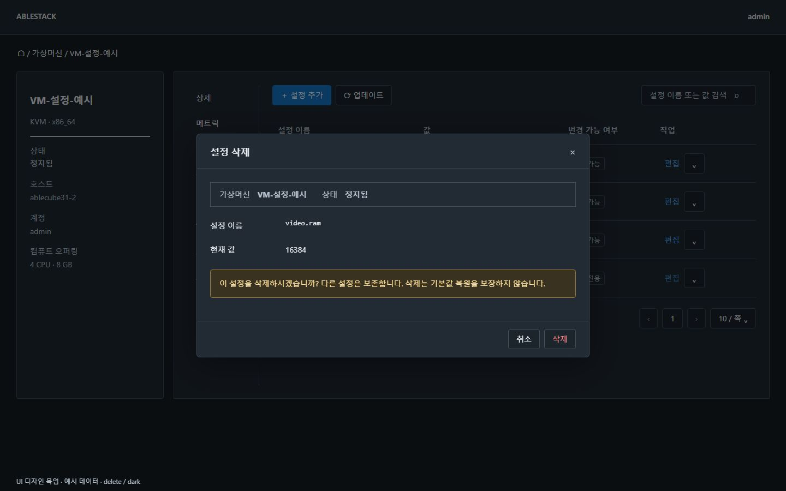

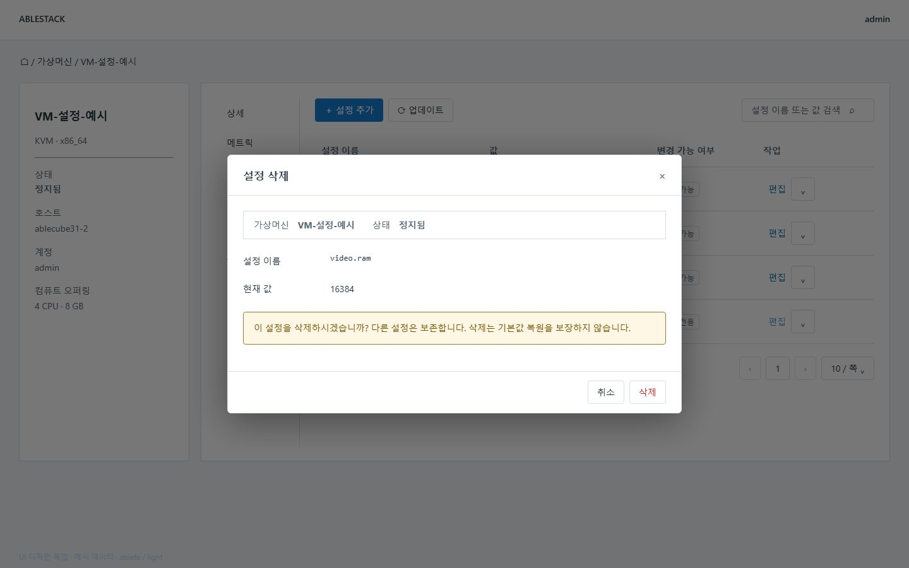

### 설정 상세와 읽기 전용 사유

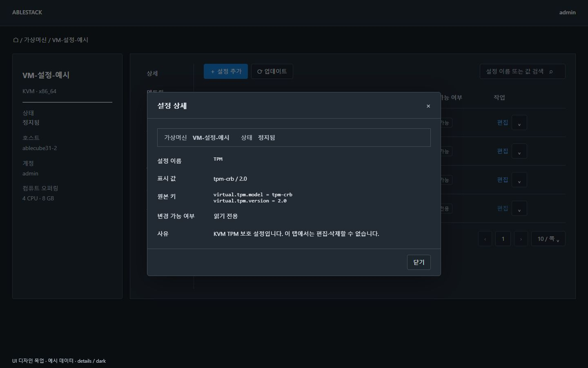

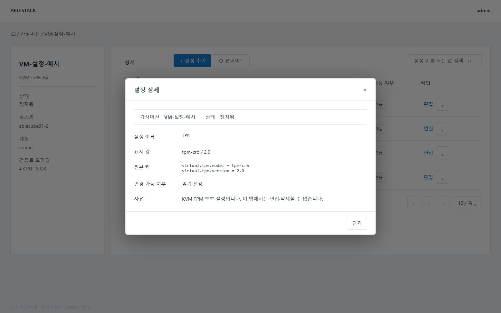

### 비디오 장치 구성

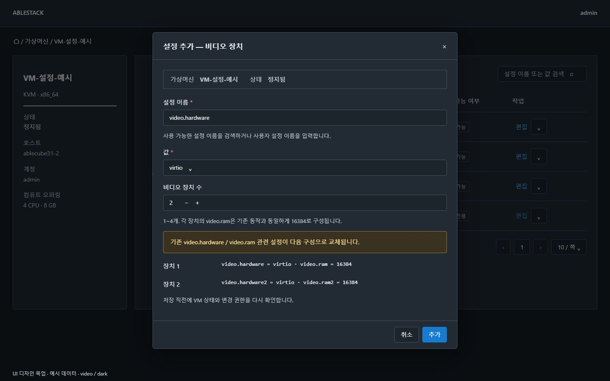

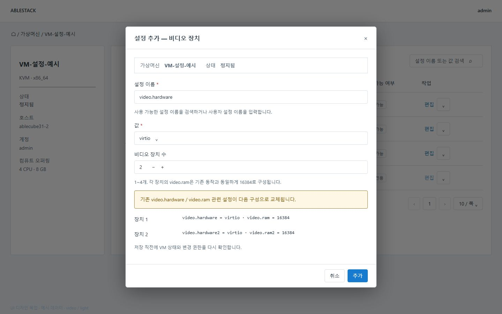
