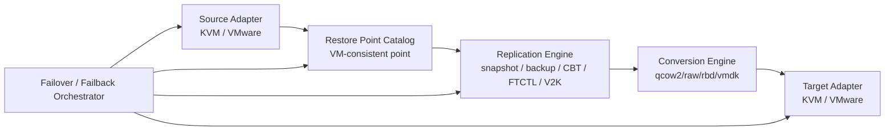
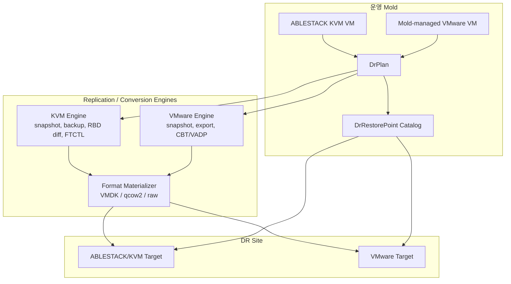
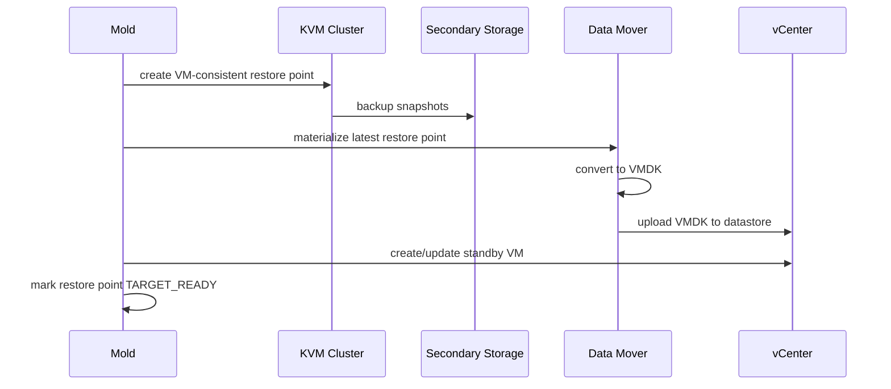
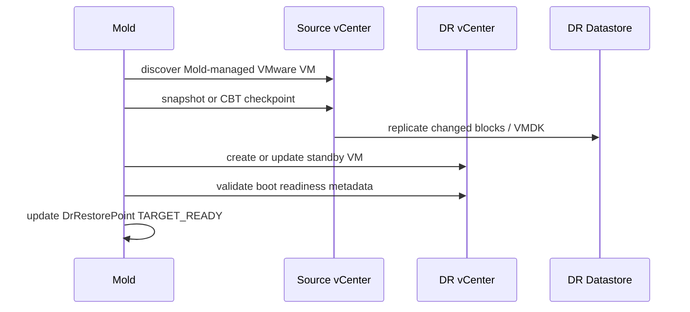

# Cross Hypervisor DR Architecture Plan

작성일: 2026-06-30

대상 브랜치: `feature/ftctl-cloud-integration`

## 1. 목적

ABLESTACK Mold가 KVM 기반 ABLESTACK 클러스터와 VMware 클러스터를 함께 운영 관리하는 환경에서, 가상머신의 운영 위치와 DR 위치가 서로 다른 하이퍼바이저일 수 있는 `Cross Hypervisor DR` 아키텍처를 수립한다.

이 문서는 특정 방향 하나만을 위한 설계가 아니라, 아래 네 가지 조합을 모두 수용할 수 있는 공통 구조를 정의한다.

| Source 운영 클러스터 | Target DR 클러스터 | 주요 엔진 |
| --- | --- | --- |
| ABLESTACK/KVM | ABLESTACK/KVM | FTCTL, snapshot, RBD/qcow2 replication |
| ABLESTACK/KVM | VMware | snapshot/backup + VMDK materialization |
| VMware | VMware | VMware snapshot, CBT/VADP, VMDK replica |
| VMware | ABLESTACK/KVM | V2K/import workflow |

목표 RTO는 1시간 이내로 한다. RPO는 하이퍼바이저와 스토리지별로 가능한 최소 수준까지 줄이되, 초기 구현에서는 안정성과 운영 가능성을 우선한다.

## 2. 현재 시스템에서 확인한 기반 요소

### 2.1 기존 Disaster Recovery Cluster 플러그인

`plugins/integrations/disaster-recovery`는 Mold 간 DR 클러스터 등록, VM 매핑, promote/demote/resync, VM snapshot API를 제공한다.

현재 성격:

- DR 사이트/클러스터 페어링에 가까운 상위 모델이다.
- 기본 mirror interval은 `1h` 성격이므로, 수분 단위 RPO를 위해서는 별도 runtime state와 restore point 모델이 필요하다.
- GLUE/SCVM 및 Mold API 기반 절차가 강하게 결합되어 있다.

개선 방향:

- 기존 `DisasterRecoveryCluster`는 `DrSite` 또는 `DrSitePair`의 상위 개념으로 재사용한다.
- VM 단위 보호 정책은 신규 `DrPlan` 모델로 분리한다.
- promote/demote/resync API는 새 orchestrator API로 흡수하거나 호환 wrapper로 유지한다.

### 2.2 FTCTL 통합 플러그인

`plugins/integrations/ftctl-service`는 Cloud-managed FTCTL 보호 등록, 원격 Mold 리소스 준비, runtime state sync, failover/failback action, fencing 처리를 제공한다.

현재 성격:

- ABLESTACK/KVM to ABLESTACK/KVM DR에는 가장 직접적으로 재사용 가능하다.
- remote-nbd, shared-blockcopy, standby VM, cloud-managed failover 흐름이 존재한다.
- VMware target에는 직접 대응하지 않는다.

개선 방향:

- FTCTL은 `KvmToKvmReplicationAdapter` 또는 `KvmRuntimeReplicationEngine`으로 위치시킨다.
- FTCTL의 상태 모델, check/status/event/fencing 패턴은 공통 DR orchestrator의 runtime state 모델에 반영한다.

### 2.3 VMware 통합 기능

Mold는 VMware datacenter 등록, VMware VM inventory 조회, out-of-band VM 조회/clone/export, VMware snapshot backup to secondary storage 경로를 이미 보유한다.

현재 성격:

- Mold-managed VMware VM을 DR source로 삼기 위한 inventory 기반은 존재한다.
- VMware snapshot을 NFS secondary storage로 backup하는 경로가 있다.
- VMware target site에 standby VM/VMDK replica를 지속적으로 materialize하는 공통 DR target adapter는 없다.

개선 방향:

- VMware source 전용 `VmwareSourceAdapter`를 만든다.
- VMware target 전용 `VmwareTargetAdapter`를 만든다.
- VMware native RPO 최소화를 위해 CBT/VADP 기반 changed-block path를 단계적으로 추가한다.

## 3. 공통 아키텍처

핵심은 source와 target을 고정하지 않는 것이다. DR 방향은 adapter 조합으로 결정한다.

### 3.1 핵심 도메인 모델

`DrSite`

- Mold 또는 VMware endpoint를 나타낸다.
- 유형: `MOLD_KVM`, `MOLD_VMWARE`, `VMWARE_DIRECT`.
- endpoint, credential reference, zone/cluster/datastore/network capability를 가진다.

`DrPlan`

- VM 보호 정책의 중심 모델이다.
- source VM, source hypervisor, target site, RPO/RTO policy, storage/network mapping, fencing policy를 가진다.
- 기존 FTCTL의 `FtctlProtection`보다 일반화된 모델이다.

`DrRestorePoint`

- 특정 시점의 VM-consistent 복구 지점이다.
- 여러 volume snapshot/backup artifact를 하나의 VM 복구 단위로 묶는다.
- 상태: `CREATING`, `SOURCE_READY`, `MATERIALIZING`, `TARGET_READY`, `FAILED`, `EXPIRED`.

`DrReplica`

- target site에 준비된 대기 VM과 디스크 materialization 상태를 나타낸다.
- VMware target이면 vCenter MoRef, datastore path, VMDK path, NIC mapping을 가진다.
- KVM target이면 Cloud VM id, volume id, libvirt/FTCTL state를 가진다.

`DrRun`

- sync, test failover, failover, failback, reprotect 실행 이력이다.
- step, started/finished, actor, error, rollback context를 기록한다.

## 4. 전체 데이터 흐름

## 5. Source/Target 조합별 설계

### 5.1 ABLESTACK/KVM to ABLESTACK/KVM

재사용 우선순위가 가장 높다.

사용 기술:

- FTCTL remote-nbd 또는 shared-blockcopy
- RBD/qcow2 snapshot
- Cloud-managed standby VM
- FTCTL status/check/events/fencing

개선 방향:

- 기존 `FtctlProtection`을 `DrPlan`에 연결한다.
- FTCTL state를 `DrReplica` runtime state로 투영한다.
- Cloud HA lifecycle guard와 fencing 결과를 공통 failover orchestrator로 옮긴다.

RPO/RTO:

- RPO: remote-nbd mirroring 상태에서는 수분 이내 가능.
- RTO: standby VM 준비 상태에 따라 수분에서 수십 분.

### 5.2 ABLESTACK/KVM to VMware

새 구현 비중이 가장 크다.

사용 기술:

- VM-consistent snapshot 또는 volume snapshot set
- secondary/object/NFS backup
- RBD/qcow2/raw to VMDK 변환
- vCenter datastore upload
- powered-off VMware standby VM

흐름:

개선 방향:

- `KvmToVmwareReplicationAdapter` 추가.
- `VmwareTargetAdapter` 추가.
- VMDK materialization worker 추가.
- RBD diff 또는 qcow2 backing chain 기반 증분 materialization을 2단계로 추가.

RPO/RTO:

- 초기 RPO: 15-30분 목표.
- 증분 materialization 후 RPO: 5-15분 목표.
- RTO: standby VM이 `TARGET_READY`이면 1시간 이내 가능.

### 5.3 VMware to VMware

가장 자연스러운 VMware-native DR 경로다.

사용 기술:

- VMware snapshot
- NFS secondary backup existing path
- CBT/VADP changed block replication
- vCenter clone/register/power control

흐름:

개선 방향:

- `VmwareSourceAdapter` 추가.
- `VmwareToVmwareReplicationAdapter` 추가.
- 초기에는 VMware snapshot/export 기반으로 시작한다.
- 이후 CBT/VADP adapter를 추가해 RPO를 줄인다.

RPO/RTO:

- 초기 RPO: 15-30분 목표.
- CBT/VADP 적용 후 RPO: 5분 내외 목표.
- RTO: standby VM 준비 상태에서는 1시간 이내 가능.

### 5.4 VMware to ABLESTACK/KVM

기존 V2K/import workflow를 재사용한다.

사용 기술:

- `importUnmanagedInstanceForAblestackV2K`
- V2K phase1/phase2
- target Cloud VM/volume materialization

개선 방향:

- V2K import task를 사용자가 직접 다루지 않도록 `DrPlan` 아래에 감싼다.
- phase1을 DR sync, phase2를 failover cutover로 모델링한다.
- failback은 VMware target adapter 또는 V2K reverse path 필요 여부를 별도로 정의한다.

RPO/RTO:

- RTO: phase1 선행 완료 상태에서 phase2 중심으로 줄일 수 있다.
- RPO: V2K 증분/반복 sync 능력 검증이 필요하다.

## 6. RPO/RTO 정책

RPO는 두 단계로 나누어 관리한다.

`source_rpo`

- source snapshot 또는 changed-block capture가 완료된 시점 기준이다.
- 운영 VM에서 데이터가 안전하게 복구 지점으로 잡힌 시간을 의미한다.

`target_ready_rpo`

- target site에서 실제 부팅 가능한 형태로 materialization된 시점 기준이다.
- 장애 시 실제 사용할 수 있는 RPO다.

RTO는 target readiness에 의존한다.

| Target readiness | 장애 시 작업 | 예상 RTO |
| --- | --- | --- |
| VM skeleton 없음 | VM 생성, disk 변환, upload, boot | 1시간 초과 가능 |
| VM skeleton 있음, disk 미반영 | 최신 disk materialize 후 boot | 수십 분 이상 |
| VM skeleton + latest disk ready | fencing, attach 검증, boot | 1시간 이내 가능 |
| periodic test boot 완료 | fencing, power on, network cutover | 수분에서 수십 분 |

따라서 RTO 1시간 이내를 제품 목표로 삼으려면 모든 보호 VM은 최소한 `VM skeleton + latest disk ready` 상태를 유지해야 한다.

## 7. API 개선 계획

신규 API 후보:

- `createDrSite`
- `listDrSites`
- `updateDrSite`
- `deleteDrSite`
- `createDrPlan`
- `listDrPlans`
- `updateDrPlan`
- `deleteDrPlan`
- `syncDrPlan`
- `listDrRestorePoints`
- `testFailoverDrPlan`
- `failoverDrPlan`
- `failbackDrPlan`
- `reprotectDrPlan`

기존 API 호환:

- 기존 `createDisasterRecoveryCluster`는 `createDrSitePair`로 내부 매핑한다.
- 기존 FTCTL API는 KVM-to-KVM adapter의 구현 세부로 유지한다.
- 기존 UI의 DR 탭은 `DrPlan` 중심으로 재구성한다.

## 8. 구성요소별 개선 방향

| 구성요소 | 현재 상태 | 개선 방향 |
| --- | --- | --- |
| DisasterRecoveryCluster | Mold-to-Mold/GLUE 중심 | `DrSite`, `DrSitePair`로 일반화 |
| FtctlProtection | KVM/libvirt 보호 중심 | `DrPlan`의 KVM-to-KVM adapter로 연결 |
| Snapshot/Backup | volume 중심 API | VM 단위 restore point catalog 추가 |
| VMware plugin | inventory, snapshot backup, import 지원 | source/target adapter 계층 추가 |
| Data mover | 분산된 import/backup command 중심 | format materializer worker 추가 |
| UI | 기존 DR와 FTCTL 흐름 분리 | 단일 Cross Hypervisor DR wizard 제공 |
| Monitoring | FTCTL state sync 중심 | RPO lag, target readiness, materialization status 추가 |
| Fencing | FTCTL/IPMI 중심 | source type별 fencing policy로 일반화 |

## 9. 단계별 구현 계획

### Phase 1: 공통 모델과 VMware target 기반

목표:

- `DrSite`, `DrPlan`, `DrRestorePoint`, `DrReplica`, `DrRun` schema/API 추가.
- VMware target adapter 구현.
- standby VM 생성, datastore/network mapping, power control 구현.

검증:

- VMware target site에 powered-off standby VM이 생성된다.
- DR Plan 상태가 `TARGET_READY`까지 전이된다.

### Phase 2: VMware source to VMware target

목표:

- Mold-managed VMware VM을 source로 등록한다.
- VMware snapshot/export 기반 restore point를 만든다.
- DR VMware site에 VMDK replica를 준비한다.

검증:

- 15-30분 주기로 target-ready restore point가 갱신된다.
- test failover가 운영 VM에 영향 없이 수행된다.

### Phase 3: KVM source to VMware target

목표:

- ABLESTACK/KVM VM snapshot set을 restore point로 묶는다.
- RBD/qcow2/raw를 VMDK로 materialize한다.
- VMware standby VM에 최신 VMDK를 반영한다.

검증:

- KVM source VM이 VMware DR site에서 부팅된다.
- target-ready RPO가 15-30분 범위에 들어온다.

### Phase 4: 증분 최적화

목표:

- VMware CBT/VADP changed block path 추가.
- KVM RBD diff 또는 qcow2 backing-chain 기반 증분 materialization 추가.
- target-ready RPO를 5-15분 수준으로 단축한다.

검증:

- 대용량 VM에서 full conversion 없이 반복 sync가 완료된다.
- sync lag와 materialization lag가 UI/API에 표시된다.

### Phase 5: Failback/Reprotect

목표:

- VMware to KVM은 V2K phase1/phase2 기반으로 failback한다.
- VMware to VMware는 reverse replication 또는 clone-back을 제공한다.
- KVM to KVM은 FTCTL failback/reprotect를 사용한다.

검증:

- failover 이후 source/target 역할 전환이 `DrPlan`에 반영된다.
- reprotect 후 다시 정상 sync가 시작된다.

## 10. 우선순위 권고

1. 공통 `DrPlan`/`DrRestorePoint` 모델을 먼저 만든다.
2. Target이 VMware인 경로를 우선 완성한다. 현재 요구의 핵심이 VMware DR site이기 때문이다.
3. Source는 VMware부터 처리한다. 같은 VMDK 계열이라 RPO/RTO 목표 달성이 빠르다.
4. 다음으로 KVM source to VMware target을 구현한다. 변환/증분 최적화가 핵심 난제다.
5. ABLESTACK target 경로는 기존 FTCTL/V2K 자산을 adapter로 묶어 흡수한다.

## 11. 주요 리스크와 확인 과제

| 리스크 | 설명 | 대응 |
| --- | --- | --- |
| snapshot consistency | 다중 디스크 VM의 application consistency | QGA, VMware tools, quiesce policy 도입 |
| target-ready RPO 지연 | 변환/업로드 시간이 source RPO보다 길어질 수 있음 | source RPO와 target-ready RPO를 분리 표시 |
| KVM to VMware driver 문제 | VirtIO 기반 VM이 VMware에서 바로 부팅되지 않을 수 있음 | guest driver injection 또는 compatibility check |
| VMware credential 관리 | vCenter credential/secret 저장 위험 | credential reference와 암호화 저장소 사용 |
| network identity | MAC/IP 보존과 충돌 위험 | failover policy로 preserve/remap 선택 |
| fencing | source VM 미정지 상태에서 dual-active 위험 | source type별 fencing adapter와 manual-confirm 단계 |
| large VM conversion | full conversion은 RTO/RPO 목표를 깨뜨릴 수 있음 | full seed 후 incremental materialization 구현 |

## 12. 결론

`Cross Hypervisor DR`은 특정 방향의 기능이 아니라 source/target adapter 조합으로 동작하는 DR 플랫폼으로 설계해야 한다.

현재 코드베이스 기준으로는 다음 배치가 가장 자연스럽다.

- 기존 `DisasterRecoveryCluster`: site/pairing 상위 모델로 재사용.
- 기존 `ftctl-service`: KVM-to-KVM replication engine으로 재사용.
- VMware plugin: VMware source/target adapter의 기반으로 재사용.
- 신규 `DrPlan` 계층: 사용자에게 보이는 공통 보호 정책과 failover/failback orchestration을 담당.

이 구조를 적용하면 DR 사이트가 VMware든 ABLESTACK/KVM이든 동일한 UX/API로 대응할 수 있고, 각 하이퍼바이저 조합의 기술 차이는 adapter 내부로 격리된다.
