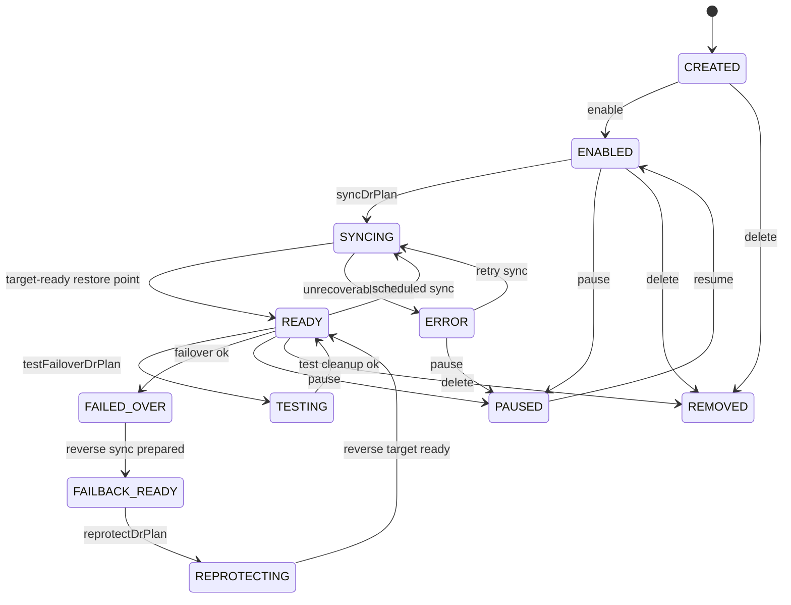
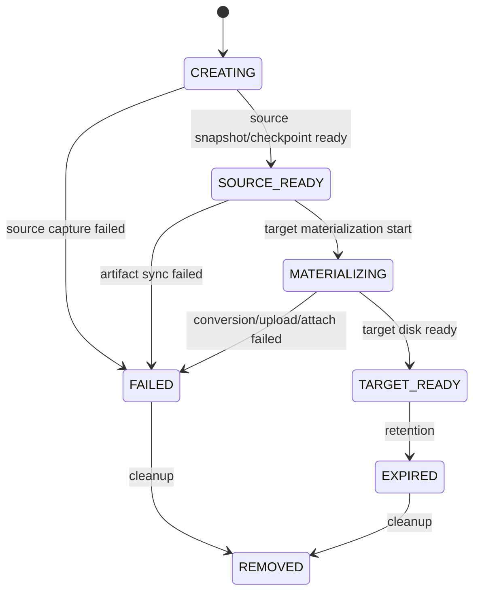
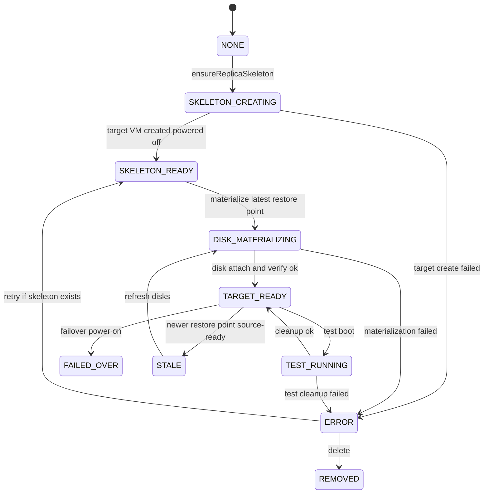
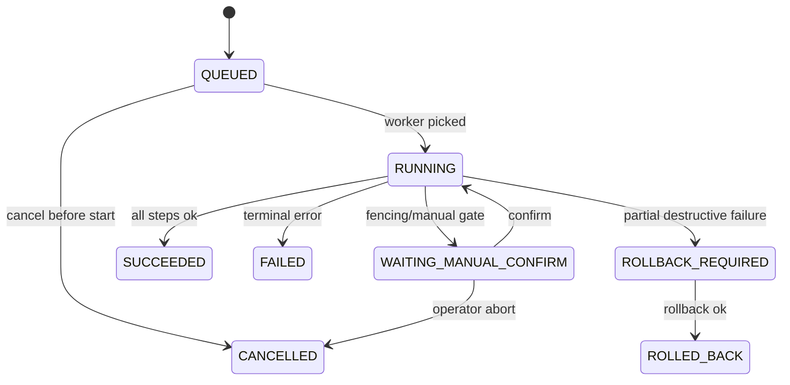

# Cross Hypervisor DR State Machine And Worker Design

작성일: 2026-06-30

대상 브랜치: `feature/ftctl-cloud-integration`

상위 문서:

- [500-cross-hypervisor-dr-architecture-plan-20260630.md](500-cross-hypervisor-dr-architecture-plan-20260630.md)
- [501-cross-hypervisor-dr-domain-schema-design-20260630.md](501-cross-hypervisor-dr-domain-schema-design-20260630.md)
- [502-cross-hypervisor-dr-adapter-contract-design-20260630.md](502-cross-hypervisor-dr-adapter-contract-design-20260630.md)

## 1. 목적

이 문서는 `Cross Hypervisor DR`의 상태 전이, worker 실행 위치, lock/idempotency, progress 관측 방식을 구체화한다.

범위는 설계까지다. 이 문서는 실제 worker, timer, async job 코드를 만들지 않는다.

## 2. 상태 관리 원칙

- `DrPlan`은 사용자가 이해하는 보호 정책 상태를 나타낸다.
- `DrRestorePoint`는 source capture와 target materialization 상태를 나타낸다.
- `DrReplica`는 target site의 VM/disk readiness를 나타낸다.
- `DrRun`은 작업 실행 상태를 나타내며, 실패 원인과 rollback context를 보존한다.
- engine별 runtime detail은 `DrRunStep.details_json`과 `DrReplica.runtime_state_json`에만 격리한다.

## 3. `DrPlan` 상태 전이

상태 규칙:

- `READY`는 최소 하나의 `DrRestorePoint.state=TARGET_READY`와 `DrReplica.state=TARGET_READY`가 있어야 한다.
- `FAILED_OVER`는 target VM이 service VM으로 승격된 상태다.
- `FAILBACK_READY`는 reverse direction의 준비가 끝났지만 source로 cutback되지는 않은 상태다.
- `ERROR`는 plan 삭제가 아니라 운영자 개입 또는 retry가 필요한 상태다.

## 4. `DrRestorePoint` 상태 전이

RPO 계산:

- `source_rpo_seconds = now - source_captured_at`
- `target_ready_rpo_seconds = now - target_ready_at`
- source capture가 되어도 target materialization이 끝나지 않았으면 장애 시 사용할 수 없으므로 `target_ready_rpo_seconds`는 null 또는 이전 target-ready restore point 기준으로 표시한다.

## 5. `DrReplica` 상태 전이

상태 규칙:

- `SKELETON_READY`는 RTO 1시간 보장을 의미하지 않는다.
- `TARGET_READY`는 최소 최신 target disk set이 attach 가능하고, target VM metadata가 boot 가능한 상태임을 의미한다.
- `TEST_RUNNING`은 운영 network와 격리되어야 한다.

## 6. `DrRun` 상태 전이

## 7. Worker 실행 위치

Phase 1 기준 worker 정책:

- Orchestrator worker는 management server에서 실행한다.
- VMware target skeleton 생성은 management server가 VMware plugin/service를 통해 vCenter API로 수행한다.
- heavy data movement는 Phase 1 범위에 넣지 않는다.
- format conversion, VMDK upload, CBT/VADP, RBD diff는 이후 Phase에서 별도 data mover worker로 분리한다.

장기 구조:

| 작업 | 권장 실행 위치 | 이유 |
| --- | --- | --- |
| API orchestration | management server | Cloud async job, DB transaction과 가까움 |
| VMware inventory/VM create | management server 또는 VMware plugin service | vCenter API 호출 중심 |
| KVM snapshot/RBD diff | KVM host 또는 storage-aware worker | storage locality 필요 |
| qcow2/raw to VMDK conversion | data mover worker | CPU/I/O heavy |
| VMDK datastore upload | data mover worker 또는 vCenter datastore path worker | 대용량 upload |
| FTCTL xcolo/remote-nbd | KVM host FTCTL | 기존 성공 로직 보존 |
| V2K phase execution | V2K worker/current import path | 기존 V2K 흐름 재사용 |

## 8. Lock 정책

Plan 단위 lock:

- 동일 `DrPlan`에는 동시에 하나의 destructive run만 허용한다.
- `SYNC`는 이전 `SYNC`와 중복 실행하지 않는다.
- `TEST_FAILOVER`는 `SYNC`와 병행하지 않는다.
- `FAILOVER`, `FAILBACK`, `REPROTECT`, `DELETE`는 모든 다른 run과 배타적이다.

Resource 단위 lock:

- target VM 생성 시 `target_site_id + target_name` lock을 잡는다.
- datastore/VMDK path 생성 시 `target_site_id + datastore + path` lock을 잡는다.
- FTCTL adapter 호출 시 기존 FTCTL lock/profile state와 충돌하지 않게 Cloud side run lock을 먼저 잡는다.

## 9. Idempotency 정책

API retry:

- public action API는 `idempotencyKey`를 선택 입력으로 받는다.
- key가 없으면 서버가 run UUID를 생성한다.
- 동일 plan, 동일 key, 동일 run type이면 기존 run을 반환한다.

Adapter retry:

- `ensureReplicaSkeleton`은 같은 target name의 owned VM이 있으면 재사용한다.
- `materialize`는 같은 restore point와 disk path가 이미 ready이면 skip한다.
- `powerOnForFailover`는 이미 powered on이고 ownership marker가 맞으면 success로 처리한다.
- cleanup은 ownership marker와 run context가 맞을 때만 수행한다.

## 10. Progress 계산

`DrRun.progress_percent`는 step weight 기반으로 계산한다.

`SYNC` 기본 weight:

| step | weight |
| --- | --- |
| validate source/target | 5 |
| source consistency | 10 |
| create restore point | 20 |
| sync artifacts | 20 |
| materialize artifacts | 25 |
| ensure target replica | 10 |
| verify target ready | 10 |

`FAILOVER` 기본 weight:

| step | weight |
| --- | --- |
| preflight | 10 |
| fence request/verify | 35 |
| target power on | 30 |
| service validation | 15 |
| state finalize | 10 |

## 11. Failure handling

Retryable:

- temporary vCenter connection failure
- storage upload timeout
- source snapshot busy
- Cloud async job still running

Non-retryable:

- invalid datastore mapping
- unsupported guest/controller conversion
- missing credential reference
- ownership conflict on target VM/path

Manual gate:

- source VM still running when failover would create dual-active
- fencing result unknown
- target test boot uses production network

Rollback required:

- target VM was created but disk attach failed after partial attach
- failover power-on succeeded but service validation failed
- cleanup failed and target may conflict with next run

## 12. Monitoring projection

API/UI should display:

- plan state
- latest source RPO
- latest target-ready RPO
- target readiness
- current run and current step
- last successful restore point
- last target-ready restore point
- last error and retryability
- fencing/manual action required

FTCTL adapter 추가 projection:

- FTCTL protection state
- transport state
- active side
- standby state
- last event summary
- QMP/COLO state when available

VMware adapter 추가 projection:

- vCenter connection state
- target VM MoRef
- datastore path
- power state
- VMware tools status
- last task ref

## 13. 구현 전 확인 과제

1. Cloud async job table과 `dr_run`의 중복 역할을 어떻게 분리할지 결정한다.
2. Scheduler/timer가 management cluster active node에서 한 번만 돌도록 보장해야 한다.
3. Long-running worker timeout과 cancellation semantics를 정의해야 한다.
4. `WAITING_MANUAL_CONFIRM` run이 재시작 후에도 복구되도록 DB에 충분한 context를 저장해야 한다.
5. 기존 FTCTL timer/reconcile과 신규 DrRun scheduler가 같은 VM을 동시에 만지지 않도록 adapter boundary를 명확히 해야 한다.

## 14. AS-IS / TO-BE 요약

| 구분 | AS-IS | TO-BE |
| --- | --- | --- |
| 실행 상태 | Cloud async job, FTCTL state, 외부 task가 분리 | `DrRun`과 `DrRunStep`이 공통 실행 상태를 표현 |
| 장기 작업 | 기능별 polling/timeout 처리 | `DrRunExecutor`가 step 단위 timeout, retry, cancellation 처리 |
| 수동 조치 | 기능별 화면/로그에서 확인 | `WAITING_MANUAL_CONFIRM` 상태와 event/action gate로 표준화 |
| progress 표시 | FTCTL 또는 VMware task별 별도 표시 | plan/run/step projection으로 UI가 동일 방식 표시 |
| 충돌 방지 | 엔진별 lock에 의존 | plan lock과 adapter lock을 함께 사용해 중복 작업 방지 |
