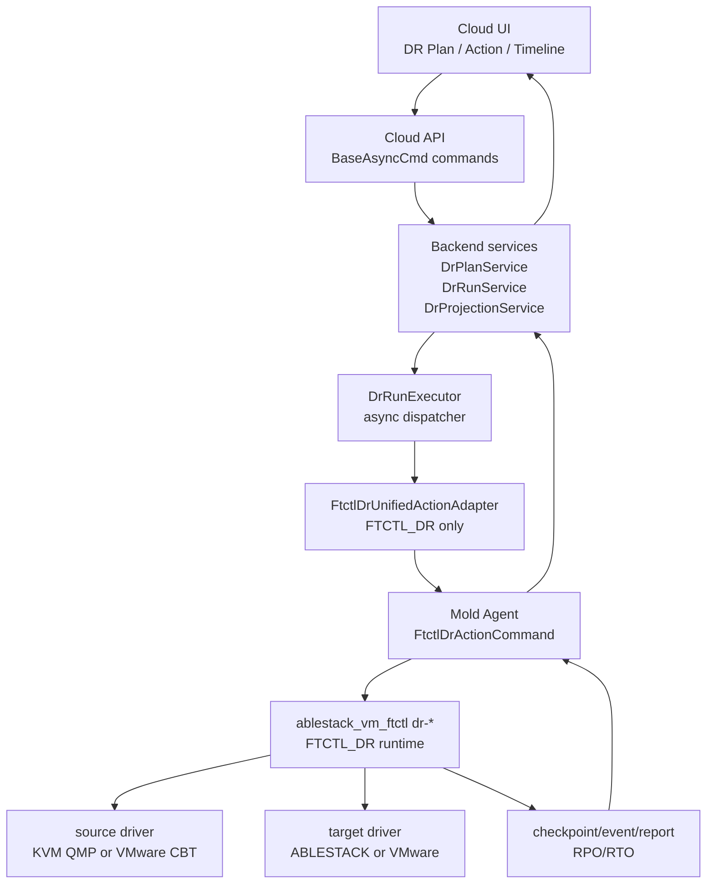
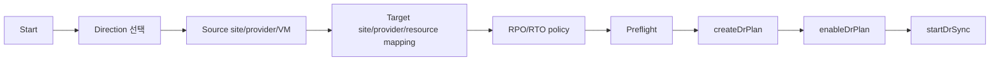

# Cross Hypervisor DR Full Stack Implementation Design

작성일: 2026-07-01

상위 계획: [520-cross-hypervisor-dr-full-implementation-work-plan-20260701.md](520-cross-hypervisor-dr-full-implementation-work-plan-20260701.md)

범위: UI, API, Backend, Agent, FTCTL 전 계층의 실제 DR 구현 설계

## 1. 목표

이 문서는 4개 DR 방향을 모두 동일한 구현 수준으로 완성하기 위한 full stack 설계이다.

완료 기준은 skeleton, 정의, task tracking이 아니다. 모든 방향은 다음 기능을 실제로 수행해야 한다.

- DR 보호 설정
- full seed
- 지속 또는 반복 incremental 데이터 전송
- target-ready restore point 생성
- RPO/RTO 산정
- test failover
- planned failover
- disaster failover
- failback
- reprotect
- release/cleanup

## 2. 구현 방향 고정

| 항목 | 결정 |
|---|---|
| 공통 production engine | `FTCTL_DR` |
| 기존 `FTCTL` | KVM-to-KVM legacy 호환과 기존 성공 경로 보존 |
| `VMWARE_PHASE1` | production DR engine에서 제외. preview/skeleton로만 남기거나 제거 |
| `V2K` | DR engine으로 사용 금지. migration/import 전용으로 유지 |
| VMware 데이터 접근 | VDDK/CBT 기반 source/target driver |
| KVM 데이터 접근 | QEMU/QMP dirty bitmap, 기존 FTCTL/xcolo 성공 경로 |

VDDK는 DR engine의 VMware disk access library로만 사용한다. V2K workflow를 DR에 재사용하지 않는다.

## 3. 방향별 동일 구현 수준

| 방향 | source driver | target driver | engine |
|---|---|---|---|
| ABLESTACK -> VMware | `KvmQmpSourceDriver` | `VmwareVddkTargetDriver` | `FTCTL_DR` |
| VMware -> VMware | `VmwareCbtSourceDriver` | `VmwareVddkTargetDriver` | `FTCTL_DR` |
| ABLESTACK -> ABLESTACK | `KvmQmpSourceDriver` 또는 기존 FTCTL/xcolo projection | `AblestackTargetDriver` | `FTCTL_DR` |
| VMware -> ABLESTACK | `VmwareCbtSourceDriver` | `AblestackTargetDriver` | `FTCTL_DR` |

동일 구현 수준이란 UI action, API command, backend run state, agent command, ftctl status, restore point, RPO/RTO field가 네 방향 모두 동일하게 존재한다는 뜻이다.

## 4. 전체 구조



## 5. UI 설계

### 5.1 수정/추가 대상

| 파일 | 역할 |
|---|---|
| `ui/src/api/dr.js` | DR API wrapper 유지, 신규 pause/resume/release/status API 추가 |
| `ui/src/views/infra/dr/DrPlanList.vue` | plan 목록, RPO/RTO KPI, action 진입 |
| `ui/src/views/infra/dr/DrPlanOverview.vue` | 단일 plan overview, active side, readiness |
| `ui/src/views/infra/dr/DrRestorePointsTab.vue` | restore point timeline과 target-ready 표시 |
| `ui/src/views/infra/dr/DrRunsTab.vue` | run history |
| `ui/src/views/infra/dr/DrEventsTab.vue` | ftctl event relay |
| `ui/src/components/dr/DrActionToolbar.vue` | actionEligibility 기반 공통 버튼 |
| `ui/src/components/dr/DrRunProgress.vue` | async run step polling |
| `ui/src/components/dr/DrRpoKpi.vue` | RPO target/current lag 표시 |
| `ui/src/style/cross-dr.less` | light/dark mode 상태 색상 |

### 5.2 보호 설정 wizard



wizard step은 direction이 달라도 같은 구조를 사용한다.

| step | 공통 입력 | 방향별 차이 |
|---|---|---|
| Direction | source provider, target provider | 4개 방향 중 하나 |
| Source | VM, disk, consistency policy | KVM은 Cloud VM, VMware는 vCenter VM |
| Target | site, datastore/storage, network | ABLESTACK은 storage pool/network, VMware는 datastore/folder/network |
| Policy | RPO target, RTO target, retention, test network | 동일 |
| Preflight | credential, driver, target capacity, worker host | provider별 check |

### 5.3 action toolbar

모든 버튼은 backend `actionEligibility`를 기준으로 표시한다. UI가 자체 추론으로 버튼을 열면 안 된다.

| 버튼 | API | 필요 조건 |
|---|---|---|
| Sync | `startDrSync` | plan enabled, no active run |
| Pause | `pauseDrSync` | sync loop running |
| Resume | `resumeDrSync` | sync loop paused |
| Test Failover | `startDrTestFailover` | target-ready restore point 존재 |
| Stop Test | `stopDrTestFailover` | test VM running |
| Failover | `startDrFailover` | target-ready, acknowledgement if disaster |
| Failback | `startDrFailback` | active side target, reverse path ready |
| Reprotect | `startDrReprotect` | failed-over or failback complete |
| Release | `releaseDrProtection` | stable or forced acknowledgement |

### 5.4 UI polling

UI는 작업 완료를 동기식으로 기다리지 않는다.

| polling 대상 | API |
|---|---|
| plan summary | `getDrPlan` |
| runs | `listDrRuns` |
| run steps | `listDrRunSteps` |
| events | `listDrEvents` |
| replicas | `listDrReplicas` |
| restore points | `listDrRestorePoints` |

polling은 active run이 있을 때 짧은 주기, stable state일 때 긴 주기를 사용한다. 화면 전체 loading으로 막지 않고, 변경된 panel만 갱신한다.

## 6. API 설계

### 6.1 기존 API 유지

현재 존재하는 command surface는 유지한다.

| API | 유지/변경 |
|---|---|
| `createDrPlan` | `FTCTL_DR` profile 필드 추가 |
| `updateDrPlan` | RPO/RTO policy, mapping 갱신 |
| `enableDrPlan` | preflight 후 enabled |
| `disableDrPlan` | sync loop 정지 후 disabled |
| `startDrSync` | full seed 또는 incremental loop 시작 |
| `startDrTestFailover` | 실제 isolated target boot 수행 |
| `stopDrTestFailover` | test 자원 정리 |
| `startDrFailover` | planned/disaster failover |
| `startDrFailback` | reverse sync + original site promote |
| `startDrReprotect` | active side 기준 새 보호 방향 구성 |
| `cancelDrRun` | cancellable run 중지 요청 |
| `listDrRestorePoints` | target-ready checkpoint 목록 |

### 6.2 신규 API

| API | 목적 |
|---|---|
| `pauseDrSync` | sync loop 일시정지 |
| `resumeDrSync` | sync loop 재개 |
| `releaseDrProtection` | profile/state/target cleanup |
| `getDrRuntimeStatus` | host runtime 상태 직접 조회 |
| `checkDrPlanPreflight` | plan 생성 전 driver/credential/capacity 검증 |
| `listDrWorkerHosts` | site별 FTCTL_DR worker 후보 조회 |

### 6.3 action command request

`AbstractDrPlanActionCmd`의 공통 필드는 유지하고, request JSON에는 action별 option만 넣는다.

```json
{
  "restorePointId": 123,
  "replicaId": 456,
  "dryRun": false,
  "force": false,
  "acknowledgement": "I understand source may be unavailable",
  "reason": "planned maintenance",
  "mode": "planned",
  "finalSync": true,
  "testNetworkId": "uuid",
  "rpoOverrideSeconds": 300
}
```

### 6.4 API 응답

action API는 run 접수 결과만 반환한다.

```json
{
  "id": "run-uuid",
  "planid": "plan-uuid",
  "runtype": "FAILOVER",
  "state": "QUEUED",
  "currentstepname": "queued",
  "accepted": true
}
```

실제 진행률과 결과는 `listDrRunSteps`, `listDrEvents`, `getDrPlan`에서 확인한다.

## 7. Backend 설계

### 7.1 수정/추가 클래스

| 파일/클래스 | 변경 |
|---|---|
| `DrConstants.java` | `ENGINE_TYPE_FTCTL_DR`, run/action/state/error 추가 |
| `DrPlanServiceImpl.java` | 4개 방향 모두 `FTCTL_DR` 허용, skeleton engine DR 노출 차단 |
| `DrRunServiceImpl.java` | idempotency, active run lock 강화 |
| `DrRunExecutorImpl.java` | run 접수와 worker dispatch 분리 유지, retry/cancel 보강 |
| `DrAdapterRegistryImpl.java` | `FTCTL_DR` adapter 등록 |
| `FtctlDrUnifiedActionAdapter.java` | 모든 direction의 action payload 생성 |
| `FtctlDrProjectionAdapter.java` | FTCTL_DR status/report를 plan/replica/restore point로 반영 |
| `DrRestorePointService.java` | target-ready checkpoint upsert와 RPO 계산 |
| `DrRuntimeReportService.java` | agent/ftctl status report 수신/반영 |
| `DrPreflightService.java` | source/target/worker/driver/capacity 검증 |

### 7.2 state model

| object | 주요 state |
|---|---|
| `DrPlan` | `NEW`, `ENABLED`, `SYNCING`, `READY`, `TESTING`, `FAILING_OVER`, `FAILED_OVER`, `FAILING_BACK`, `REPROTECTING`, `ERROR`, `DISABLED` |
| `DrRun` | `QUEUED`, `DISPATCHING`, `RUNNING`, `CANCELLING`, `SUCCEEDED`, `FAILED`, `CANCELLED` |
| `DrReplica` | `SEEDING`, `SYNCING`, `TARGET_READY`, `TEST_RUNNING`, `PROMOTED`, `FAILED_OVER`, `REVERSE_SYNCING`, `ERROR` |
| `DrRestorePoint` | `CAPTURING`, `TRANSFERRING`, `VALIDATING`, `TARGET_READY`, `EXPIRED`, `FAILED` |

### 7.3 action eligibility

`getActionEligibility`는 engine-specific exception을 제거하고 `FTCTL_DR` capability와 current state를 기준으로 계산한다.

| key | true 조건 |
|---|---|
| `sync` | enabled, no active run, not failed-over unless reprotecting |
| `pauseSync` | sync loop running |
| `resumeSync` | sync loop paused |
| `testFailover` | latest target-ready restore point exists, no active test |
| `stopTestFailover` | test replica exists |
| `failover` | target-ready restore point exists, no active run |
| `failback` | active side target, reverse path preflight passed |
| `reprotect` | failed-over or failback complete |
| `releaseProtection` | no active run or forced acknowledgement |
| `cancelRun` | active run cancellable |

### 7.4 worker host 선택

FTCTL_DR은 hypervisor host와 별개로 worker host 개념을 가진다.

| site type | worker host |
|---|---|
| ABLESTACK/KVM site | Mold Agent가 있는 compute host |
| VMware-only site | FTCTL_DR worker appliance 또는 관리 대상 Linux worker |
| mixed site | source/target proximity와 VDDK 설치 여부 기준 선택 |

Cloud DB에는 plan별 worker binding을 저장한다.

| field | 의미 |
|---|---|
| `source_worker_host_id` | source reader를 실행할 host |
| `target_worker_host_id` | target writer/provisioner를 실행할 host |
| `coordinator_worker_host_id` | session lock과 run orchestration owner |

## 8. Agent 설계

### 8.1 신규 command

| command | 역할 |
|---|---|
| `FtctlDrActionCommand` | `dr-*` action 접수 |
| `FtctlDrStatusCommand` | plan/run 상태 조회 |
| `FtctlDrCancelCommand` | 실행 중 run cancel 요청 |
| `FtctlDrPreflightCommand` | worker driver/capacity/credential preflight |

### 8.2 command payload

```json
{
  "engine": "FTCTL_DR",
  "planUuid": "plan-uuid",
  "runUuid": "run-uuid",
  "action": "SYNC",
  "direction": "VMWARE_TO_KVM",
  "role": "coordinator",
  "sourceWorker": "host-uuid",
  "targetWorker": "host-uuid",
  "profile": {
    "source": {},
    "target": {},
    "policy": {},
    "credentials": {}
  },
  "wait": false
}
```

Agent는 장시간 작업 완료를 기다리지 않는다. command는 profile 저장과 run 시작 접수까지만 수행하고 accepted answer를 반환한다.

### 8.3 status report

status report는 polling과 push 모두 허용한다. 첫 구현은 polling으로 충분하다.

```json
{
  "planUuid": "plan-uuid",
  "runUuid": "run-uuid",
  "state": "RUNNING",
  "step": "incremental-transfer",
  "progress": 72,
  "lastTargetDurableAt": "2026-07-01T12:00:00Z",
  "targetReadyRpoSeconds": 43,
  "eventsOffset": 12033,
  "errorCode": null,
  "errorMessage": null
}
```

## 9. FTCTL 설계

FTCTL runtime 상세는 [523-cross-hypervisor-dr-ftctl-engine-driver-design-20260701.md](523-cross-hypervisor-dr-ftctl-engine-driver-design-20260701.md)에 둔다.

여기서는 Cloud/Agent와 맞춰야 할 external contract만 고정한다.

| ftctl command | backend action |
|---|---|
| `ablestack_vm_ftctl dr-plan-apply` | profile apply/preflight |
| `ablestack_vm_ftctl dr-sync-start` | `SYNC` |
| `ablestack_vm_ftctl dr-sync-stop` | pause/disable/release |
| `ablestack_vm_ftctl dr-test-failover` | `TEST_FAILOVER` |
| `ablestack_vm_ftctl dr-test-cleanup` | `TEST_CLEANUP` |
| `ablestack_vm_ftctl dr-failover` | `FAILOVER` |
| `ablestack_vm_ftctl dr-failback` | `FAILBACK` |
| `ablestack_vm_ftctl dr-reprotect` | `REPROTECT` |
| `ablestack_vm_ftctl dr-status --json` | projection/status |

## 10. DB 설계

기존 테이블을 최대한 재사용하고, 부족한 필드는 upgrade script로 추가한다.

### 10.1 `dr_plan`

추가/보강 필드:

| field | type | 설명 |
|---|---|---|
| `rpo_target_seconds` | int | 목표 RPO |
| `rto_target_seconds` | int | 목표 RTO |
| `active_side` | varchar | `SOURCE` 또는 `TARGET` |
| `source_worker_host_id` | bigint | source worker |
| `target_worker_host_id` | bigint | target worker |
| `coordinator_worker_host_id` | bigint | coordinator worker |
| `last_source_checkpoint_at` | datetime | source checkpoint |
| `last_target_durable_at` | datetime | target durable checkpoint |
| `target_ready_rpo_seconds` | int | 현재 RPO lag |

### 10.2 `dr_restore_point`

필수 필드:

| field | 설명 |
|---|---|
| `checkpoint_sequence` | plan 내 순번 |
| `checkpoint_token` | QMP bitmap generation 또는 VMware CBT changeId |
| `source_checkpoint_at` | source 기준 시각 |
| `target_durable_at` | target durable 시각 |
| `target_ready_rpo_seconds` | target-ready 기준 RPO |
| `consistency_state` | crash/app/unknown |
| `validation_state` | checksum/boot/test result |

### 10.3 `dr_replica_disk`

필수 필드:

| field | 설명 |
|---|---|
| `source_disk_ref` | source disk identifier |
| `target_disk_ref` | target disk identifier |
| `source_driver` | `KVM_QMP`, `VMWARE_CBT` |
| `target_driver` | `ABLESTACK_RBD`, `ABLESTACK_QCOW2`, `VMWARE_VDDK` |
| `last_extent_manifest_ref` | 마지막 전송 manifest |
| `bytes_total` | disk size |
| `bytes_transferred` | latest transfer |

## 11. 보안/자격증명

| 원칙 | 설계 |
|---|---|
| credential 최소 저장 | Cloud DB에는 credential reference만 저장 |
| host 전달 | action 시 one-time encrypted payload로 전달 |
| 로그 | password/token/API secret redaction |
| VDDK | 라이브러리 포함 배포 금지, worker preflight로 설치 확인 |
| VMware session | run 종료 시 session close, lease cleanup |

## 12. 구현 순서

1. Cloud `FTCTL_DR` engine constant, plan validation, action eligibility 정리
2. API 신규 command 보강: pause/resume/release/preflight/runtimeStatus
3. Agent command/answer class 추가
4. FTCTL_DR profile/status JSON contract 구현
5. KVM source + ABLESTACK target로 ABLESTACK->ABLESTACK 먼저 완성
6. VMware source driver 추가
7. VMware target driver 추가
8. 4개 방향 통합 action sequence 완성
9. UI wizard/action/timeline 보강
10. 4개 방향 smoke와 RPO/RTO evidence 작성

## 13. 외부 기술 참고

- [Broadcom VDDK latest overview](https://developer.broadcom.com/sdks/vmware-virtual-disk-development-kit-vddk/latest)
- [Broadcom VDDK programming guide - changed block tracking](https://techdocs.broadcom.com/us/en/vmware-cis/vsphere/vsphere-sdks-tools/8-0/virtual-disk-development-kit-programming-guide/backing-up-virtual-disks-in-vsphere/low-level-backup-procedures/changed-block-tracking-on-virtual-disks.html)
