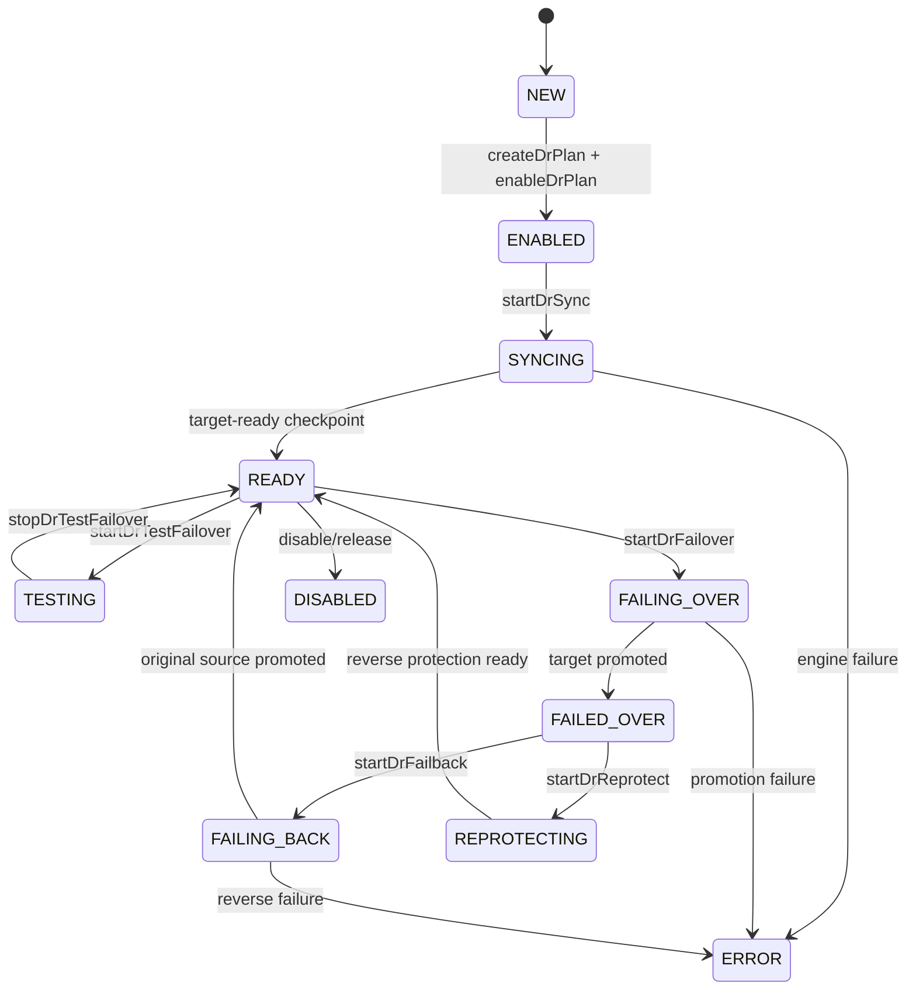
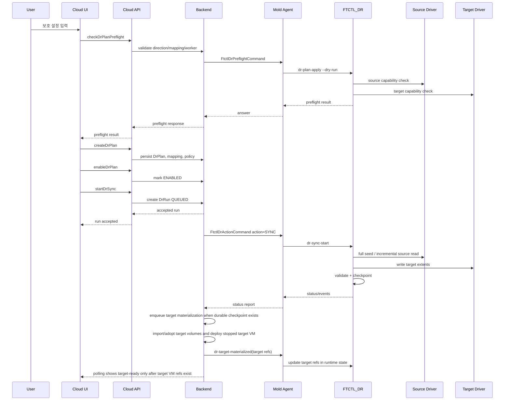
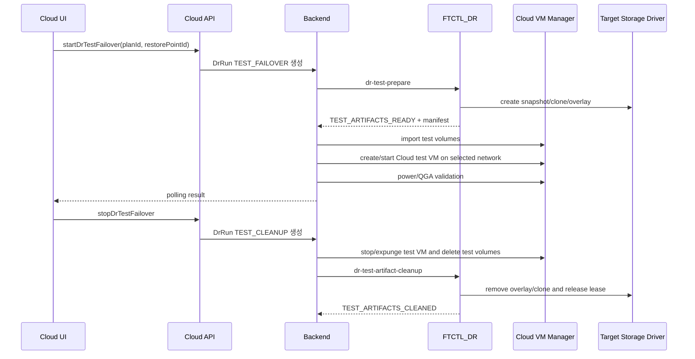
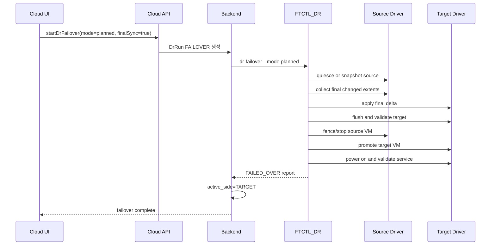
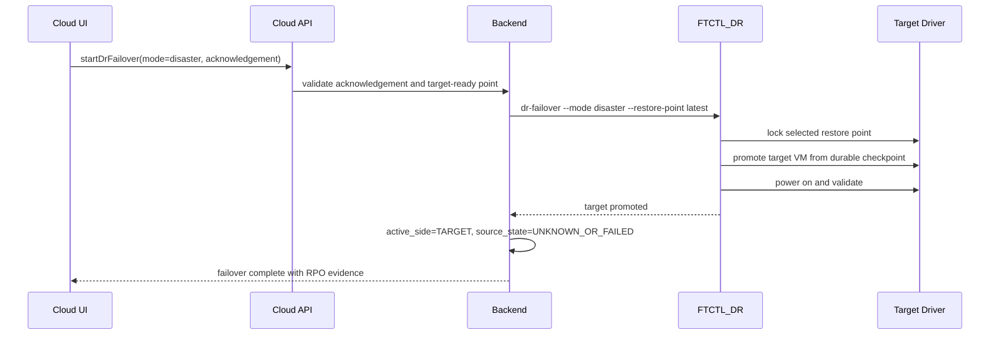
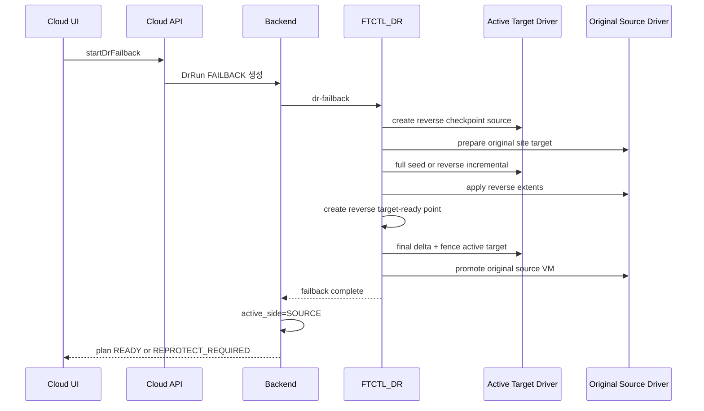
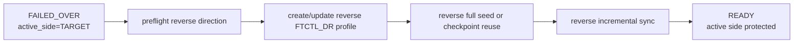

# Cross Hypervisor DR Protection, Failover, Failback Sequence Design

> Normative Test Failover update (2026-07-19):
> [562-cross-hypervisor-dr-test-artifact-contract-and-projection-isolation-design-20260719.md](562-cross-hypervisor-dr-test-artifact-contract-and-projection-isolation-design-20260719.md)
> governs the Test Failover sequence. Cloud creates the durable Test Session
> before dispatch and owns all temporary Cloud resources. FTCTL owns only the
> checkpoint lease, writable artifacts, guest preparation, and artifact cleanup.

작성일: 2026-07-01

상위 계획: [520-cross-hypervisor-dr-full-implementation-work-plan-20260701.md](520-cross-hypervisor-dr-full-implementation-work-plan-20260701.md)

관련 설계:

- [521-cross-hypervisor-dr-full-stack-implementation-design-20260701.md](521-cross-hypervisor-dr-full-stack-implementation-design-20260701.md)
- [523-cross-hypervisor-dr-ftctl-engine-driver-design-20260701.md](523-cross-hypervisor-dr-ftctl-engine-driver-design-20260701.md)

## 1. 목적

이 문서는 DR 보호 설정, failover, failback 흐름을 UI/API/Backend/Agent/FTCTL 단위로 고정한다.

모든 방향은 같은 run model을 사용한다.

| 방향 | source | target |
|---|---|---|
| ABLESTACK -> VMware | KVM/QMP dirty bitmap | VMware VDDK/VMDK |
| VMware -> VMware | VMware CBT/VDDK | VMware VDDK/VMDK |
| ABLESTACK -> ABLESTACK | KVM/QMP 또는 기존 FTCTL/xcolo | ABLESTACK RBD/QCOW2 |
| VMware -> ABLESTACK | VMware CBT/VDDK | ABLESTACK RBD/QCOW2 |

## 2. 공통 action lifecycle



## 3. DR 보호 설정 흐름

### 3.1 UI 흐름

1. 사용자가 direction을 선택한다.
2. source site와 VM을 선택한다.
3. target site와 storage/network mapping을 선택한다.
4. RPO/RTO target을 입력한다.
5. preflight를 실행한다.
6. plan을 생성한다.
7. plan을 enable한다.
8. sync를 시작한다.
9. target-ready restore point가 만들어질 때까지 진행률을 표시한다.

### 3.2 Sequence



### 3.3 Target materialization gate

The protection flow must not treat a durable restore point as a usable DR
target by itself. VMware-to-ABLESTACK sync can finish disk transfer and still
have no Cloud-visible target VM, volume references, or network binding. In that
state UI/API must show `target-materializing`, not `target-ready`.

The Cloud backend owns this boundary:

1. Detect durable checkpoint plus missing target VM refs from
   `FtctlDrRuntimeProjectionAdapter`.
2. Queue `DrTargetMaterializationService` asynchronously.
3. Import or adopt the seeded target disk artifacts into managed Cloud volumes.
4. Deploy a stopped target VM from the imported root volume and selected
   compute/network/offering placement.
5. Persist `dr_replica.target_vm_id`, `dr_replica.target_external_ref`, and
   `dr_replica_disk.target_volume_id`.
6. Send `dr-target-materialized` through Agent to FTCTL so runtime
   `dr-status` exposes `target_vm_present=true`,
   `target_network_present=true`, and `target_materialized=true`.

Failover, test failover, and failback eligibility must require the target
materialization evidence above. This keeps the UI asynchronous while preventing
the 40 percent stuck state from being mistaken for a transfer still in
progress.

### 3.4 Backend step 설계

| step | `DrRunStep.name` | 설명 |
|---|---|---|
| 1 | `validate-plan` | direction, engine, state, mapping 검증 |
| 2 | `dispatch-agent` | `FtctlDrActionCommand` 전송 |
| 3 | `apply-profile` | FTCTL profile 저장 |
| 4 | `preflight-source` | source driver 검증 |
| 5 | `preflight-target` | target driver 검증 |
| 6 | `full-seed` | 최초 전체 데이터 전송 |
| 7 | `incremental-sync` | 변경 영역 전송 |
| 8 | `validate-target` | flush/checksum/manifest 검증 |
| 9 | `publish-restore-point` | target-ready restore point 생성 |
| 10 | `update-rpo` | RPO lag 계산 |

### 3.5 방향별 보호 설정 차이

| 방향 | source preflight | target preflight | full seed | incremental |
|---|---|---|---|---|
| ABLESTACK -> VMware | QMP access, disk map, bitmap support | vCenter, datastore, network, VDDK writer | KVM disk export to VMDK | QMP dirty extents |
| VMware -> VMware | vCenter, CBT, VDDK reader | vCenter, datastore, network, VDDK writer | VDDK read to VMDK | CBT changed extents |
| ABLESTACK -> ABLESTACK | QMP/FTCTL profile, storage map | RBD/QCOW2 target, standby VM | 기존 FTCTL seed 또는 QMP export | 기존 xcolo/dirty extents |
| VMware -> ABLESTACK | vCenter, CBT, VDDK reader | ABLESTACK storage/network/VM | VDDK read to RBD/QCOW2 | CBT changed extents |

## 4. Test Failover 흐름

test failover는 운영 checkpoint를 오염시키지 않는다. target snapshot/clone/overlay 기반으로 격리된 VM을 부팅한다.



방향별 target test 방식:

| target | test 방식 |
|---|---|
| VMware | snapshot 또는 linked clone + isolated portgroup |
| ABLESTACK RBD | RBD snapshot/clone + isolated network VM |
| ABLESTACK QCOW2 | qcow2 backing overlay + isolated network VM |

## 5. Planned Failover 흐름

planned failover는 source가 살아 있는 상태를 전제로 한다. final delta sync 후 source를 fence/stop하고 target을 promote한다.



### 5.1 planned failover step

| step | 설명 |
|---|---|
| `pre-failover-check` | latest target-ready, no active test, capacity, network |
| `source-quiesce` | guest freeze/snapshot or crash-consistent marker |
| `final-delta-capture` | QMP dirty bitmap or VMware CBT final extent |
| `final-delta-apply` | target write and flush |
| `target-validation` | manifest/checksum/boot metadata |
| `source-fence` | source stop/network isolate/operator fence |
| `target-promote` | target VM attach/network/power-on |
| `service-validation` | guest agent/network check |
| `active-side-switch` | Cloud DB active side update |

## 6. Disaster Failover 흐름

disaster failover는 source가 불능일 수 있다. latest durable restore point를 사용한다.



disaster failover에서는 final delta가 없을 수 있으므로 UI와 event에 실제 사용한 restore point와 RPO lag를 반드시 표시한다.

## 7. Failback 흐름

failback은 단순히 원래 VM을 켜는 작업이 아니다. target에서 운영된 변경 데이터를 original source 쪽으로 reverse sync한 뒤 planned cutback을 수행한다.



### 7.1 방향별 failback source/target reversal

| original direction | failback data direction |
|---|---|
| ABLESTACK -> VMware | VMware -> ABLESTACK |
| VMware -> VMware | VMware DR -> VMware original |
| ABLESTACK -> ABLESTACK | ABLESTACK DR -> ABLESTACK original |
| VMware -> ABLESTACK | ABLESTACK -> VMware |

즉, failback은 네 방향 driver 조합을 모두 구현해야 완성된다. 한 방향만 구현하면 failback은 반쪽이 된다.

## 8. Reprotect 흐름

reprotect는 현재 active side를 source로 삼아 반대 방향 보호를 새로 구성한다.



reprotect 완료 후 사용자는 새 active source에서 다시 failover/failback/test failover를 수행할 수 있어야 한다.

## 9. Release/Cleanup 흐름

release는 운영 VM 삭제가 아니라 보호 관계와 DR runtime 자원을 정리하는 action이다.

정리 대상:

- FTCTL_DR profile
- session lock
- temporary export/socket
- test failover clone/overlay
- stale checkpoint under retention policy
- Cloud `DrRun` active lock
- target replica, 단 force release가 아니면 latest target-ready checkpoint는 보존 가능

forced release는 별도 acknowledgement가 필요하다.

## 10. UI/API/Backend/Agent/FTCTL 책임 분리

| 계층 | 책임 |
|---|---|
| UI | action 요청, 상태 표시, acknowledgement 수집 |
| API | parameter validation, async run 접수 |
| Backend | state machine, lock, worker selection, DB projection |
| Agent | host command 실행, status polling/report |
| FTCTL | source/target driver 실행, 데이터 전송, checkpoint, failover |

UI/API는 long-running 작업을 동기식으로 처리하지 않는다.

## 11. 완료 기준

각 방향마다 아래 evidence가 있어야 완료로 본다.

| evidence | 설명 |
|---|---|
| protection setup | plan, profile, preflight, initial sync 성공 |
| incremental sync | 변경 데이터만 전송된 checkpoint 2개 이상 |
| RPO | target-ready RPO lag 계산 및 UI 표시 |
| test failover | isolated target VM boot + cleanup 성공 |
| planned failover | final delta + target promote 성공 |
| disaster failover | latest durable checkpoint promote 성공 |
| failback | reverse sync + original site promote 성공 |
| reprotect | active side 기준 보호 재구성 성공 |

한 방향이라도 위 항목이 빠지면 4개 방향 동일 수준 구현 완료로 보지 않는다.

## 12. 2026-07-14 보강: 지속 동기화 중 전환 순서

Test Failover와 planned failover는 지속 Scheduler를 강제 종료하거나
global lock이 풀리기를 재시도하는 방식으로 시작하지 않는다.

```text
queued Run
  -> transition lock
  -> quiesce request generation
  -> current cycle commit
  -> PAUSED acknowledgment
  -> latest completed checkpoint lease
  -> test/failover materialization
```

Test cleanup은 test resource와 checkpoint lease를 제거한 뒤 Scheduler를
resume하고 다음 incremental checkpoint 완료까지 확인한다. UI의 "복제본"
표현은 임의 과거 시점 복구를 의미하지 않으며, Test Failover는 가장 최근에
완료된 내구성 복제본을 사용한다.

상세 순서와 timeout/failure 계약:
`553-cross-hypervisor-dr-continuous-sync-control-and-quiesce-lock-design-20260714.md`.

## 13. 2026-07-14 보강: Guest Preparation과 VM Boot Gate

`test/failover materialization`은 다음 하위 단계로 분해한다.

```text
checkpoint lease
  -> writable layer
  -> guest inspection
  -> VirtIO preparation
  -> domain preparation
  -> VM start
  -> boot validation
```

Test Failover는 격리된 transient domain이 `TEST_RUNNING`에 도달해야 성공이다.
Stop Test Failover는 domain, writable layer, snapshot, lease를 제거하고 복제를
재개한다.

실제 Failover는 FTCTL의 `CUTOVER_READY` 이후 Cloud backend가 target VM을
시작한다. 부팅 검증 전에는 `activeSide=TARGET`으로 전환하지 않는다. Linux,
Windows, Secure Boot 및 storage별 상세 순서는 다음 문서를 따른다.

- `554-cross-hypervisor-dr-vmware-to-kvm-cutover-and-virtio-bootstrap-design-20260714.md`

### 2026-07-14 Latest-Cycle Readiness Addendum

Test Failover and Failover may lease only the latest Cloud-committed durable
cycle. A VMware incremental cycle is eligible only when its aggregate and all
disk rows have `incremental_verified=true`; see
`555-cross-hypervisor-dr-vmware-cbt-incremental-and-transfer-metrics-design-20260714.md`.

### 2026-07-19 Test Failover Sequence Ownership Addendum

The Test Failover sequence in section 4 is superseded for ABLESTACK targets.
FTCTL creates and prepares checkpoint-derived test disk artifacts only. Cloud
imports those artifacts as temporary volumes, creates and starts the temporary
test VM on a selected Cloud network, and performs VM-state validation through
Cloud/Agent. Stop Test Failover expunges the Cloud VM/volumes before FTCTL
removes artifacts and releases the checkpoint lease.

Normative sequence and failure compensation:
`561-cross-hypervisor-dr-cloud-managed-test-failover-lifecycle-design-20260719.md`.
