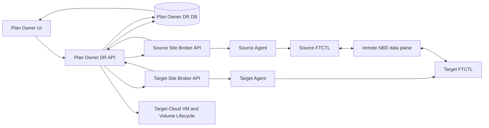

# ABLESTACK RBD Cross-Site DR Plan Authority And UI Lifecycle Design

Date: 2026-08-24

## 1. Scope

This design completes the single-VM `KVM_TO_KVM` path between the 22 and 32
ABLESTACK clusters. Both source and target storage are RBD. Ceph `rbd-mirror`
is explicitly out of scope.

The already validated `VMWARE_TO_KVM` path is a regression-protected contract.
Provider-specific changes in this design must not alter VMware inventory, VDDK,
CBT, target materialization, failover, or failback behavior.

### 1.1 Plan-owner data-plane correction

The Cloud instance that stores the DR Site and DR Plan is the sole control
authority. For the 22-to-32 validation, the 32 management server owns the Plan
even though the protected VM runs on the 22 site. The source Agent and FTCTL
are data-plane workers; they do not SSH to, provision, or administrate the
target site.

The first remote KVM implementation violated this boundary by placing a
`qemu+ssh` URI and a target-host SSH key in the source FTCTL profile. It also
allowed the source worker to synthesize `/dev/rbd/<pool>/<image>` before the
target Cloud had created its VM and volume records. That path is removed for
remote `KVM_TO_KVM` plans.

Corrected ordering:

1. The Plan Owner resolves target placement and creates the stopped target VM
   and Cloud-owned RBD volume records before dispatching the first Sync.
2. The Plan Owner sends `TARGET_EXPORT_START` to the selected target Agent.
   Target FTCTL validates or creates the Cloud-selected RBD image and exposes
   it with librbd-backed `qemu-nbd` on the reserved DR port range.
3. The Plan Owner receives the typed export manifest and adds only NBD endpoint
   metadata to the source command profile.
4. The Plan Owner sends `SYNC` or `RECOVER_SYNC` to the source Site through the
   registered Mold API and Agent broker.
5. Source FTCTL reads source RBD through librbd. Full Seed writes to the target
   NBD export. Incremental cycles retain only source RBD snapshot baselines,
   calculate changed extents with `rbd diff`, and apply those extents to the
   target NBD export. No target SSH command or target RBD snapshot is used.
6. After a durable checkpoint, the existing materialization completion and
   `TARGET_MATERIALIZED` notification contract marks the replica Ready.
7. Before production target VM power-on, and on Release or Delete, the export
   is stopped and checked before Cloud starts the VM through its normal krbd
   runtime path.

`profile.transport.mode` is `site-agent-nbd`. It contains no SSH user, key, or
libvirt URI. `profile.transport.exports[]` contains `device`, `host`, `port`,
`name`, `uri`, and the canonical target locator. The required FTCTL capability
is `dr-site-agent-rbd-transport-v1`.

This branch is selected only for remote-source `KVM_TO_KVM`. VMware-to-KVM
continues to use the validated VDDK/librbd mover, while local KVM-to-KVM and
existing HA/FT `remote-nbd` profiles retain their contracts.

| Area | AS-IS | TO-BE |
|---|---|---|
| Control authority | Source FTCTL administers target by SSH | Plan Owner controls both Sites through API and Agent |
| Target resources | Synthetic path before Cloud ownership | Stopped target VM and Cloud volume created first |
| Full Seed | Source starts target qemu-nbd through SSH | Target Agent starts export; source connects to NBD |
| Incremental | `rbd export-diff` piped to target SSH | source changed extents applied over target NBD |
| Credentials | target root SSH material reaches source | no target SSH credential in source runtime |
| VM runtime | export can overlap target VM power-on | export stopped before VM starts with krbd |

## 2. Authority Model

The Cloud that owns `dr_site`, `dr_plan`, `dr_run`, and the operator UI is the
**Plan Owner Cloud**. It remains authoritative whether it is located at the
source site, target site, or a third management site.

The Plan Owner Cloud:

- validates the complete plan and records every asynchronous Run;
- owns lifecycle decisions, action eligibility, status projection, and UI;
- asks the Cloud that owns a VM or volume to perform its local lifecycle action;
- never addresses a remote Agent or libvirt daemon directly.

Plan ownership is independent from replication direction. In the concrete
`22 -> 32` qualification, cluster 32 owns the sites, plan, Runs, and operator
UI, so cluster 32 is the Plan Owner while cluster 22 is the remote source. If
the same plan is created on cluster 22, cluster 22 remains the Plan Owner and
must invoke cluster 32 through the same signed site contract. A data-plane
worker never acquires lifecycle authority merely because it executes on the
source or target site.

Each registered ABLESTACK site exposes a signed Mold API execution broker. The
broker resolves local UUIDs, dispatches commands to its local Agent/FTCTL, and
returns an accepted operation reference. Status and cancellation use the Plan
UUID, Run UUID, and operation reference. API secrets are decrypted only for the
outbound request and are never written to an FTCTL profile or event.

The execution broker is an FTCTL site capability, not a DR Plan API. Therefore
it is registered by the always-on `ftctl-service` plugin whenever
`cloud.ftctl.service.enabled=true`; it must not depend on the remote site's
`cloud.dr.service.enabled` value. A site may execute delegated work for a Plan
Owner without exposing DR Site or DR Plan menus locally. The Plan Owner alone
creates Runs and decides lifecycle state; the remote broker only validates and
executes the allow-listed site-local command.

The broker boundary has two independent contracts:

1. `SiteExecutionBroker` resolves a site-local host UUID and submits or polls
   Agent/FTCTL work.
2. `SiteResourceBroker` inventories and creates, starts, stops, retains, or
   deletes site-local Cloud VMs, volumes, networks, and offerings.

The current `22 -> 32` test invokes the execution broker remotely on cluster
22 and uses the resource broker locally on the Plan Owner/target cluster 32.
A source-side Plan Owner must route target materialization through the remote
resource broker; it must never resolve remote UUIDs with the Plan Owner's local
numeric DAOs.

## 3. Storage And Replication Modes

| Mode | UI name | Data path | Durability boundary |
| --- | --- | --- | --- |
| Scheduled | RPO scheduled replication | RBD snapshot/diff or full seed -> remote NBD -> target librbd | target flush, export drain, checkpoint commit |
| Live | Near-real-time replication | running VM krbd -> QEMU mirror -> remote NBD -> target librbd | mirror ready plus periodic durable checkpoint |

VM execution continues to use the Cloud-created krbd attachment. Replication
writes use librbd through the target-side NBD exporter. A target VM is never
started while its writer/export is active.

Live mode is selectable only when all source disks support QEMU live mirror,
both site brokers support the contract version, target NBD capacity is
available, and the network preflight succeeds. Otherwise the UI explains why
only scheduled mode is available. Live mode does not mean synchronous zero-RPO;
the displayed RPO is measured from the latest durable checkpoint.

## 4. Remote Site Broker Contract

### 4.1 Inventory

`listDrSiteWorkloads` returns VM hardware, NICs, and every protected volume:

- VM UUID, instance name, power state, host UUID;
- firmware, secure boot, machine type, CPU, memory, guest OS;
- volume UUID, RBD pool/image, device target, size, type, device ID, offering;
- NIC/network UUID and MAC address.

Target placement inventory is also read from the selected site: zone, KVM host,
RBD pool, compute offering, disk offering, and network. Local numeric IDs are
never sent across sites; UUIDs are used at every broker boundary.

### 4.2 Resource preparation

The target Cloud creates the stopped replica VM and all RBD volumes through the
existing Cloud-managed FTCTL provisioning service. It returns target VM UUID,
host UUID, volume UUIDs, and canonical `rbd:<pool>/<image>` mappings.

### 4.3 Data-plane action

`submitFtctlDrSiteAction` accepts a redacted Plan profile and immutable
`planUuid/runUuid/action/siteRole/sourceVmUuid`. It resolves a local execution
host, submits the Agent command asynchronously, and returns `ACCEPTED` plus an
operation reference. Duplicate requests with the same Plan/Run/Action are
idempotent.

`getFtctlDrSiteActionStatus` and `cancelFtctlDrSiteAction` use the same identity.
The Plan Owner projects source and target evidence into one canonical Run.

The concrete signed API command is `executeFtctlDrSiteAgentCommand`. Its
parameters are limited to `commandtype`, `commandjson`, and `workerhostuuid`.
The local FTCTL service accepts only `ACTION`, `STATUS`, `CAPABILITIES`, and
`REVERSE_PREFLIGHT`, resolves the host by UUID, requires an Up KVM host, and
returns the typed Agent answer. The legacy DR-plugin-owned broker command is not
used for cross-site execution because a worker site is not required to enable
the DR Plan service.

Cloud API serialization may expose the broker fields either directly below
`executeftctldrsiteagentcommandresponse` or below its
`ftctldrsiteagentcommand` object. The Plan Owner client unwraps both forms and
requires `answerclass` plus `answerjson` before accepting the remote execution.
This wire-compatibility rule is covered by regression tests so a valid
site-local Agent answer cannot be misclassified as a remote engine outage.

## 5. UI Lifecycle

All mutations are UI initiated and immediately return an accepted Run. The UI
polls cached Plan projection and does not block on Agent or FTCTL work.

| UI action | Expected authority and result |
| --- | --- |
| Create plan | Plan Owner validates both site inventories and stores UUID mappings |
| Full resync | target Cloud resources -> source broker seed -> durable target checkpoint |
| Pause / Resume | Plan Owner sends scheduler control to the currently active source site |
| Test failover | target Cloud creates isolated test VM from the latest durable target artifact |
| Test cleanup | target Cloud removes test-only VM/artifacts and resumes protection |
| Failover | source isolation/final sync when available, writer drain, target Cloud starts replica |
| Failback | reverse broker path replicates target changes into Cloud-owned source RBD, then source Cloud starts VM |
| Reprotect | active-site broker becomes source and the opposite site becomes target |
| Release | stops protection; target retention or deletion follows the explicit operator choice |
| Delete plan | removes Plan metadata only after the selected resource disposition completes |

## 6. State And Failure Rules

- Broker unavailability is `WAITING_SITE`, retryable, and never a false terminal
  failure.
- Target resource or NBD shortage is `WAITING_RESOURCE` with bounded backoff.
- A successful Run requires both data-plane durability and Cloud VM/volume
  lifecycle convergence.
- A late status reply cannot overwrite a newer terminal Run.
- Failover/failback authority transitions and durable checkpoint commit are
  transactional in the Plan Owner DB.
- UI action eligibility is derived from the canonical Plan state, not from the
  latest event text.

## 7. Preflight And Regression Gates

Preflight must verify signed API calls in both directions, source VM inventory,
target placement UUIDs, RBD feature compatibility, NBD device/port capacity,
QEMU mirror capability, Agent-controlled NBD reachability, available capacity,
and stopped target VM state. Source FTCTL never receives target SSH credentials
and never starts a process on the target host directly.

The target Agent allocates an export port from the configured reserved range.
It starts every disk export as one operation and records a Plan-scoped manifest.
If any disk, RBD image, port, or `qemu-nbd` start fails, all exports opened by
that attempt are stopped and the incomplete manifest is removed. A collision on
the deterministic first port searches the remaining reserved range before the
operation becomes `WAITING_RESOURCE`.

### 7.1 Verified 22 -> 32 data-plane preflight

The implementation preflight on 2026-08-24 used a temporary 64 MiB image in
the 32-cluster RBD pool. The 32.2 target Agent host exported it with
`qemu-nbd` on the configured `11809-11872/tcp` range. The 22.1 source host read
the export metadata, wrote a 4 KiB `0x5a` pattern, and read the same pattern
back successfully. The exporter and temporary RBD image were then removed.
This proves the Plan Owner selected data path without touching a protected VM
disk. The current 32.2 host has duplicate historical port declarations and the
last value, `11809`, is effective. This feature reads that effective value and
does not rewrite the existing remote-NBD setting during deployment, because
the validated VMware path shares the setting. Configuration hygiene is handled
separately after both paths are idle and revalidated.

Deployment preflight must also call `listApis` or issue a signed broker probe on
every ABLESTACK site and verify `executeFtctlDrSiteAgentCommand` is present
before a Plan Run is accepted. Missing API registration is a deployment error,
not a credential error and not a terminal Plan failure.

Before deployment, run the FTCTL baseline contract suite for sync,
pause/resume, release/tombstone, test failover/cleanup, failover, failback, and
reprotect. Run the existing VMware-to-ABLESTACK tests unchanged. The release is
blocked if either contract regresses.

### 7.2 Test deployment baseline

The paired test deployment on 2026-08-24 used Cloud commit `dc8757a8a9` and
FTCTL commit `5597e72`. FTCTL GitHub Actions run `32711444688` produced
`ablestack_vm_ftctl-0.9.5-1.noarch.rpm` with SHA-256
`53248c7a34b154616ba10dfe1b785290f63ed71c0f0b8b8a5426ad93e39947eb`.
The package was installed on all six compute hosts. Changed Cloud management
and Agent classes were injected into the package-owned runtime JARs on both
test clusters, and every affected service was restarted.

Post-deployment verification requires all of the following before UI testing:

- both `mold` services are active and `/client/` returns HTTP 200;
- the active webapp retains `WEB-INF`;
- both management runtimes contain `TARGET_EXPORT_START`, `site-agent-nbd`,
  and `prepareSyncTarget` markers;
- all six `mold-agent` services are active and contain the new Agent command;
- all six installed FTCTL runtimes contain the target export command, transport
  schema marker, and `rbd_extent_copy.py`;
- both Cloud DBs report all three routing hosts as `Up / Enabled`;
- recent management logs contain no class or method linkage errors.

This deployment met every gate. UI lifecycle verification is therefore allowed
to proceed without a direct DB state repair or backend-only action.

### 7.3 Durable target finalization and incremental-cycle contract

The first live 22 -> 32 UI run exposed two state-boundary defects that are now
part of the regression contract:

- the Plan Owner may create the stopped target VM and RBD volumes before the
  first durable checkpoint exists. Target finalization must therefore depend on
  the durable checkpoint plus the replica materialization digest, not on a
  missing target VM reference;
- scheduler cycle names are wire values and are case-insensitive. `incremental`,
  `CBT_INCREMENTAL`, and equivalent normalized values must select the RBD diff
  writer when a committed source baseline exists. They must never silently
  select `qemu-img convert` because of letter case.

After any durable ABLESTACK-to-ABLESTACK cycle, Cloud reconciles an existing
`SKELETON_READY` replica to `READY`, validates and claims the existing target
VM and volumes, sends `TARGET_MATERIALIZED`, stores the immutable SHA-256
materialization digest, and updates target readiness. This reconciliation is
idempotent and is allowed to use the completed initiating Run as correlation
evidence; it does not rewrite that Run's terminal result.

FTCTL normalizes the scheduler cycle mode before dispatch. A committed baseline
selects the site-agent RBD diff path, keeps the previous source snapshot until
the new target write is durable, and only then advances the baseline. A missing
baseline may perform one explicit full-seed fallback and must record the reseed
reason. Tests cover lowercase scheduler input, committed-baseline incremental
selection, and the pre-created-target/durable-finalization race.

### 7.4 Cross-site scheduler recovery and semantic acceptance contract

An owner-side `RECOVER_SYNC` request is a two-site ordered operation for
`KVM_TO_KVM`:

1. the Plan Owner starts or validates every target RBD export on the target
   worker;
2. only after the export contract is durable, it sends `RECOVER_SYNC` through
   the source site's signed Agent broker;
3. the source FTCTL drains any Plan-owned quarantined NBD clients, restores the
   scheduler launch journal, and starts the Plan-scoped systemd unit;
4. Cloud accepts the Run only when the source answer is semantically accepted.

Transport success and operation success are separate. `dr-status` may return
`result=ok` because the status query itself succeeded while the requested Run
has `state=ERROR`, `accepted=false`, or a non-empty `error_code`. Such a payload
is a failed operation and must never be converted to a successful Agent answer
or terminal Cloud Run. The KVM Agent wrapper and the Plan Owner adapter both
enforce this rule so a stale or mixed-version Agent cannot create a false
success.

NBD quarantine recovery resolves the installed FTCTL recovery executable by
an explicit, validated path. It must not call an optional or undefined
provider helper. A recovery failure records `recovery_stage`, the original
return code, and a typed error code before returning to Cloud. The scheduler is
started only after NBD cleanup succeeds. These changes are shared runtime
safety fixes, so the VMware-to-ABLESTACK action contract suite remains a
release gate and no VMware data-plane behavior is changed.

### 7.5 Target export durability and Plan Owner recovery ordering

For a remote `KVM_TO_KVM` Plan, the target RBD image is Cloud-owned but the
`qemu-nbd` endpoint is an Agent-managed lease. The Plan Owner must regard the
lease as a recoverable prerequisite, not as an incidental process created only
by the first Sync Run.

Before `SYNC` or `RECOVER_SYNC` is dispatched to the remote source, Cloud sends
the idempotent `TARGET_EXPORT_START` command to the selected target Agent and
requires a semantically successful answer containing all expected disk
exports. The target FTCTL persists a redacted desired-state contract and its
timer restores missing exporters after package replacement, Agent restart, or
host reboot. Cloud does not store target credentials in the FTCTL contract and
does not ask the source site to control the target host.

Runtime projection maps `DR_TARGET_EXPORT_UNAVAILABLE` to a retryable
`WAITING_RESOURCE` state. The UI shows that protection is waiting for the
target data path and keeps actions asynchronous; it must not present the Plan
as terminally failed or claim that a new Full Seed is running. Automatic
recovery and an operator Full Resync both create a tracked Cloud Run. The Run
is accepted only after target export preflight succeeds and the remote source
Agent accepts the command.

This ordering applies only to the Plan Owner controlled
`KVM_TO_KVM/site-agent-nbd` provider pair. The validated
VMware-to-ABLESTACK path does not enter this branch.

### 7.6 Full-seed mode normalization and terminal Run convergence

The UI and Cloud action contract use `FULL_RESEED`, while the canonical FTCTL
Cycle persists the engine mode as `FULL_SEED`. These are equivalent full-seed
values. Cloud must normalize both spellings, including their hyphenated wire
forms, before binding an accepted Cycle or deciding whether a durable Cycle
satisfies a Full Resync Run.

A Full Resync Run may reach the following valid recovery state after a service
restart or a later scheduler Cycle:

- the Run request is `FULL_RESEED` and remains `ACCEPTED`;
- its immutable `accepted_cycle_sequence` and `accepted_cycle_token` identify
  the initiating Cycle;
- that Cycle is owned by the Run, is `READY`, is `LOCAL_DURABLE`, and is stored
  with `requested_mode=FULL_SEED`;
- the target VM, storage, network, and restore point are present;
- the current scheduler has already advanced to a later incremental Cycle.

This state must converge to `SUCCEEDED` without rewriting the Cycle, starting
a new transfer, or repairing the database manually. A stale `completed` value
on a non-terminal Run is cleared first, then the same projection pass evaluates
the normalized canonical Cycle and target readiness. The regression test must
use the production combination `Run=FULL_RESEED`, `Cycle=FULL_SEED`, and a
non-authoritative operation status so the test cannot pass only because both
fixtures use the same spelling.

## 8. AS-IS / TO-BE

| Area | AS-IS | TO-BE |
| --- | --- | --- |
| Controller | worker binding assumes local source/target hosts | Plan Owner Cloud controls either remote site through broker APIs |
| Authority placement | target-side ownership is implicit in the tested path | whichever Cloud stores the plan remains authoritative; source/target location does not transfer control |
| Remote execution API | broker registration depends on the remote DR Plan plugin being enabled | FTCTL service always exposes the narrow site-local broker while the Plan Owner retains lifecycle authority |
| Broker response contract | nested Cloud API object is mistaken for a missing typed answer | Plan Owner accepts the flat and standard object-wrapped response forms and validates the typed Agent payload |
| KVM inventory | VM summary only; disks and hardware absent | complete VM, RBD disk, NIC, and hardware inventory by UUID |
| Target placement | Plan Owner local DAOs used for every KVM target | selected target site's Mold inventory and lifecycle APIs |
| KVM replication | lowercase scheduled `incremental` can fall through to repeated `qemu-img convert` full seed | normalized cycle mode selects remote-NBD RBD diff when the baseline is committed |
| Full-seed terminal projection | Run uses `FULL_RESEED` while its durable canonical Cycle uses `FULL_SEED`, leaving the Run `ACCEPTED` | normalize both values before Cycle binding and terminal satisfaction; durable target evidence converges the Run to `SUCCEEDED` |
| Target readiness | pre-created VM makes the missing-reference trigger false, leaving `SKELETON_READY` after durable data | durable reconciliation stores the materialization digest and converges the existing replica to `READY` without rewriting terminal Run history |
| Recovery result | `result=ok` from a status query can hide `state=ERROR` and terminate `RECOVER_SYNC` as successful | Agent and Plan Owner require accepted state, no error code, and a non-error operation state |
| NBD recovery | scheduler calls an undefined mover resolver and returns an untyped recovery failure | installed recovery tool is resolved explicitly; stage and original RC are preserved |
| Target export failure | a partial multi-disk start can leave an exporter running | Plan-scoped manifest, reserved-range fallback, and all-or-nothing rollback |
| Target export restart | package/host restart can remove the exporter while source scheduling continues | target desired-state is durable; Agent reconcile restores the fixed endpoints before source retry |
| Export outage projection | repeated failed Cycles may appear as terminal replication errors | one pending Cycle waits with a typed resource error and bounded backoff |
| VM lifecycle | local target materializer assumptions | Cloud owning each VM performs create/start/stop/delete |
| UI | KVM_TO_KVM appears selectable before end-to-end readiness | capability-gated mode and complete asynchronous lifecycle |

## 9. Target-Side Transition Checkpoint Contract

The Plan Owner remains authoritative when the source and target belong to
different ABLESTACK sites. A `KVM_TO_KVM` scheduler and the production
`FAILOVER` final-delta operation are dispatched to the remote source worker.
`TEST_PREPARE` remains a target-worker artifact operation. Cloud owns target VM
lifecycle, but that ownership does not move the RBD reader: only the source
worker can read the source RBD and its local `restore-points.jsonl`.

Before either action is dispatched, Cloud selects the latest active
`dr_restore_point` in `READY` state and writes an immutable controller
checkpoint envelope into the redacted request/profile:

- `checkpointContractVersion=1`;
- `checkpointPlanUuid`, `checkpointRef`, and positive `checkpointSequence`;
- `checkpointState=READY`, cycle type/token, and effective mode;
- source-created and target-ready epoch timestamps plus target RPO evidence.

For test failover, `buildTestArtifactSpec()` repeats the checkpoint reference
and sequence. FTCTL may reconstruct target-side transition metadata only when
the envelope and artifact contract match exactly. Cloud does not copy source
credentials, source host files, or checkpoint payloads to the target. Failed
test preparation must also project its `dr_test_session` from `REQUESTED` to
`FAILED`, preventing a stale session from blocking a retry.

The contract is used only when `direction=KVM_TO_KVM` and the source site is
remote. The existing VMware-to-ABLESTACK execution and restore-point lookup
remain unchanged regression gates.

For that same remote-source condition Cloud writes
`schedulerTransitionScope=REMOTE_SOURCE`. Test failover and cleanup are target
artifact operations and must not pause, resume, or recreate a scheduler on the
target coordinator. Production failover is not allowed to reuse this shortcut.
The Plan Owner keeps the target export running while remote source FTCTL writes
the final delta. After source FTCTL reports durable `CUTOVER_READY`, Cloud
quiesces the remote scheduler and source VM, drains the target export, and
starts the target VM.

### 9.1 AS-IS / TO-BE

| Area | AS-IS | TO-BE |
| --- | --- | --- |
| Plan Owner evidence | Sends only a textual restore-point reference | Sends a versioned, DB-backed durable checkpoint envelope |
| Target Agent lookup | Searches a source-worker-local journal | Validates the controller envelope and target artifact contract |
| Test session failure | Run fails while session can remain `REQUESTED` | Runtime failure atomically projects the session to `FAILED` |
| Actual failover | Target FTCTL attempts to read a remote source RBD after its target export was stopped | Remote source FTCTL writes the final delta through the live target export and owns the cutover engine session |
| VMware regression | Shared fallback could alter a validated path | No fallback outside remote `KVM_TO_KVM` |
| Scheduler authority | Target test action may resume a duplicate scheduler | Test action leaves the remote source scheduler authoritative |

## 10. Plan-Owner Production Failover Transaction

For a remote `KVM_TO_KVM` source, the Cloud that stores the Plan owns the
production cutover transaction even when it is the target site. The source
site remains a credentialed execution endpoint; it does not become a second
Plan authority.

The Plan Owner executes the following ordered barrier for planned failover:

1. start or reconcile the target Plan-owned RBD export and inject its typed NBD
   endpoints into the source profile;
2. dispatch `FAILOVER` to the remote source Agent and poll that same Agent until
   it reports a durable `CUTOVER_READY` checkpoint and manifest;
3. send a typed `PAUSE_SYNC` command through the source site's narrow Agent
   broker and require a semantically successful answer;
4. stop the source VM through the registered source Mold API and poll until it
   is `POWERED_OFF`;
5. persist `sourceFenceState=VERIFIED` and
   `sourcePowerState=POWERED_OFF` in the cutover session;
6. stop the Plan-owned target export, then start the existing target replica
   through local Cloud VM lifecycle APIs and
   validate its configured boot policy;
7. submit `DR_CUTOVER_COMMIT_V2` to the same remote source FTCTL session with the exact checkpoint,
   manifest, target identity, fence, power, and boot evidence;
8. switch `dr_plan.active_side` to `TARGET` only after the engine acknowledges
   the same envelope.

If preparation fails before promotion, target power-on is forbidden. The Plan
Owner sends `FAILOVER_ABORT` to remote source FTCTL, restores the target export
from its persisted profile, and resumes the source scheduler. The Plan remains
source-authoritative. Disaster mode does not call an unreachable source; it uses
the existing explicit isolation acknowledgement and reason, while preserving
the same target-power and engine-commit gates.

This transaction is not used by test failover. It is also excluded from the
validated `VMWARE_TO_KVM` branch, which keeps its vCenter isolation logic.

### 10.1 API, Backend, Agent, FTCTL, DB, UI contract

| Layer | Contract |
| --- | --- |
| UI/API | Planned/disaster intent is asynchronous; UI never talks to either host directly |
| Backend | Plan Owner coordinates target export, remote final delta, source quiesce, VM power, and commit in order |
| Remote Agent | Owns `FAILOVER`, status, pause/resume, abort, and cutover commit for the selected source worker |
| FTCTL | Source publishes `CUTOVER_READY`; target export is drained before VM power-on; final authority requires the V2 commit envelope |
| DB | Cutover session stores fence/power/manifest/target identity before authority changes |
| UI projection | Shows preparing/commit-verifying until DB and FTCTL both agree on `FAILED_OVER/TARGET` |

### 10.2 AS-IS / TO-BE

| Area | AS-IS | TO-BE |
| --- | --- | --- |
| Remote source isolation | Only VMware planned failover is actively powered off | Remote KVM scheduler is paused and source VM is stopped through source Mold |
| Target activation | KVM engine may claim promotion while Cloud VM is off | Cloud starts and validates the existing replica before commit |
| Failure handling | Failed local final sync can leave export and scheduler intent inconsistent | Remote abort, target export restore, and source scheduler resume converge before retry |
| Authority evidence | Runtime state alone can move active side | Cutover session and typed FTCTL commit must match atomically |
| Existing success path | Shared projection code risks VMware regression | New branch requires remote `KVM_TO_KVM`; VMware behavior is unchanged |

## 11. 2026-08-25 Remote Final-Delta Defect And Regression Gate

Live plan `8bce9b04-386c-497d-a40e-bbeb50f6762f` exposed an ordering defect:
Cloud stopped the target export before final synchronization and dispatched
`FAILOVER` to the target coordinator. The target host could neither read the
remote source RBD nor reach the export it had just stopped, so FTCTL returned
`DR_TARGET_EXPORT_UNAVAILABLE`. Source power stayed on and target power stayed
off, preserving data safety.

The release gate for remote `KVM_TO_KVM` requires all of the following:

- `TARGET_EXPORT_START` precedes remote `FAILOVER` dispatch;
- status polling, `FAILOVER_ABORT`, and `CUTOVER_COMMIT` use the same remote
  source worker and engine run UUID;
- target export stop occurs only after durable `CUTOVER_READY` and source VM
  power-off, and before target VM power-on;
- abort restores the target export from its persisted profile and resumes the
  remote source scheduler;
- local and VMware plans retain their existing dispatch and commit paths;
- tests assert the full order and abort/retry convergence path.

### 11.1 AS-IS / TO-BE

| Area | AS-IS | TO-BE |
| --- | --- | --- |
| Final-delta owner | Target coordinator | Remote source FTCTL |
| Target export | Stopped before final delta | Running through `CUTOVER_READY`, drained before target boot |
| Status and commit | Local coordinator | Same remote source engine session |
| Abort | Local abort only | Remote abort, target export restore, remote scheduler resume |
| Safety | Failure happened before VM power change | Explicit ordering test preserves this invariant |

## 12. Committed Target Authority Projection

After a production cutover session is committed as
`FAILED_OVER / TARGET / ACKNOWLEDGED`, that session is the Plan authority until
a finite Failback or Reprotect operation explicitly changes it. An idle target
worker may still contain a pre-cutover scheduler status because its role was a
Plan-owned RBD export endpoint. That local status is diagnostic evidence only;
it must not replace the committed Cloud cutover authority.

Projection therefore follows these rules:

1. when no finite operation is active and a committed target-authority session
   exists, project `FAILED_OVER`, `TARGET`, target power, and cleared errors
   directly from the session;
2. do not poll or apply an idle target-side replication scheduler as Plan
   authority in that state;
3. when Failback or Reprotect starts, poll the operation owner selected by the
   existing action contract and allow only its correlated run to change
   authority;
4. retain the last durable Cycle for RPO/history display without converting a
   stopped source scheduler into a replication failure;
5. keep remote VMware and source-authoritative KVM projection behavior
   unchanged.

### 12.1 AS-IS / TO-BE

| Area | AS-IS | TO-BE |
| --- | --- | --- |
| Idle post-cutover refresh | Polls the target export host and reads stale `ERROR` | Uses the committed cutover session as authority |
| Plan state | Successful Run can become `DEGRADED` | Remains `FAILED_OVER / TARGET` with cleared errors |
| Active operation | Authority source is implicit | Finite Failback/Reprotect run owns its correlated projection |
| VMware regression | Shared refresh change could alter VMware | Fast path requires remote `KVM_TO_KVM` plus committed target authority |
