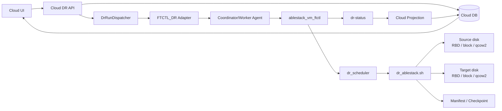
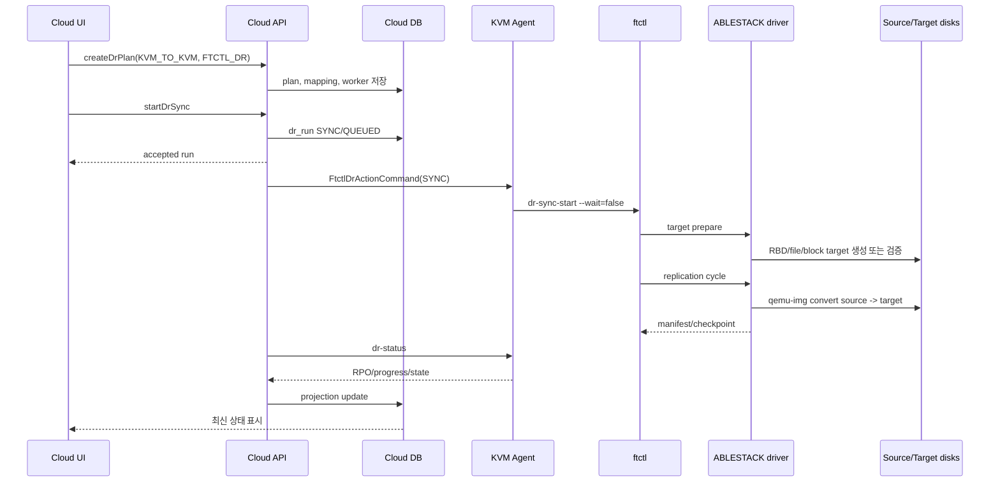

# ABLESTACK -> ABLESTACK DR 아키텍처, 시퀀스, 기능 및 단계별 태스크

문서 기준일: 2026-07-01  
방향: `KVM_TO_KVM`  
권장 엔진: `FTCTL_DR`

## 1. 아키텍처

ABLESTACK 운영 VM을 ABLESTACK DR site로 보호하는 방향이다. source와 target 모두 KVM/ABLESTACK이므로 ftctl ABLESTACK driver가 disk mapping을 canonicalize하고 target RBD/file/block device를 준비한 뒤 `qemu-img convert` 기반 seed/checkpoint를 수행한다.

## 2. 기능 범위

| 기능 | 현재 흐름 |
| --- | --- |
| 보호 설정 | ABLESTACK source VM과 target disk mapping을 Plan에 저장 |
| Target 준비 | target RBD create, block size check, qcow2 create를 수행 |
| Sync 시작 | `dr-sync-start` 후 scheduler가 checkpoint loop를 시작 |
| 지속 복제 | 현재 구현은 매 cycle `qemu-img convert` full seed를 수행한다. |
| Restore Point | full seed 완료 시 manifest/checkpoint와 RPO projection 생성 |
| Test Failover | target-ready restore point로 test artifact/session 생성 |
| Failover | final checkpoint 선택 후 active side를 TARGET으로 전환 |
| Failback | reverse profile로 target -> source checkpoint 수행 |
| Reprotect | reverse direction으로 지속 복제를 재개 |

## 3. 시퀀스

## 4. 단계별 태스크

| 단계 | Operator/UI 태스크 | Backend/Agent/ftctl 태스크 |
| --- | --- | --- |
| 1. Site 등록 | 운영 ABLESTACK site와 DR ABLESTACK site 등록. UI에서 각 Mold API URL/API Key/Secret Key 입력 | `dr_site.hypervisorType=KVM`, `dr_site_credential.credential_type=MOLD_API` |
| 2. Plan 생성 | `KVM_TO_KVM`, `FTCTL_DR`, source VM, RPO/RTO 입력 | topology와 duplicate plan 검증 |
| 3. Disk mapping | source disk path와 target path/type/format/size 지정 | `dr_ablestack_canonicalize_profile`로 disk map 생성 |
| 4. Worker 지정 | source/target/coordinator host 지정 | coordinator가 Agent command를 받음 |
| 5. Sync 시작 | Start Sync | target disk 준비, scheduler 시작 |
| 6. Checkpoint 확인 | UI에서 restore point와 RPO 확인 | 매 cycle manifest/checkpoint 생성 |
| 7. Test Failover | target restore point로 테스트 | test session/artifact 기록 |
| 8. Failover | planned/disaster 선택 | planned는 final checkpoint 후 TARGET active |
| 9. Failback | source 복구 후 failback | reverse profile, reverse checkpoint, SOURCE active |
| 10. Reprotect/Release | 재보호 또는 보호 해제 | scheduler control 또는 runtime release |

## 5. RPO/RTO 분석

| 항목 | 분석 |
| --- | --- |
| RPO | 현재 cycle이 full seed이므로 RPO는 scheduler interval보다 full copy 시간의 영향을 크게 받는다. 큰 disk에서는 목표 RPO를 만족하기 어렵다. |
| RTO | target disk가 준비되어 있고 restore point가 최신이면 failover 상태 전환은 빠르지만, 실제 VM lifecycle hook이 없으면 전원/등록 단계가 별도 작업으로 남는다. |
| 개선 포인트 | KVM block dirty bitmap, qcow2 backing chain, RBD diff/export-diff 등 delta 기반 복제 엔진을 추가해야 낮은 RPO를 안정적으로 만족한다. |

## 6. 소스 검토 결과와 운영 전 확인 사항

| 항목 | 판정 |
| --- | --- |
| UI/API/Run/Agent/ftctl 제어 경로 | 연결됨 |
| ABLESTACK target disk 준비 | 구현됨. RBD/file/block target 준비 경로가 있다. |
| 지속 복제 | 부분 구현. scheduler는 반복 실행되지만 현재 ABLESTACK cycle은 full seed copy이다. |
| 실제 VM lifecycle | runtime은 상태 projection 중심이며 실제 target VM power-on/provision hook은 운영 통합 필요 |
| 흐름 단절 위험 | disk mapping 누락 시 `WAITING_FOR_DISK_MAP`, full seed 장기화 시 RPO 악화 |
