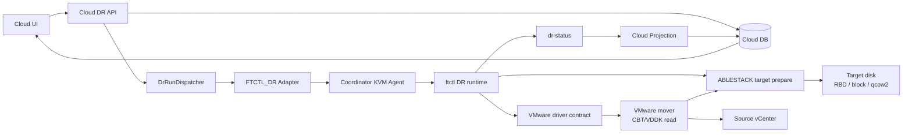
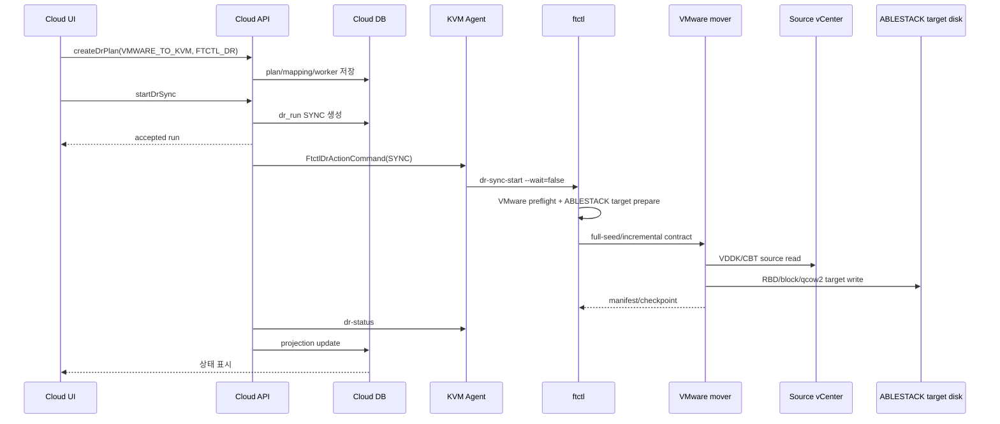

# VMware -> ABLESTACK DR 아키텍처, 시퀀스, 기능 및 단계별 태스크

문서 기준일: 2026-07-01  
방향: `VMWARE_TO_KVM`  
권장 엔진: `FTCTL_DR`

## 1. 아키텍처

VMware 운영 VM을 ABLESTACK DR site로 보호하는 방향이다. source VMware VMDK/CBT를 읽고 target ABLESTACK disk(RBD, block, qcow2)에 반영해야 하므로 VMware mover와 ABLESTACK target 준비 로직이 함께 필요하다. V2K는 이관용 도구이므로 이 DR 지속 복제 경로에서는 사용하지 않는다.

## 2. 기능 범위

| 기능 | 현재 흐름 |
| --- | --- |
| 보호 설정 | VMware source VM ref와 ABLESTACK target disk mapping을 Plan에 저장 |
| Sync 시작 | VMware preflight와 ABLESTACK disk map 준비 후 scheduler 시작 |
| 지속 복제 | VMware mover가 CBT/VDDK delta를 읽어 ABLESTACK target disk에 반영해야 한다. |
| Restore Point | mover와 ftctl scheduler가 manifest/checkpoint/RPO를 생성 |
| Test Failover | ABLESTACK target restore point 기반 test session 생성 |
| Failover | target ABLESTACK active projection. 실제 VM 생성/전원 제어는 provider lifecycle hook 필요 |
| Failback | reverse profile로 ABLESTACK -> VMware checkpoint 수행 |
| Reprotect | target ABLESTACK 운영 기준으로 reverse protection 시작 |

## 3. 시퀀스

## 4. 단계별 태스크

| 단계 | Operator/UI 태스크 | Backend/Agent/ftctl 태스크 |
| --- | --- | --- |
| 1. Site 등록 | Source VMware site, Target ABLESTACK site 등록. UI에서 vCenter 인증정보와 Mold API 인증정보 입력 | source hypervisor VMWARE, target hypervisor KVM 검증, `dr_site_credential` 암호화 저장 |
| 2. Plan 생성 | `VMWARE_TO_KVM`, `FTCTL_DR`, sourceExternalRef, target mapping 입력 | `DrPlanServiceImpl`이 engine/direction topology 검증 |
| 3. VMware 설정 | VM/VMDK ref, CBT/VDDK 조건 준비 | 저장된 vCenter credential로 ftctl VMware preflight 수행 |
| 4. ABLESTACK target 설정 | target RBD/qcow2/block path와 size 지정 | target disk create/check 수행 |
| 5. Sync 시작 | Start Sync | Agent `dr-sync-start`, scheduler 시작 |
| 6. Checkpoint 확인 | RPO와 restore point 확인 | mover가 checkpoint 생성, projection 반영 |
| 7. Test Failover | target restore point로 test failover | ABLESTACK test VM lifecycle hook 필요 |
| 8. Failover | planned/disaster failover | target active projection, final checkpoint 선택 |
| 9. Failback | source VMware 복구 후 failback | reverse ABLESTACK -> VMware mover 필요 |
| 10. Reprotect | ABLESTACK 운영 기준 재보호 | reverse profile 기반 scheduler 시작 |

## 5. RPO/RTO 분석

| 항목 | 분석 |
| --- | --- |
| RPO | source VMware CBT delta 추출 시간과 ABLESTACK target write 시간이 합쳐진다. |
| RTO | ABLESTACK target VM 생성, disk attach, network mapping, power-on 시간이 지배한다. |
| V2K 판단 | V2K는 one-shot migration/convert 도구 성격이라 지속 checkpoint, failback, reprotect 요구를 만족하지 못한다. |
| 필수 엔진 | VMware mover가 source CBT read와 target ABLESTACK write를 모두 수행해야 한다. |

## 6. 소스 검토 결과와 운영 전 확인 사항

| 항목 | 판정 |
| --- | --- |
| UI/API/Run/Agent/ftctl 제어 경로 | 연결됨 |
| V2K 사용 여부 | Cloud UI에서 migration-only로 분리되어 있고 본 DR 경로에는 사용하지 않는 것이 맞다. |
| VMware source data plane | `FTCTL_DR_VMWARE_MOVER` 필수 |
| ABLESTACK target 준비 | target disk 준비 로직은 있으나 VMware mover가 target write까지 완결해야 한다. |
| 실제 VM lifecycle | ABLESTACK target VM materialize/power-on hook 필요 |
| 흐름 단절 위험 | mover/hook 미배치 시 Run은 accepted 후 status projection에서 오류 또는 delegated 상태로 남을 수 있다. |

## 2026-07-19 Test Failover 운영 모델 보정

영구 DR 대상 VM은 실제 Failover용으로 `Stopped` 상태를 유지한다. Test
Failover에서는 최신 정상 체크포인트로부터 별도의 테스트 디스크를
준비하고, Cloud가 해당 디스크를 임시 볼륨으로 등록한 뒤 임시 테스트
VM을 생성·기동·정리한다. FTCTL은 체크포인트 lease, 테스트 디스크,
VirtIO 준비만 담당하며 고객 테스트 VM을 직접 `virsh`로 관리하지 않는다.

테스트 네트워크는 Cloud 네트워크를 명시적으로 선택한다. 네트워크가
없는 테스트는 `NO_NIC`로 구분하며 격리 네트워크로 표시하지 않는다.
스토리지 식별자는 Cloud가 볼륨과 스토리지 풀에서 구조화하여 만들고,
Agent가 대상 호스트에서 검증한 뒤 FTCTL에 전달한다. FTCTL은 디스크 표시
이름으로 RBD/파일 경로를 추론하지 않는다. 테스트 작업 실패는 작업 이력과
테스트 세션에 표시하되 정상 동작 중인 지속 복제 상태를 오류로 바꾸지 않는다.

기본 수명주기 설계는
`../561-cross-hypervisor-dr-cloud-managed-test-failover-lifecycle-design-20260719.md`,
canonical artifact와 상태 투영 보정은
`../562-cross-hypervisor-dr-test-artifact-contract-and-projection-isolation-design-20260719.md`를 따른다.
